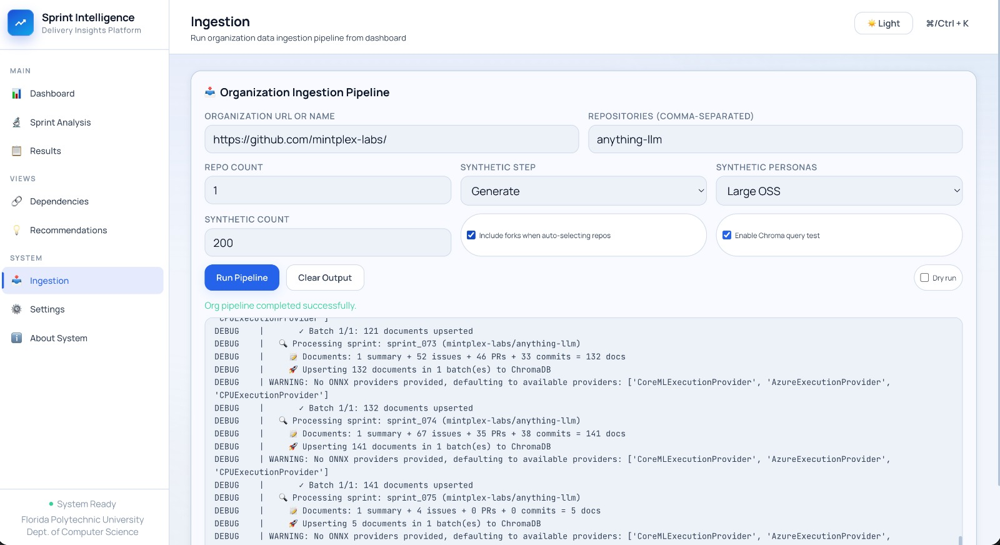
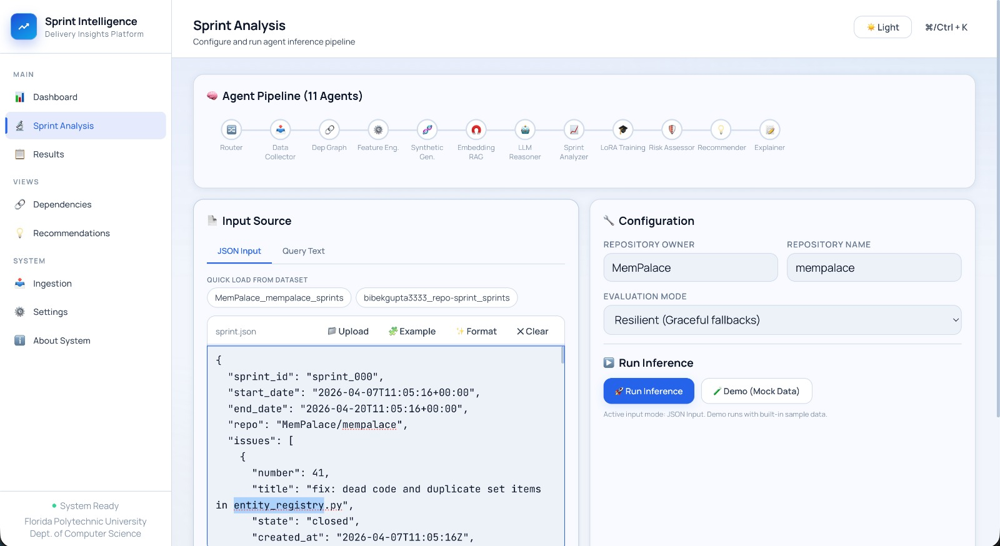
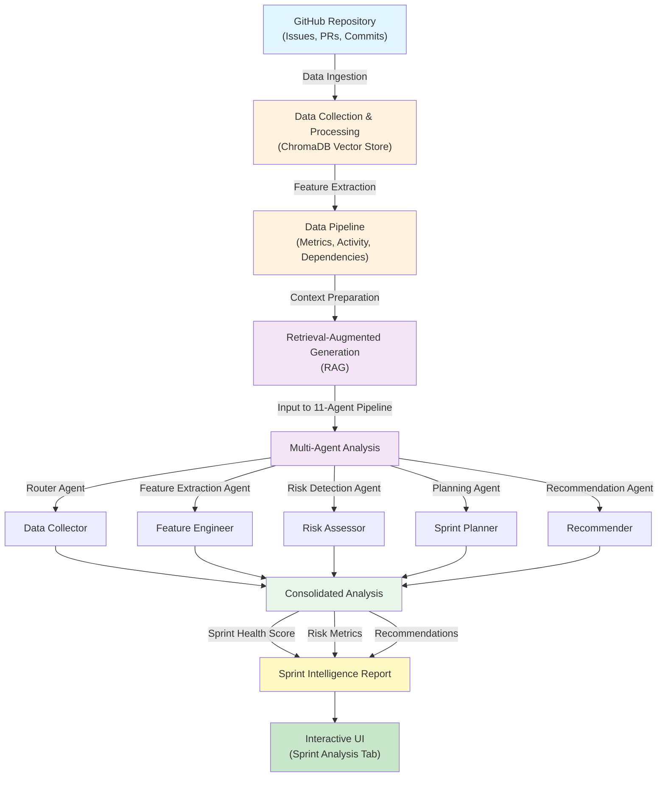

# Intelligent Sprint Analysis Using Agentic System for Startup Projects

## About

This project is a local-first sprint intelligence system for GitHub-based software teams. It combines feature extraction, retrieval-augmented generation, and multi-agent LLM reasoning to analyze sprint activity, identify risks, and generate evidence-backed recommendations.

The application runs against local Ollama models and can use GitHub data for ingestion and analysis workflows.

## Key Features

- **Data Ingestion**: Automatically collect and process GitHub repositories (issues, pull requests, commits, discussions)
- **Multi-Agent Analysis**: 11-agent LLM pipeline for feature extraction, risk assessment, sprint forecasting, and recommendations
- **Retrieval-Augmented Generation**: Context-aware analysis powered by ChromaDB vector store and local Ollama LLMs
- **Interactive UI**: Configure analysis parameters, select local Ollama models, view sprint insights and recommendations
- **Local-First**: All processing happens locally—no cloud dependencies, no external API calls to LLM providers

## Quick Start Workflow

1. **Install & Setup** (5 mins)
   - Install dependencies and configure environment variables
   - Start Ollama server locally

2. **Ingest Data** (5–10 mins)
   - Navigate to the **Ingestion** tab
   - Provide GitHub organization URL and repository names
   - Configure ingestion parameters (synthetic data, data generation settings)
   - Click "Run Pipeline"

3. **Analyze Sprints** (5–15 mins)
   - Go to the **Sprint Analysis** tab
   - Select repository and upload sprint JSON data, or use demo data
   - Choose evaluation mode (Resilient, Synthetic, Real)
   - Select desired local Ollama model
   - Click "Run Inference" to trigger the agent pipeline
   - View results and recommendations

## System Architecture

### Ingestion Pipeline


### Sprint Analysis Pipeline


## Methodology

The sprint intelligence system follows a multi-stage pipeline:



**Key Stages:**
1. **Data Ingestion**: Collect GitHub repository data (issues, PRs, commits, discussions)
2. **Feature Extraction**: Process raw data into actionable sprint metrics
3. **Retrieval-Augmented Generation (RAG)**: Use ChromaDB vector store to provide context-aware prompts
4. **Multi-Agent Analysis**: 11 specialized agents analyze different aspects in parallel
5. **Report Generation**: Consolidate findings into sprint health scores, risk assessments, and actionable recommendations

## Setup

### Prerequisites

- **Python 3.11+**
- **Git**
- **Ollama** (install from [ollama.ai](https://ollama.ai))
  - Local Ollama server must be running at `http://localhost:11434`
  - Default model: `qwen3:0.6b` (auto-installed during setup)
- **GitHub Token** (required for GitHub API ingestion)
  - Create a personal access token at [github.com/settings/tokens](https://github.com/settings/tokens)

### Step 1: Clone & Environment

```bash
git clone https://github.com/bibekgupta3333/repo-sprint.git
cd repo-sprint
```

### Step 2: Python Environment

```bash
python3 -m venv .venv
source .venv/bin/activate
pip install -r requirements.txt
```

### Step 3: Configure Environment Variables

Create a `.env` file or export these variables:

```bash
# GitHub API access (required for ingestion)
export GITHUB_TOKEN=your_github_personal_access_token

# Ollama LLM configuration (optional—defaults shown)
export OLLAMA_BASE_URL=http://localhost:11434
export OLLAMA_MODEL=qwen3:0.6b
```

**Note:** The app reads either `GITHUB_TOKEN` or `GH_TOKEN` for GitHub authentication.

### Step 4: Start Ollama

In a separate terminal:

```bash
ollama serve
ollama pull qwen3:0.6b
```

This starts the Ollama server at `http://localhost:11434` and downloads the default model.

### Step 5: Run the Application

```bash
uvicorn src.app:app --host 0.0.0.0 --port 8000 --reload
```

Or use the npm script:

```bash
npm run fastapi
```

Open your browser to `http://localhost:8000`

## Navigation Guide

### Ingestion Tab
- Provide GitHub organization URL (e.g., `https://github.com/mintplex-labs/`)
- List repositories to ingest (comma-separated)
- Adjust ingestion parameters as needed
- Click **Run Pipeline** to start data collection and processing

### Sprint Analysis Tab
- Select repository owner and name
- Upload sprint JSON file, or use **Demo (Mock Data)** for testing
- Choose evaluation mode:
  - **Resilient (Graceful fallbacks)**: Recommended for most use cases
- Select a local Ollama model from the dropdown
- Click **Run Inference**
- View analysis results and sprint recommendations

### About System Tab
- View system status and configuration details

## Customizing the Ollama Model

You can change the Ollama model at runtime:

1. In the **Sprint Analysis** tab, select a different model from the **Model Selector** dropdown
2. Or update the `OLLAMA_MODEL` environment variable before starting the app
3. Ensure the selected model is installed locally: `ollama pull <model-name>`

Popular lightweight models:
- `qwen3:0.6b` (default, ~400MB)
- `llama2:7b` (~4GB)
- `mistral:7b` (~4GB)

## Notes

- **GitHub token required**: The app needs a GitHub personal access token for API-based data ingestion. You can ingest local repositories without a token, but GitHub API workflows require authentication.
- **Ollama must be running**: Always start `ollama serve` in a separate terminal before starting the application.
- **Model selection UI**: The Sprint Analysis tab includes a dropdown to select from installed Ollama models at runtime. Your selection applies only to that analysis run.
- **Troubleshooting**: If models don't appear in the dropdown, check that Ollama is running at `http://localhost:11434` and that models are installed locally.

