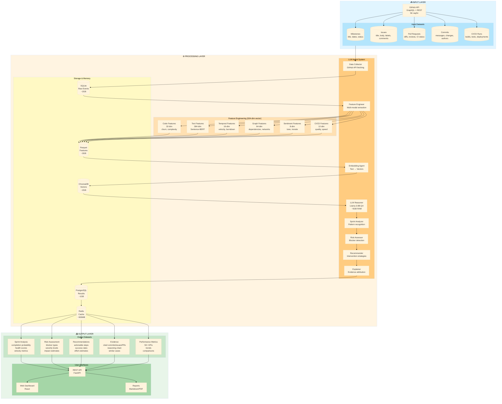
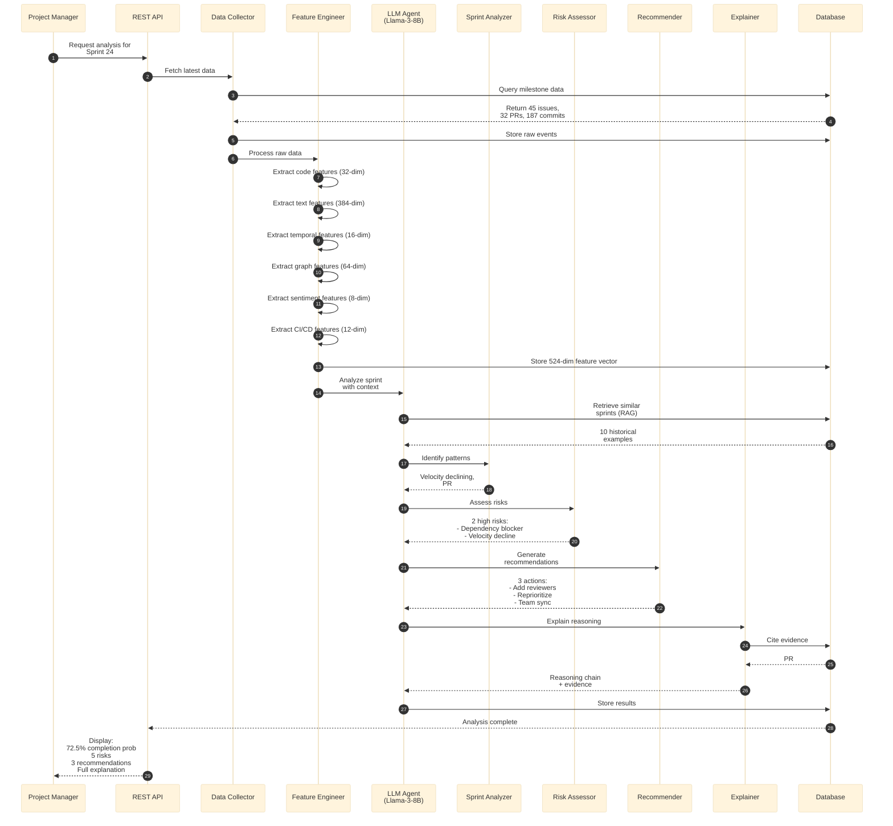
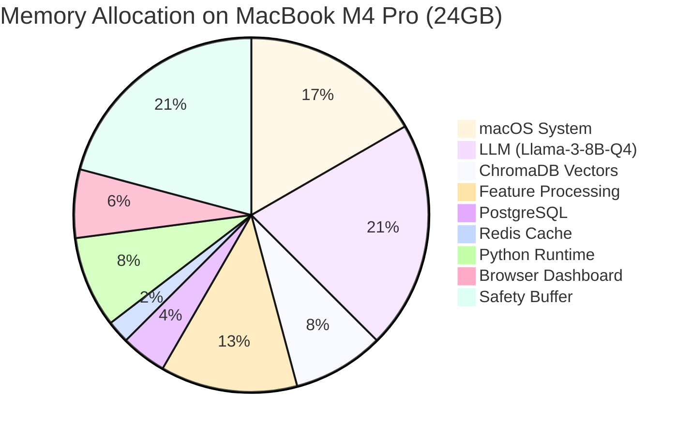
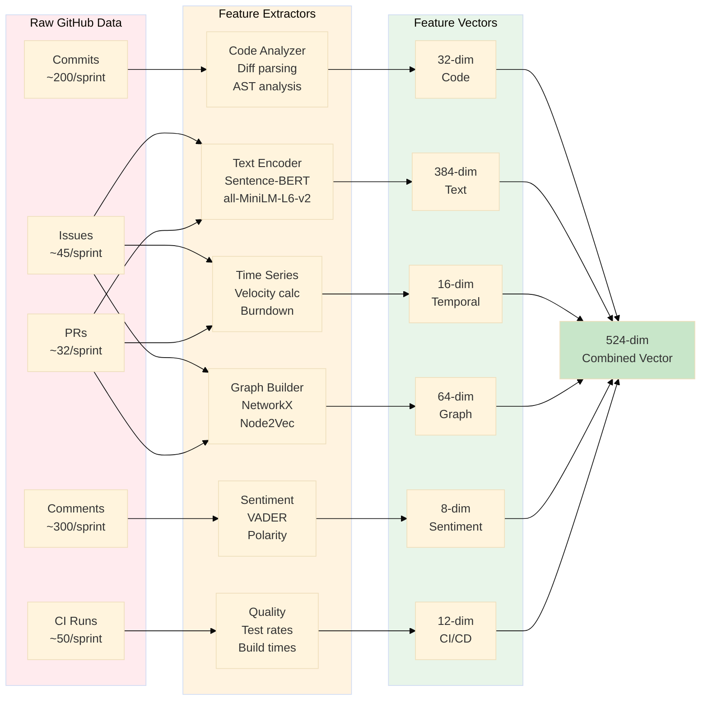
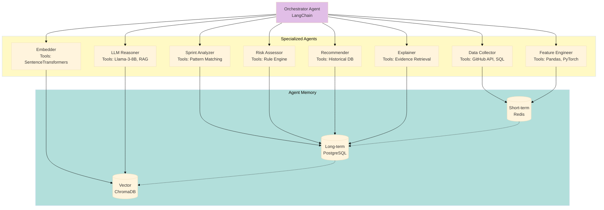
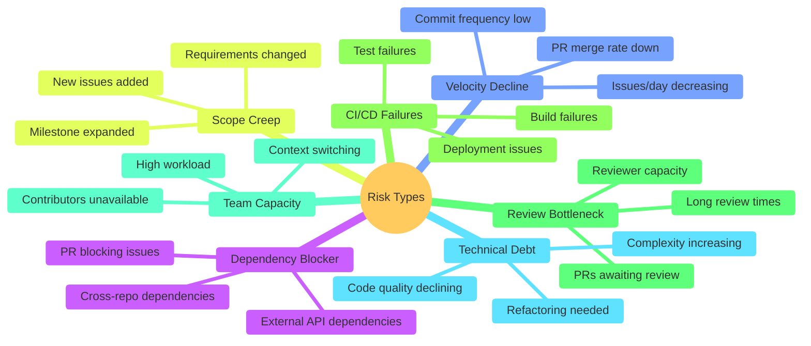
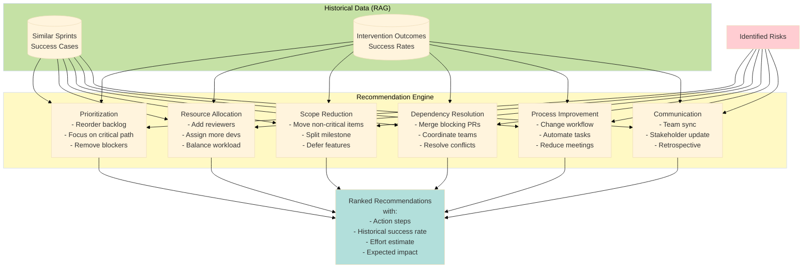
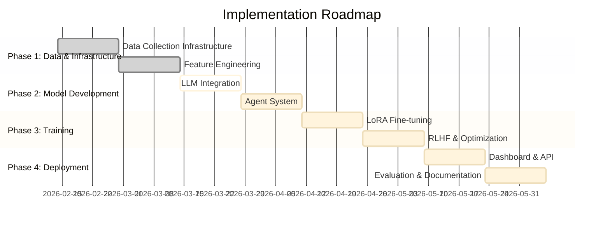

# Visual Architecture Overview

This document contains high-level visual diagrams for quick understanding of the system architecture.

## System Overview: Input → Process → Output



## Data Flow: Example Sprint Analysis



## Memory Budget Visualization (M4 Pro - 24GB RAM)



## Feature Engineering Pipeline



## Multi-Agent System Architecture



## GitHub Metrics Collection Strategy

```mermaid
%%{init: {'theme':'base'}}%%
graph TB
    START[Start Analysis]
    
    subgraph ORG_LEVEL["Organization Level (1 API call)"]
        O1[GET /orgs/{org}<br/>Basic info]
        O2[GET /orgs/{org}/repos<br/>Repository list]
    end
    
    subgraph REPO_LEVEL["Repository Level (1 GraphQL call per repo)"]
        R1[GraphQL Query:<br/>Milestones + Issues + PRs +<br/>Commits + Reviews + CI]
    end
    
    subgraph DERIVED["Derived Metrics (Computed)"]
        D1[Velocity Metrics<br/>- Current velocity<br/>- Required velocity<br/>- Velocity gap]
        D2[Burndown Analysis<br/>- Ideal vs actual<br/>- Slope<br/>- Deviation]
        D3[Team Metrics<br/>- Active contributors<br/>- Collaboration score<br/>- Response times]
        D4[Quality Metrics<br/>- Code churn<br/>- Review coverage<br/>- CI success rate]
        D5[Risk Indicators<br/>- Blocked issues<br/>- Open PRs<br/>- Failed builds]
    end
    
    CACHE[(Redis Cache<br/>15-min TTL)]
    DB[(PostgreSQL<br/>Persistent Storage)]
    
    START --> O1
    O1 --> O2
    O2 --> R1
    R1 --> CACHE
    CACHE --> D1
    CACHE --> D2
    CACHE --> D3
    CACHE --> D4
    CACHE --> D5
    D1 --> DB
    D2 --> DB
    D3 --> DB
    D4 --> DB
    D5 --> DB
    
    style START fill:#e3f2fd
    style ORG_LEVEL fill:#fff3e0
    style REPO_LEVEL fill:#f3e5f5
    style DERIVED fill:#e8f5e9
    style CACHE fill:#ffebee
    style DB fill:#e0f2f1
```

## Risk Types & Detection



## Recommendation Categories



## Performance Benchmarks

```mermaid
%%{init: {'theme':'base'}}%%
gantt
    title Processing Time per Organization Size
    dateFormat X
    axisFormat %s seconds
    
    section Small Org (5 repos, 25 milestones)
    Data Collection :0, 120
    Feature Engineering :120, 180
    LLM Analysis :300, 60
    
    section Medium Org (20 repos, 100 milestones)
    Data Collection :0, 480
    Feature Engineering :480, 720
    LLM Analysis :1200, 240
    
    section Large Org (50 repos, 250 milestones)
    Data Collection :0, 1200
    Feature Engineering :1200, 1800
    LLM Analysis :3000, 600
```



## 16-Week Implementation Timeline



---

## Key Takeaways

### ✅ Achievable on M4 Pro (24GB RAM)
- Peak RAM usage: ~22GB
- Storage: ~30GB
- Processing time: 15 sec/milestone

### 🎯 Complete System
- 7 input datasets
- 6 feature modalities (524-dim)
- 8 specialized agents
- 5 output datasets
- 50+ derived metrics

### 🚀 Novel Contributions
- Organization-level intelligence
- Multi-modal LLM fusion
- RAG-based explainability
- LoRA fast adaptation
- Real-time capable architecture

### 📊 Realistic Performance
- Small org: 6 minutes
- Medium org: 25 minutes
- Large org: 65 minutes
- 3 orgs total: 80 minutes

**Status**: Ready for Implementation ✅
