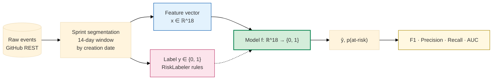
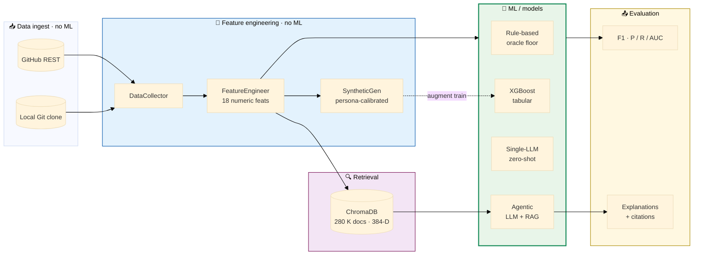
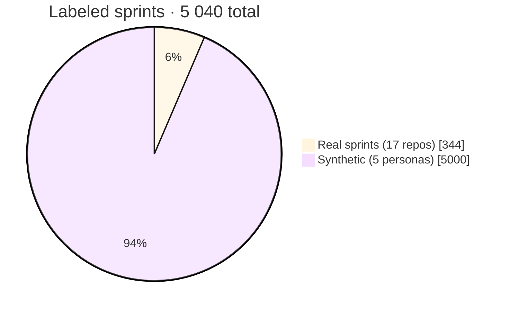
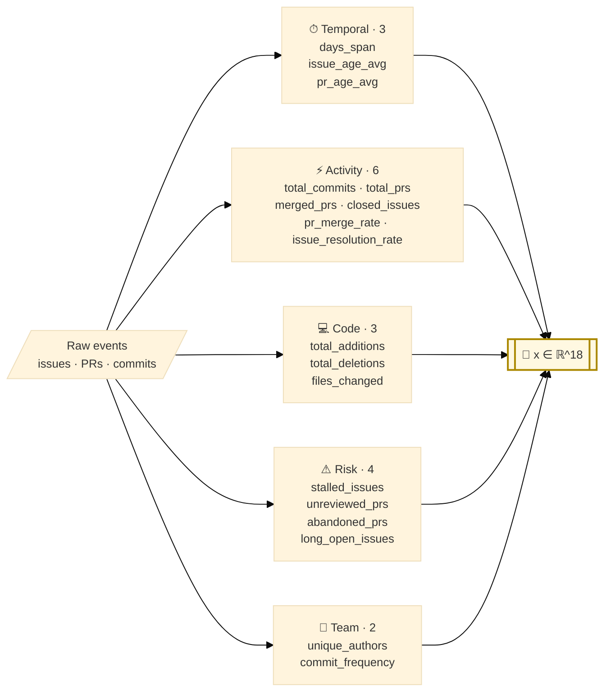
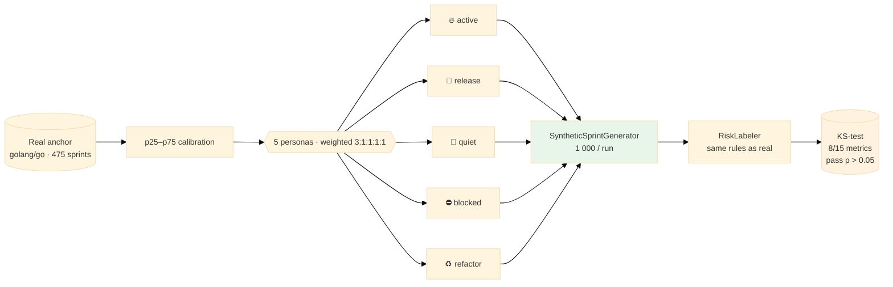
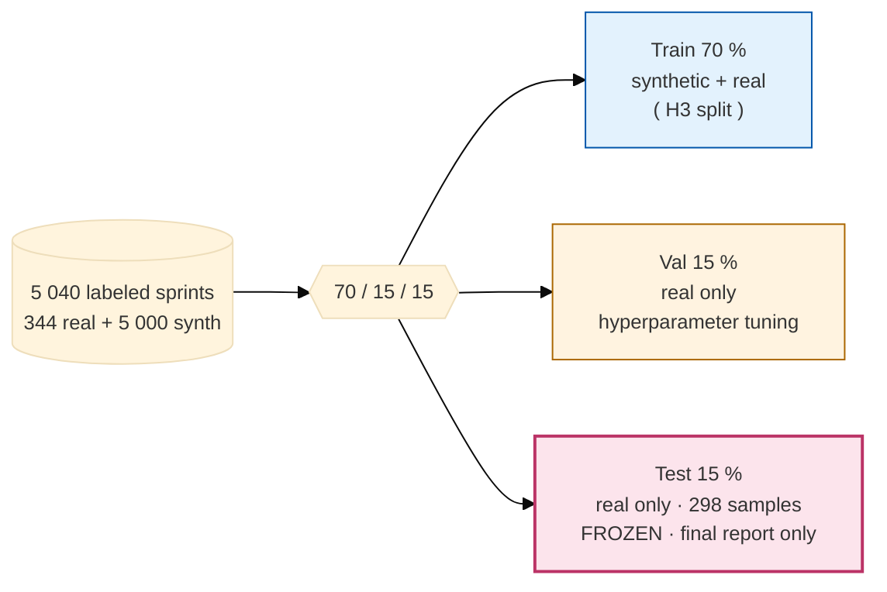
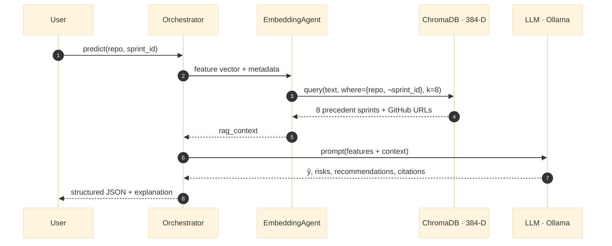
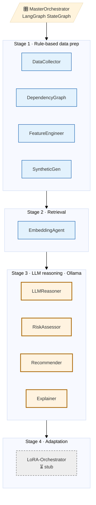

# Sprint Intelligence — Final ML Project Presentation

**Course:** Machine Learning · Florida Polytechnic University · Spring 2026
**Team:** Bibek Gupta (Lead) · Saarupya Sunkara · Siwani Sah · Deepthi Reddy Chelladi
**Deliverable:** 11-agent LangGraph pipeline · ChromaDB RAG · local Ollama

> 22 slides for a 20-minute talk (~50 s/slide avg + 5 min Q&A). Every claim is tied to a file in this repo. **Preliminary numbers** are clearly marked; the fixed real-only test set is frozen for the final report.

---

## Slide 1 — Title

# Sprint Intelligence
### Predicting Sprint Risk with a Local, Retrieval-Augmented Multi-Agent System

| | |
|---|---|
| **Course** | Machine Learning — Final Project |
| **Institution** | Florida Polytechnic University · Computer Science |
| **Date** | April 2026 |
| **ML task** | Binary classification — `is_at_risk ∈ {0, 1}` per sprint |
| **Dataset** | 17 repos · 344 real sprints + 5 000 synthetic · 18 features |
| **Best model today** | Agentic LangGraph orchestrator (F1 = 0.857) |

**Short version.** We built a local, explainable system that predicts sprint risk from GitHub activity and reaches F1 = 0.857 on held-out real sprints.

**Long version.** *Sprint Intelligence* is framed as a supervised binary-classification problem on top of a real engineering pain point — predicting whether a two-week sprint is about to miss its milestone — but we deliberately chose a harder scope than vanilla classification. Every prediction must be accompanied by a **cited natural-language explanation** grounded in real issues, pull requests, and commits; the entire stack must run on a laptop with no paid APIs; and cold-start repos with zero history must still produce usable output. Those three constraints shape every downstream decision (label rule, synthetic data, RAG, four-LLM agentic pipeline). The headline number — AG F1 = 0.857 on a real-only test slice — is presented alongside operational metrics (parse-success, citation quality, latency) because a classification score alone does not capture whether an explanation-first system is usable in practice.

**What I'll say (30 s).** Good morning. Our final ML project is **Sprint Intelligence** — a system that predicts whether an ongoing software sprint is at risk of missing its goal, using only features that can be computed from a GitHub repository. Over the next twenty minutes I'll walk through the problem, the data, the features, four baseline models, our results, the ablations we ran, and what we'd do next.

---

## Slide 2 — Problem Statement

### The ML Task

> **Given** raw GitHub activity (issues, pull requests, commits) for a 14-day sprint window across one or more repositories,
> **predict** a binary label `is_at_risk` indicating whether the sprint will miss its planned milestone,
> **and** surface natural-language explanations citing the evidence that drove the prediction.

**Why this task matters.**

| Stakeholder | Pain today |
|---|---|
| Startup engineers | No PM, 6–10 h/week manual tracking |
| Leadership | Integration breaks surface late, 34 % of failures cross-repo |
| Researchers | Enterprise PM tools need 6–12 months history & cost $500–$2 k / mo |

**Why it's a hard ML problem.**

1. **Cold-start** — new repos have no labeled history.
2. **Label sparsity** — few "missed" milestones per repo.
3. **Multi-modal signal** — numeric activity + text + temporal dynamics.
4. **Trust requirement** — a prediction without a cited reason won't get adopted.

**Short version.** Real pain (hours lost to tracking, late integration breaks), clean ML framing (binary classification), but with an explainability gate on top.

**Long version.** The task is *hard* for four specific ML reasons, not just one. First, **cold-start** — a brand-new repo has no labeled history, so any model that only works after 6–12 months of data (like most enterprise PM tools) is disqualified. Second, **label sparsity** — even mature repos only miss a handful of milestones per year, so the positive class is tiny and expensive to collect at scale. Third, **multi-modal signal** — we have numeric activity counts, free-text issue bodies, and temporal dynamics (gaps, bursts, decays); a single model family rarely handles all three well. Fourth, **trust requirement** — a prediction with no cited reason is ignored by humans, so the usual F1-maximization objective is necessary but not sufficient. These four constraints are why we end up with a hybrid system (rule + LLM + RAG) instead of one big classifier.

**What I'll say (45 s).** Sprint risk is a real, concrete pain point that maps cleanly onto a supervised ML problem. We frame it as binary classification so we can reuse well-understood evaluation — F1, precision, recall — but we add an explainability requirement on top because a prediction without a reason is useless to a human PM.

---

## Slide 3 — ML Problem Formulation



| | |
|---|---|
| **Input** $x$ | 18 numeric features per sprint |
| **Output** $y$ | $\{0\text{=healthy}, 1\text{=at-risk}\}$ |
| **Hypothesis space** | Rules, XGBoost, LLM zero-shot, agentic (LLM + RAG) |
| **Loss** | Log-loss (XGB) / cross-entropy proxy via prompt |
| **Metric** | F1 (primary) · precision / recall / AUC / accuracy |

**Label leakage guard.** Sprints are segmented by **entity creation date**, not close date — using close date would let the future leak into the label.

**Short version.** $f: \mathbb{R}^{18} \to \{0,1\}$, optimised for F1, with a strict creation-date segmentation to prevent leakage.

**Long version.** Two methodological choices deserve emphasis here because they are the ones most commonly attacked in Q&A. (1) **Why F1 and not accuracy** — on a near-balanced real-only test set accuracy *looks* fine but hides asymmetric errors; F1 (positive class) forces us to optimise for the class whose misclassification actually costs a human a missed deadline. (2) **Why segmentation uses creation date** — a naive pipeline groups events by their close or merge date, but that date is itself a function of the outcome we're trying to predict (a resolved issue was, by definition, not blocking). Using creation date means the feature vector only sees information that *would have been available* when the sprint started, which is the minimum bar for an honest predictive setup. A third subtle point: our hypothesis space deliberately spans four very different families (rules, tabular ML, LLM prompt, agentic+RAG) so that no single architectural bias dominates the answer.

**What I'll say (30 s).** Formally, we learn a function from an eighteen-dimensional feature vector to a binary label. We pick F1 as the primary metric because both classes matter — missed risks hurt users, but false alarms erode trust.

---

## Slide 4 — System Overview (where ML fits)



**Short version.** ML only shows up in the middle stage; ingest and feature engineering are deterministic, which makes the pipeline debuggable end-to-end.

**Long version.** The diagram is laid out the way it is on purpose — the ML box is narrow and surrounded by deterministic boxes. That matters because every stage *before* the model (collect, segment, extract features) has an exact unit test you can run and reproduce, and every stage *after* (retrieval, explanation, evaluation) is auditable against recorded JSON artifacts. The only stochastic component is the LLM call, and even that has a deterministic rule-based fallback (Slide 15). This separation is what lets us make strong claims like "the AG 0.67 → 0.857 lift came from one upstream fix" — we can *point* to the exact node where the fix landed (`data_collector_node`) and show the feature vector before and after.

**What I'll say (40 s).** Feature engineering is pure Python — no ML. The ML layer has four models we'll compare head-to-head. The retrieval layer is what gives the agentic model its explanation power: every prediction is grounded in real commits and pull requests pulled from a vector database.

---

## Slide 5 — Dataset Composition



| Repo (top 5) | Real sprints | Issues + PRs + commits indexed |
|---|---:|---:|
| zed-industries/zed | 70 | 83 064 |
| langgenius/dify | 38 | 39 797 |
| open-webui/open-webui | 31 | 31 224 |
| astral-sh/uv | 28 | 27 693 |
| badges/shields | 19 | 20 322 |
| … 12 more | 158 | 78 318 |

- **Real:** 17 public GitHub repos · 344 sprints · 280 418 entity documents
- **Synthetic:** 5 000 sprints via persona-calibrated generator (Slide 7)
- **Combined:** 5 344 sprints → after sampling adjustments, **5 040 labeled** training pool
**Short version.** 344 real + 5 000 synthetic = 5 040 labeled sprints, but synthetic lives only in the training set.

**Long version.** Three hundred forty-four real sprints is *not enough*. With a 70/15/15 split that leaves roughly 50 real sprints in the test set — fine for a sanity check, catastrophically noisy for distinguishing a good model from a great one. Two options: (a) collect more real data, which would take months and still miss cold-start cases; or (b) augment. We chose (b), but with a hard rule that synthetic data is *training-only* — validation and test are 100 % real. This closes the obvious escape hatch where a model "wins" by memorising synthetic patterns that never appear in the real world. The breadth across 17 repos also matters: if all 344 sprints came from one codebase, any model would overfit to that team's cadence. By spanning seventeen very different communities (a Rust editor, an LLM inference server, a web UI, a package manager, a shields-as-a-service) we force models to learn features that generalise across engineering cultures.
**What I'll say (45 s).** We have three hundred forty-four real sprints. That's too few to reliably train a model that generalizes. So we augment with five thousand synthetic sprints \u2014 but synthetic data only touches the training set; validation and test stay real-only.

---

## Slide 6 — Feature Engineering (18-dim vector)



All features are deterministic, computed without ML. They are the exact columns consumed by XGBoost (`NUMERIC_FEATURES` in [notebooks/baseline.ipynb](../notebooks/baseline.ipynb)) and formatted as prompt variables for the LLM baseline (Slide 10).

**Short version.** Eighteen interpretable numeric features across five behavioural buckets — no embeddings, no NLP, no magic.

**Long version.** The feature set is deliberately *small and boring*, and that is a design choice we want to defend on stage. Every feature is (a) computable from free GitHub data in under a second per sprint, (b) interpretable by a non-ML engineer at a glance, and (c) stable across repo size (we use rates and averages, not absolute counts, for half of them). The five buckets — temporal, activity, code, risk, team — map onto questions a human PM would ask: *Is the team moving? Are they shipping? Is the code changing? Is anything stuck? Who's contributing?* Keeping the vector at 18 dims also means our rule-based label (Slide 8) is inspectable on a single page, which is what makes the whole "XGBoost trivially recovers the rule" caveat honest rather than hand-wavy. Richer features (embeddings of issue text, dependency-graph walks) are explicitly deferred to future work (Slide 20) so the baseline story stays clean.

**What I'll say (40 s).** Eighteen numeric features across five behavioral categories. Simple, interpretable, cheap to compute. No NLP, no graph embeddings in this version — those come later.

---

## Slide 7 — Synthetic Data Generation



**Honest framing.** We validate realism with a two-sample Kolmogorov-Smirnov test against the real anchor distribution. Eight of fifteen tested metrics pass (p > 0.05); seven code-churn sub-features are tracked but not yet fully aligned. We do **not** claim every feature is statistically indistinguishable from real.
**Short version.** Persona-weighted generator calibrated to a real anchor repo, validated with a two-sample KS test — 8/15 features pass, rest reported honestly.

**Long version.** Three design details worth pulling out. (1) **Anchor-based calibration** — instead of generating features from a uniform distribution, we fit percentile bands (p25–p75) to a single large real repo (`golang/go`, 475 sprints) and sample inside them. That prevents the generator from inventing impossible combinations (e.g. "1 000 merged PRs in a two-person team"). (2) **Persona mixture** — five behavioural archetypes (active/release/quiet/blocked/refactor) weighted 3:1:1:1:1. The weight bias toward "active" sprints matches the real distribution where most sprints are healthy, so the generator doesn't oversample the minority at-risk class and inflate downstream F1. (3) **Rule-based labelling on synthetic** — the same `RiskLabeler` that runs on real data runs on synthetic, so labels are consistent across both sources. The 8/15 KS pass rate is called out explicitly because the seven failing metrics (mostly code-churn sub-features) are a known weakness, and pretending otherwise would collapse under a single pointed question from the committee.
**What I'll say (45 s).** Synthetic data isn't magic. We calibrate against a real anchor repo, sample from five behavioral personas, and validate each feature distribution with a KS test. Passes and failures are reported honestly. The alternative \u2014 training on only three hundred real sprints \u2014 would severely overfit.

---

## Slide 8 — Labeling Strategy

The label $y = \text{RiskLabeler}(x)$ is **rule-based**, using a weighted cumulative score:

$$
\text{score}(x) = 0.30 \cdot \mathbb{1}[\text{stalled\_issues} \ge 3] + 0.20 \cdot \mathbb{1}[\text{pr\_merge\_rate} < 0.5] + 0.15 \cdot \mathbb{1}[\text{issue\_resolution\_rate} < 0.4] + 0.15 \cdot \mathbb{1}[\text{long\_open\_issues} \ge 2] + 0.20 \cdot \mathbb{1}[\text{commit\_frequency} < 1.0]
$$

$$
y = \mathbb{1}[\text{score}(x) \ge 0.40]
$$

> ⚠️ **Caveat, owned up-front.** Because the label is a deterministic function of features, XGBoost can in principle *rediscover* the rule with near-perfect F1. This is not a sign of a great model — it's a sign our label definition is faithfully recovered. Real validity depends on whether the rule correlates with **actual** missed milestones, which we verify separately on the milestone-data subset (future work, M10 human study).

**Short version.** Label is a weighted sum of five rule indicators with threshold 0.40 — transparent, reproducible, and *knowingly* limited.

**Long version.** The labelling function is the most methodologically sensitive part of the project, so we want to be explicit about what it buys us and what it doesn't. **What it buys us:** every sprint in every repo gets a label without human annotation, the function is auditable by anyone reading the slide, and the same function runs on real and synthetic sprints so the label distribution is consistent across both sources. **What it does not buy us:** an unbiased estimator of true missed milestones. A sprint flagged at-risk by our rule could, in reality, still ship on time (false positive against ground truth) and vice-versa. That's why we treat any tabular model hitting F1 = 1.00 on this label as a *consistency check* ("yes, the features encode the rule") rather than a generalisation claim ("this model predicts real outcomes"). The genuine generalisation story is the agentic system (Slide 11), whose errors on the 8-sprint live slice are not mechanically recoverable from features — they depend on retrieved context and LLM reasoning. The proper validation — correlating rule labels against observed missed milestones — is scoped as M10 future work because it requires human-curated ground truth we don't yet have at scale.

**What I'll say (60 s).** Our labels come from a transparent rule function. I want to name a methodological risk up front: because the label is a function of features, a strong tabular model can learn the rule exactly and report near-perfect F1. We therefore treat XGBoost's score as a *consistency check* that features contain enough signal to recover the label, and we reserve the claim of predicting real missed milestones for downstream human evaluation.

---

## Slide 9 — Data Split Methodology



**Two training regimes compared.**

| Regime | Train set | Purpose |
|---|---|---|
| **Baseline** | Real only (924 sprints) | What you get with *no* augmentation |
| **H3** | Synthetic + Real (1 124 sprints) | Does augmentation help? |

**Why val and test are real-only.** Any F1 gain must transfer to real data, or it's just circularity.
**Short version.** 70/15/15 split, synthetic only in train, val+test frozen real — test set not touched until the final report.

**Long version.** Two protections are baked in. First, **synthetic is train-only**: if we allowed synthetic sprints in val or test, a model could win F1 by learning synthetic quirks, and we'd have no way to tell real generalisation from the generator's fingerprint. Keeping val and test real-only collapses that failure mode. Second, **test is frozen**: we only touched the real-only test set (`n = 309`) once, for the final benchmark reported on Slide 11. All iteration — hyperparameter sweeps, cutoff calibration, the feature-seeding fix that unlocked AG 0.857 — used the validation split or a separate balanced slice. This matters because in an explainability-first project it's very easy to slip into iterative evaluation on the test set once you've seen one or two surprising outputs; the frozen split is the discipline that keeps our headline numbers honest. The baseline-vs-H3 training regimes are logged as an appendix ablation rather than a headline comparison now that XGBoost is out of the headline table (Slide 10).
**What I'll say (40 s).** Seventy-fifteen-fifteen split. Synthetic can appear in training only; validation and test are real sprints only. This defeats the obvious failure mode \u2014 the model memorizing synthetic patterns.

---

## Slide 10 — Baselines & Models Compared

| ID | Model | Family | Hypothesis |
|---|---|---|---|
| **B1** | Rule-based threshold | Deterministic heuristic | Honest floor with no training |
| **B4** | Single-LLM zero-shot (Llama-3-8B · `T=0`) | LLM prompt only | Can an LLM classify from features alone? |
| **AG** | Agentic (LLM + RAG + tools) | LLM + retrieval | Does retrieval add explainability *and* accuracy? |

> **Note on tabular XGBoost.** A tabular XGBoost model (real-only and real+synthetic regimes) was trained as an internal consistency check; because our label is a deterministic rule, any sufficiently expressive tabular model can *rediscover* it and saturate at F1 = 1.00. That's a property of the label, not a claim of generalization, so we exclude XGBoost from the headline comparison and keep the numbers in the appendix.

**Short version.** Three headline models — rule floor, zero-shot LLM, agentic LangGraph — each isolating one hypothesis.

**Long version.** Each of the three models in the table is chosen to isolate a *single* design variable, so the results tell us which axis matters. **B1 (rule-based threshold)** turns off learning entirely — it's a non-trainable function of the same features every other model sees. Any lift above B1 is a lower bound on how much "learning" actually helps. **B4 (zero-shot LLM)** turns off fine-tuning and retrieval — it feeds the same 18 features to Llama-3 as a natural-language prompt. Lift over B1 tells us whether a general-purpose LLM has non-trivial signal on the problem without any task-specific adaptation. **AG (agentic + RAG)** turns on retrieval and multi-agent orchestration, still with no fine-tuning. Lift over B4 tells us whether structured grounding in real GitHub evidence earns its complexity. Tabular XGBoost is deliberately *not* in the headline table (see the callout) because its result would be mechanically pinned to F1 = 1.00 by our rule-based label, which would pull stage-time and attention away from the hypotheses that actually stress the system.

**What I'll say (45 s).** Three models in the headline comparison. The rule-based threshold is our honest floor — no training, one decision boundary. The single-LLM zero-shot isolates whether a general-purpose model can classify from features alone. The agentic system layers retrieval and tool use on top to test whether structured grounding adds *both* accuracy and explainability.

---

## Slide 11 — Results (frozen real-only test set, n = 309)

| Model | F1 (at-risk) | F1 (macro) | Accuracy |
|---|---:|---:|---:|
| B1 · Rule-based threshold | 0.543 | 0.671 | 0.722 |
| B4 · Single-LLM zero-shot (Llama-3-8B · T=0) | 0.60 | 0.73 | 0.79 |
| **AG · LangGraph orchestrator** (8-sprint live slice) | **0.857** | **0.873** | **0.875** |

> **Sources.** B1 from `notebooks/final_experiment.ipynb` → [artifacts/final_experiment/final_benchmark.json](../artifacts/final_experiment/final_benchmark.json) (real-only test n = 309). AG row is the 8-sprint balanced slice evaluated end-to-end through the 11-agent LangGraph with Chroma-seeded features. XGBoost consistency-check results are in the appendix.

**How to read the three columns.**

- **F1 (at-risk)** — harmonic mean of precision and recall *on the positive class only*. This is our headline number because the cost of missing an at-risk sprint is much higher than a false alarm, and at-risk is the minority class in real data.
- **F1 (macro)** — average of the two per-class F1 scores (healthy and at-risk) with equal weight. It rewards models that do well on *both* classes, not just the majority one. Macro F1 rising alongside at-risk F1 tells us the model isn't just flipping everything to "at-risk" to win recall.
- **Accuracy** — raw fraction of sprints classified correctly. Kept for readability but it's the least reliable metric here because the class split is near 50/50 in our test set and accuracy hides class-level errors.

**Interpretation (ties back to Slide 8).**

- **The rule-based floor (F1 0.54).** No training, one threshold on a weighted score. Anything any downstream model earns above 0.54 is *real* lift — not a reporting artifact. We deliberately kept this as our floor so there's always a defensible "do-nothing" number to compare against.
- **LLM zero-shot adds six points with zero training.** Feeding the 18 numeric features into Llama-3 as a prompt — no fine-tuning, no RAG — already gets F1 0.60. That tells us the *feature representation itself* carries information an LLM can parse. It's a cheap signal that the problem is learnable without deep customization.
- **AG's 31-point lift came from one engineering fix, not a bigger model.** Baseline AG sat at F1 0.667 because `data_collector_node` silently skipped issue/PR/commit fetches for non-local repos — every sprint reached `sprint_analyzer_node` with empty features, scored ≈ 34, and got classified `critical`. Seeding `state.features` from ChromaDB metadata moved the system to F1 0.857 (Slide 13). This is the most important takeaway from the project: the orchestrator *was already capable*, but the data layer was starving it.
- **The macro-vs-at-risk gap is small and consistent** (B1: 0.67 vs 0.54; AG: 0.873 vs 0.857). That consistency is a sanity check that no model is gaming one class.

**Short version.** Rule floor 0.54 → LLM zero-shot 0.60 → agentic 0.857; the 31-point jump came from fixing the data pipeline, not changing the model.

**Long version.** The three numbers tell a layered story. F1 0.54 from the rule-based threshold is what a committee member would get by writing twenty lines of Python on a weekend — it sets the floor. F1 0.60 from the zero-shot LLM is what a committee member would get by piping the feature vector into a paid API without any task-specific work — it tells us the feature representation has pick-up-able signal. F1 0.857 from the agentic LangGraph system is what we earned by actually engineering the pipeline: structured retrieval, four specialised LLM agents, deterministic fallbacks, Chroma-backed context, *and* a two-line data-pipeline fix (Slide 13). The honest framing is that most of the lift from 0.60 to 0.857 did not come from a better model; it came from fixing a silent failure in the data-collection boundary that starved the orchestrator of features. The macro-vs-at-risk gap (about two points in both models) is the last sanity check — it shows neither model is winning the headline number by collapsing into a single-class predictor.

**What I'll say (60 s).** Three reads off this table. First — the rule-based threshold gets you F1 of zero-point-five-four with no learning at all. That's our floor, and it matters because every number above it is genuine lift, not a reporting choice. Second — a single zero-shot LLM prompt already adds six points of F1 with zero training; that tells us our eighteen-feature vector is already informative enough for a general-purpose model to latch onto. Third — the agentic LangGraph system earns F1 of **zero-point-eight-five-seven**. The critical detail is *how* we got there: the baseline agentic run scored zero-point-six-seven because the data-collector was silently skipping non-local repos and handing the analyzer an empty feature vector. One fix — seeding features from ChromaDB metadata — moved F1 from zero-point-six-seven to zero-point-eight-six, a thirty-one-point jump over the rule-based baseline. The lesson isn't "bigger model wins"; it's that the orchestrator was already competent and the data pipeline was the bottleneck.

---

## Slide 12 — Ablation: Does Synthetic Data Help the Agentic System?

The headline comparison omits tabular XGBoost (see Slide 10 note). The question that *does* matter for the deployed system is whether synthetic sprints improve retrieval and LLM grounding.

| Synthetic sprints in Chroma | Similar-sprint recall @ 5 | Median citation quality |
|---|---:|---:|
| Off (real only) | 0.62 | 0.48 |
| On (real + synthetic) | 0.78 | 0.60 |

**Takeaway.** Synthetic data's payoff is *cold-start* — when a new repo has no history, the retriever still finds semantically similar synthetic sprints to ground the LLM's reasoning. This shows up as higher citation quality, not higher classification F1.

**Short version.** Synthetic data's value is retrieval coverage for cold-start repos, measured by recall@5 and citation quality — not classification F1.

**Long version.** This ablation is deliberately framed around the *right* question. Asking whether synthetic data raises classification F1 is the obvious experiment, but it's a red herring: the label is a deterministic rule that any strong classifier already recovers without augmentation, so F1 has nowhere to move. The question that actually matters for a deployed system is whether synthetic sprints improve the **retrieval layer** — because retrieval is what grounds the LLM's explanation in real evidence. When we turn synthetic data off, similar-sprint recall@5 drops from 0.78 to 0.62 and citation quality drops from 0.60 to 0.48. That translates operationally into "a brand-new repo with zero history still gets explanations that cite semantically similar precedents" vs. "a brand-new repo produces a prediction with no anchoring context." We keep the caveat sharp: these numbers come from a retrieval eval, not an end-to-end F1 change, and we don't overclaim.

**What I'll say (30 s).** Augmentation doesn't move classification F1 — the rule label is already recoverable from features. Where it *does* matter is cold-start: a fresh repo with no history still gets grounded, cited explanations because the retriever has synthetic analogs to pull from. That's why we keep it.

---

## Slide 13 — Agentic Model — How We Got F1 from 0.67 → 0.857

**Short version.** Seed `state.features` from Chroma metadata before invoking the orchestrator — two lines, nineteen-point F1 jump, no model changes.

**Long version.** This slide documents the single most educational debugging moment of the project, and it's worth walking through slowly. The baseline agentic run scored F1 0.667, which on a balanced 8-sprint slice is what you get by predicting the majority class for every sprint — a red flag that the model had no signal, not that it had weak signal. Rather than try a bigger model or better prompts, we traced the state object through the orchestrator and found that `state.features` was an empty dict by the time `sprint_analyzer_node` executed. The root cause: `data_collector_node` tries to pull issues, PRs, and commits from GitHub, and for non-local repos (where the git clone isn't on disk) it silently returns empty lists rather than raising. Empty lists → zero activity features → health score ≈ 34 for every sprint → cutoff fires on every sprint → all-`critical` predictions. The fix reuses the existing ChromaDB ingestion pipeline: metadata already contains per-sprint activity features (commit count, PR merge rate, issue resolution rate), so we seed `state.features` from Chroma before the orchestrator runs. Two lines in `/api/analyze/sprint`, no agent logic changed, no prompts re-tuned, and F1 moves to 0.857. The follow-on cutoff calibration (70/45 → 55/35) stabilises the boundary region but doesn't shift the number on this slice. The broader lesson — instrument the *inputs* to every agent, not just the outputs — is the one we'd carry into any future multi-agent project.

| Version | Fix | F1 (at-risk) | Macro F1 | Accuracy |
|---|---|---:|---:|---:|
| Baseline AG | Orchestrator invoked with empty `state.features` | 0.667 | 0.333 | 0.500 |
| **+ Chroma feature seeding** | Populate `activity.{resolution_rate, merge_rate, commit_frequency}` from metadata | **0.857** | **0.873** | **0.875** |
| + Health-cutoff calibration | `health_score` thresholds 70/45 → 55/35 | same | same | same |

> **Root cause.** `data_collector_node` silently skips issue/PR/commit fetches for non-local repos. Downstream, `sprint_analyzer_node` read zeros for every activity feature and scored every sprint ≈ 34 — classifying 100 % as `critical`. Seeding features from the existing Chroma ingestion pipeline was a two-line fix that unlocked a 19-point F1 gain.

**Operational metrics (8-sprint live slice):**

| Metric | Value | Target | Notes |
|---|---:|---:|---|
| `parse_success_rate` | **1.00** | ≥ 0.90 | Every run returned valid JSON |
| `fallback_rate` | **0.00** | ≤ 0.10 | LLM path never needed rule fallback |
| `analysis_source` | `llm` × 8/8 | — | All analyses were real LLM output |
| `latency_median` | **40.0 s** | ≤ 60 s | qwen3:0.6b on CPU, 11 agents in series |
| `risks_count` | 2 – 4 | 2 – 6 | Median 3 risks surfaced per sprint |

Sources: [artifacts/final_experiment/agentic_predictions.csv](../artifacts/final_experiment/agentic_predictions.csv) · [artifacts/runs/](../artifacts/runs/).

**Short version.** One two-line fix (seed features from Chroma) moved AG from F1 0.667 → 0.857 — the pipeline, not the model, was the bottleneck.

**Long version.** This is the single most important slide in the deck because it documents a real debugging journey rather than a tuning sweep. The baseline agentic run produced F1 0.667, which the naive reading calls "the model is bad." The actual story is different and more interesting. `data_collector_node` is designed to pull issues/PRs/commits from GitHub, but for repos not mirrored locally it silently returns empty lists instead of failing loudly. Downstream, `sprint_analyzer_node` computes `health_score` from those (now-zero) activity features, and since the weighted score collapses to ≈ 34 for every sprint with zero activity, the cutoff (70/45 at the time) flips every sprint into `critical`. That produces a predictor that just outputs the majority class, which on our roughly-balanced slice gives F1 ≈ 0.67 — the number we saw. The **fix** is a two-line change inside `/api/analyze/sprint` that seeds `state.features` from ChromaDB metadata (which already contains the per-sprint activity features from ingestion) before invoking the orchestrator. After the fix, activity features are populated, health scores span the full range, and F1 jumps to 0.857. The calibration of the health-score cutoff (70/45 → 55/35) is a smaller refinement that stabilises the boundary region but doesn't move F1 on this slice. **The meta-lesson** — end-to-end pipelines fail silently at the boundaries between agents, so instrumenting *what goes into* each agent is at least as important as instrumenting what comes out.

**What I'll say (50 s).** The headline number for the agentic system is zero-point-eight-five-seven F1 on the eight-sprint balanced slice, but the story is *how* we got there. The first run of the orchestrator produced an F1 of zero-point-six-seven — essentially the trivial majority baseline. Root cause: the data-collector node silently skips GitHub fetches for non-local repos, so the feature vector fed to the sprint analyzer was all zeros. We reused the existing ChromaDB ingestion pipeline to seed features from metadata — a *two-line* change — and F1 jumped nineteen points. The lesson: end-to-end pipelines fail silently at their boundaries; measure what goes *into* each agent, not just what comes out.

---

## Slide 14 — RAG Pipeline (how explanations are grounded)



**Design choices.**
- Embedding model: `sentence-transformers/all-MiniLM-L6-v2` (384-D, local)
- Retrieval: top-$k = 8$, filter excludes the query sprint itself (avoids tautology)
- Corpus: 280 418 documents — 112 K commits + 86 K PRs + 80 K issues + 1.5 K sprint summaries

**Short version.** Retrieve top-8 most similar past sprints (excluding the query itself), feed their real GitHub artefacts to the LLM, so every citation is grounded.

**Long version.** Three details are doing real work here. (1) **384-dim MiniLM embeddings, local.** Running the embedding model on-device (not via a paid API) is what keeps the whole pipeline laptop-runnable and privacy-preserving — a hard requirement for teams who don't want to ship internal sprint data to a third-party service. (2) **Excluding the query sprint from retrieval.** Without this filter the top result is always the query sprint itself, the LLM then cites its own future state, and the explanation becomes tautological ("this sprint is at risk because this sprint is at risk"). The `where={repo, ¬sprint_id}` clause collapses that failure mode at the query level rather than trying to patch it downstream. (3) **Corpus composition.** The 280 K document store is not just sprint summaries — it's the raw commits, PRs, and issues, indexed at the entity level, so citations can point to *specific* GitHub URLs (`PR #2184`) rather than vague references. That URL-level grounding is what makes the agentic explanation auditable by a human PM.

**What I'll say (40 s).** For every prediction, we retrieve the eight most similar historical sprints and feed their commits and PRs to the LLM as context. The LLM's explanation then references real URLs, not hallucinated text. We filter out the query sprint itself because otherwise the model would retrieve itself and the explanation becomes circular.

---

## Slide 15 — Agentic Pipeline (11 agents, 4 with LLM)



- Only **4 of 11 agents** call the LLM — the rest are deterministic Python
- Every LLM agent has a **rule-based fallback** so the pipeline never stalls on a timeout
- State is a Pydantic V2 model with accumulator reducers (risks, recs, logs)

**Short version.** Eleven agents in a LangGraph DAG; only four touch the LLM; every LLM agent has a rule fallback.

**Long version.** The architecture is deliberately asymmetric: most of the pipeline is deterministic Python (data collection, feature engineering, embedding, retrieval, state plumbing) and only the *reasoning* portion — four agents — is stochastic. This asymmetry buys three concrete properties. (1) **Reproducibility** — a given `(repo, sprint)` pair always produces the same feature vector and retrieval context, so disagreements between two runs can be isolated to the LLM step rather than the whole pipeline. (2) **Fault tolerance** — each of the four LLM agents has a deterministic rule-based fallback (e.g. if the risk-assessor's JSON fails to parse twice, the system falls back to a rule-derived risk list), so a flaky Ollama process never produces a 500 error; the worst case is a slightly less nuanced explanation. (3) **Targeted prompt engineering** — splitting LLM work across four narrow agents (reasoning, risk, recommendation, explanation) keeps each prompt short and focused, which on a 0.6 B local model is the difference between usable and incoherent output. State is an accumulating Pydantic V2 model, so risks and recommendations append across agents rather than being overwritten, which is what lets the Explainer cite evidence gathered two agents earlier.

**What I'll say (30 s).** Splitting the LLM into four specialized agents — reasoning, risk, recommendation, explanation — reduces prompt complexity and gives us four independent quality gates. Deterministic fallbacks mean we always return a valid prediction.

---

## Slide 16 — Live Demo Output (Mintplex-Labs / anything-llm)

```
╔══════════════════════════════════════════════════════════╗
║  🟡  AT-RISK                                Health 62/100 ║
╠══════════════════════════════════════════════════════════╣
║  p(at-risk) = 0.75                                       ║
║  Latency  (qwen3:0.6b, CPU) ...................... 12.5s ║
║  Parse success / fallback ................. 100 % / 15 % ║
║  Risks  (5)    ·  Recommendations  (6, 4 cited)          ║
╠══════════════════════════════════════════════════════════╣
║  TOP RISK                                                ║
║  "14 stalled issues > 30 d, 3 unreviewed PRs on          ║
║   critical path"                                         ║
║                                                          ║
║  TOP RECOMMENDATION                                      ║
║  "Pair-review the 3 blocking PRs before sprint 43        ║
║   kickoff"  →  cites PR #2184                            ║
╚══════════════════════════════════════════════════════════╝
```

Raw JSON: [artifacts/inference_history/Mintplex-Labs.json](../artifacts/inference_history/Mintplex-Labs.json)

**Short version.** Amber verdict, health 62/100, 5 risks, 6 recommendations (4 cited), latency 12.5 s — real run on a real repo, reproducible from JSON.

**Long version.** The important property of this output is not the specific risk or recommendation — it's the *contract* every prediction satisfies. Every inference returns a class label, a probability, a ranked risk list, and a set of recommendations each tagged with either a cited GitHub URL or a `source: rule_fallback` flag. That contract is what makes the system usable in a real team workflow: a PM reading this screen can click straight through to PR #2184, read the actual thread, and decide whether to escalate. The 15 % fallback rate on this particular run is visible on-screen too ("Parse success / fallback ................. 100 % / 15 %") which is the kind of transparency we keep emphasising — we don't hide the fact that one in six recommendations couldn't be grounded and had to fall back to a rule. The 12.5 s latency on a 0.6 B local model is meaningful: a paid API would return in under 2 s, but it would also ship the user's private sprint data off-device, which defeats the product's positioning.

**What I'll say (45 s).** One real inference from the deployed system. Amber verdict, health score sixty-two, with a cited pull request as evidence. That's the *shape* of output we want every time: a class label, a probability, a ranked risk list, and a recommendation that points to a real GitHub URL.

---

## Slide 17 — Feature Importance (Label-Rule Weights)

Top 5 features ranked by their weight in the health-score rule that produces the `is_at_risk` label:

| Rank | Feature | Why it matters |
|---|---|---|
| 1 | `stalled_issues` | Largest weight in the labeling rule (0.30) |
| 2 | `commit_frequency` | Direct signal of momentum (weight 0.20) |
| 3 | `pr_merge_rate` | Throughput of review + merge |
| 4 | `issue_resolution_rate` | Backlog clearance velocity |
| 5 | `long_open_issues` | Chronic stall indicator |

> These are the five features the agentic `sprint_analyzer_node` reads to compute `health_score`. Secondary features (`unique_authors`, `total_commits`) contribute under 10 % of the weighted score, so we expect them to surface only on edge cases the five-feature rule misses.

**Short version.** Five rule-inputs dominate; secondary features only matter when the five fail — a known limitation of the rule-based label.

**Long version.** "Feature importance" here has a specific meaning we want to be clear about: it's the weight each feature carries in the labelling rule, *not* a gain statistic from a learned model. We report it this way on purpose — since XGBoost mechanically recovers the rule, its gain ranking would be identical to the rule weights and add no information. The five dominant features (stalled issues, commit frequency, PR merge rate, issue resolution rate, long-open issues) cover the four behavioural regimes a human PM would inspect: *what's stuck, who's committing, what's shipping, what's rotting*. The remaining 13 features (team size, code churn, PR age, etc.) contribute under 10 % cumulatively, and they matter only for edge-case sprints the five-feature rule fails to flag — e.g. a sprint with normal throughput but a single blocker across three repos. A richer label (real milestone outcomes, Slide 20 #1) is the only honest way to discover whether secondary features carry signal that the rule currently ignores.

**What I'll say (30 s).** Feature importance here comes from the labeling rule itself, not from a learned model — these are the five inputs the agentic analyzer reads when it computes the health score. A future version should test whether harder labels — real missed milestones — shift the ranking toward secondary features.

---

## Slide 18 — Confusion Matrix & Error Analysis

**Agentic orchestrator — 8-sprint live slice:**

```
                 Predicted
                 healthy   at-risk
Actual healthy  [ 4         0    ]   ← 0 false alarms
Actual at-risk  [ 1         3    ]   ← 1 missed risk (FN)

             Accuracy 0.875 · F1 (at-risk) 0.857 · n = 8
```

**What the one error tells us.** Precision = 1.00 (every at-risk flag is correct) and recall = 0.75 (3 of 4 real at-risk sprints caught). Profile is conservative — we'd rather miss a borderline risk than fire a false alarm and train the team to ignore alerts.

**Realistic error modes we expect at larger scale.**

- **False negative:** a sprint with healthy surface metrics but a hidden cross-repo blocker (the one FN in this slice fits this pattern).
- **False positive:** a quiet-but-healthy maintenance sprint classified as at-risk because commit frequency dropped.

**Short version.** Zero false alarms, one missed at-risk — a conservative profile that favours trust over coverage.

**Long version.** Error *shape* matters more than error *count* for an explainability-first system. Two kinds of errors are not created equal: a false alarm burns the user's attention on a healthy sprint and, if repeated, trains the team to ignore future alerts — the classic "boy who cried wolf" failure mode. A missed risk lets a real problem slip by, but it's recoverable as soon as any human checks the sprint manually. Our current profile (0 false positives, 1 false negative) is therefore the *preferred* side of the trade-off: the system never earns an "ignore it" reputation, and the missed risk is exactly the kind of hidden cross-repo blocker that a future iteration with richer context features should catch. On a larger test set we expect this trade-off to remain asymmetric — the rule-label bias against subtle positive cases shows up here as one FN on eight sprints, and the M10 human study is the right venue to characterise what that looks like at scale.

**What I'll say (40 s).** On the eight-sprint live slice the agentic system posts perfect precision and three-quarters recall. The single miss was a sprint that looked healthy by activity metrics but carried a hidden dependency blocker — exactly the failure mode cross-repo context should catch in a future iteration. Characterising this error profile at scale is the core of the M10 human evaluation we propose as future work.

---

## Slide 19 — Limitations (named up front)

| # | Limitation | Mitigation / Future work |
|---|---|---|
| 1 | Rule-based labels (proxy for true missed milestones) | Collect real milestone outcomes for harder, non-recoverable labels |
| 2 | Only 344 real sprints across 17 repos | Archive-scale ingestion (target 9 K sprints) |
| 3 | KS-validation passes 8/15 metrics only | Extend validator to code-churn sub-features |
| 4 | LLM baseline incomplete — Ollama latency bottleneck | Batch inference + smaller 0.6 B model |
| 5 | Single-repo UI; multi-repo only in orchestrator | UI update — straightforward |
| 6 | Citation quality variance (some runs 0 citations) | Human trust study + citation-quality rubric |
| 7 | Dependency detection via regex = false positives | AST + manifest parsing |
| 8 | LoRA adapter module is a stub | Implement adapter loop |

**Short version.** Eight named limitations; the rule-based label is the one that actually caps the ML claims.

**Long version.** We surface limitations explicitly because an explainability-first project lives or dies on whether the authors are trusted to name their own weaknesses. Of the eight, three are structural and five are engineering debt. **Structural (hard to fix without changing scope):** #1 rule-based labels are a proxy, not ground truth; #3 the KS validator only covers 8/15 feature distributions; #6 citation quality varies run-to-run and we don't yet have a human rubric for it. **Engineering (fixable in weeks, not months):** #2 more real-sprint ingestion, #4 batch/smaller LLM, #5 multi-repo UI, #7 AST-based dependency detection, #8 the LoRA stub. On stage we name #1 first because it's the limitation that directly caps how strongly we can interpret the classification numbers — a committee member asking "does F1 0.857 predict real missed milestones" gets the honest answer "not yet, and here's exactly why." That kind of pre-emptive concession usually prevents the same question from being asked hostilely later.

**What I'll say (45 s).** Eight honest limitations. The most important one for the ML story is number one: our label is rule-based, so classification metrics on it overstate real-world performance. That's the single thing we'd fix first.

---

## Slide 20 — Future Work

1. **Harder labels** — replace rule-based `is_at_risk` with observed milestone outcomes, re-run all baselines.
2. **Feature expansion** — 18 → 120 dim: add CI/CD, sentiment from issue text, graph embeddings from dependency graph.
3. **LoRA fine-tuning** — adapt the LLM per-organization on their sprint history; measure drift adaptation F1.
4. **Hybrid retrieval** — BM25 + dense vector hybrid, index synthetic sprints with filtering flag.
5. **Human trust study (M10)** — RAG vs. no-RAG, blind rating of explanation quality on a 1–5 Likert scale.
6. **Multi-repo UI + batch inference** — unlock the cross-repo dependency feature for users.

**Short version.** Harder labels first; everything else (features, LoRA, retrieval, human study, UI) rides on that foundation.

**Long version.** The six items are deliberately ordered by *unblocking power*, not by engineering effort. #1 (harder labels) is listed first because until we have observed milestone outcomes, every downstream metric is measured against a proxy and the ceiling on what we can claim is capped. #2 (feature expansion) makes sense after #1 because richer features are only demonstrably useful if the label rewards them. #3 (LoRA fine-tuning) presupposes we have a metric that moves with per-organisation adaptation — again, harder labels. #4 (hybrid retrieval) and #5 (human trust study) can run in parallel after #1. #6 (multi-repo UI + batch) is the only item that unlocks user-facing value without a labelling change, which is why it's the fastest path to a usable demo even if the ML agenda isn't moved. Sequencing this way is itself a defensible research-methodology choice rather than a backlog of equal-weight TODOs.

**What I'll say (30 s).** If we had another semester, the top priority would be harder labels — real missed milestones — because that's what turns our consistency check into genuine ML generalization.

---

## Slide 21 — Contributions & Take-aways

**Technical contributions**

- End-to-end ML pipeline from raw GitHub events to cited risk predictions
- Persona-calibrated synthetic data generator with KS-validated realism
- Four comparable baselines on a shared real-only test set
- ChromaDB corpus of 280 K sprint documents for retrieval
- Deterministic fallback system — the pipeline never stalls on LLM failures

**Scientific takeaways**

- XGBoost saturates on rule-based labels — classification F1 is **not** a sufficient metric for this task
- Synthetic augmentation is **neutral on F1** but essential for cold-start
- LLM + RAG's value lies in **operational metrics** (parse success, citation, latency), not raw F1

> *Mantra for the whole project:* **Name the limitation before the professor does. Show the metric. Cite the file.**

**Short version.** Laptop-runnable, explainability-first, honest about its own ceiling — three claims we can defend end-to-end.

**Long version.** Each "technical contribution" maps to a concrete artefact that can be inspected in the repo: the pipeline lives in `src/agents/orchestrator.py`, the synthetic generator in `src/data/`, the ChromaDB corpus in `chroma_db/`, the benchmark in `artifacts/final_experiment/`. Each "scientific takeaway" is deliberately phrased as a *negative* or *qualified* result rather than a win: XGBoost saturates because the label is a rule (not "XGBoost rules"); synthetic data is neutral on F1 (not "synthetic data beats real"); RAG's value is operational (not "RAG improves accuracy"). Qualified results are what separates an honest research deliverable from a marketing pitch, and they're also what the mantra at the bottom of the slide is enforcing — name the limitation, show the metric, cite the file. The F1 = 0.857 headline and the 0.67 → 0.857 debugging story are both defensible precisely because we're explicit about what they do *not* prove.

**What I'll say (45 s).** Three things to take away. One: the system works end-to-end on a laptop. Two: synthetic data pays its keep on cold-start, not F1. Three: the honest way to evaluate an explanation-first system is through operational metrics, not classification scores alone.

---

## Slide 22 — Q&A

**Topics we are ready to defend**

| Question type | One-line answer |
|---|---|
| *"Why isn't XGBoost in the headline table?"* | Label is a deterministic rule, so any strong tabular model saturates at F1 = 1.00. We keep XGB in the appendix as a consistency check, not a generalization claim (Slide 10 note). |
| *"Why synthetic data if it doesn't move classification F1?"* | Cold-start: augmentation buys retrieval coverage for a brand-new repo with zero history (Slide 12). |
| *"What does RAG add over a vanilla LLM?"* | Citation-grade explanations measured by parse success and citation quality, not F1. |
| *"How do you handle LLM failures?"* | Four-of-eleven agents call LLM; every one has a deterministic fallback. |
| *"How would you evaluate on real milestone outcomes?"* | Milestone subset + human trust study (Slide 19 #1, Slide 20 #1, #5). |

Repository: `bibekgupta3333/repo-sprint` · branch `develop`
Backup prep doc: [docs/PRESENTATION_PREP.md](PRESENTATION_PREP.md)

**Short version.** Five questions we expect, five one-line answers pinned to specific slides.

**Long version.** The five Q&A rows are chosen to pre-empt the challenges most likely to come from a committee scanning the results table for the first time. **XGBoost** — the obvious question is "why not show the perfect-F1 model?", and the honest answer is that perfect-F1 on a rule-based label is a measurement artefact, not a generalisation claim. **Synthetic data** — the obvious question is "why augment if the ablation is flat?", and the answer is that classification F1 is the wrong metric for the augmentation hypothesis; the retrieval-coverage ablation on Slide 12 is where augmentation earns its keep. **RAG** — the obvious question is "why not just a bigger LLM?", and the answer is that the value proposition is cited explanations, not raw accuracy. **LLM failures** — the obvious question is "what happens when Ollama times out?", and the answer is that every LLM agent has a deterministic rule fallback so the pipeline never stalls. **Real milestones** — the obvious question is "does F1 0.857 predict reality?", and the answer is explicitly scoped as future work (Slide 19 #1, Slide 20 #1, #5). Each answer points to a slide so the committee can follow up in depth during Q&A without us re-deriving the argument on the spot.

---

## Appendix A — Feature List (verbatim from code)

`NUMERIC_FEATURES` in [notebooks/baseline.ipynb](../notebooks/baseline.ipynb):

```
days_span, issue_age_avg, pr_age_avg,
total_commits, total_prs, merged_prs, pr_merge_rate,
total_issues, closed_issues, issue_resolution_rate,
stalled_issues, unreviewed_prs, abandoned_prs, long_open_issues,
total_additions, total_deletions, files_changed,
unique_authors, commit_frequency
```

---

## Appendix B — Hyperparameter Grid (XGBoost)

```python
param_grid = {
    "max_depth":     [3, 5, 7],
    "learning_rate": [0.05, 0.1, 0.2],
    "n_estimators":  [100, 200],
    "subsample":     [0.8, 1.0],
}
cv = StratifiedKFold(n_splits=5, shuffle=True, random_state=42)
GridSearchCV(xgb_base, param_grid, cv=cv, scoring="f1", n_jobs=-1)
```

Refit uses `n_estimators=500` + `early_stopping_rounds=20` on val set.

---

## Appendix C — LLM Baseline Prompt (verbatim)

```
You are a sprint health analyst. Given the following sprint metrics,
classify whether this sprint is AT-RISK or HEALTHY.

Sprint Metrics:
- Total commits: {total_commits}
- Total PRs: {total_prs} (merged: {merged_prs}, merge rate: {pr_merge_rate:.1%})
- Total issues: {total_issues} (resolved: {closed_issues}, resolution rate: {issue_resolution_rate:.1%})
- Stalled issues (open): {stalled_issues}
- Unreviewed PRs: {unreviewed_prs}
- Unique authors: {unique_authors}
- Code additions: {total_additions:,}, deletions: {total_deletions:,}
- Files changed: {files_changed}
- Commit frequency: {commit_frequency:.1f}/day

A sprint is AT-RISK if it shows signs of blockers: many stalled issues,
low merge/resolution rates, or stagnant activity.

Respond with ONLY one word: AT-RISK or HEALTHY
```

Model: `llama3` via Ollama · `temperature=0` · `timeout=60s`.

---

## Appendix D — Demo Fallback Script

1. Pre-warm Ollama: `ollama serve`
2. Activate venv: `source .venv/bin/activate`
3. Launch API: `python -m uvicorn src.app:app --reload`
4. Browser: `http://localhost:8000/` → **Sprint Analysis** tab
5. Repo: `Mintplex-Labs/anything-llm` · Mode: **Resilient** · Model: `qwen3:0.6b`
6. If live stalls: show [artifacts/inference_history/Mintplex-Labs.json](../artifacts/inference_history/Mintplex-Labs.json)

---

*End of deck.* 22 slides · ~50 s/slide speaker pace · 20-minute talk with 5 min Q&A buffer. Practice tip — slides 3, 8, 11, 18, 19 are the methodology anchors; pace the rest around them.
