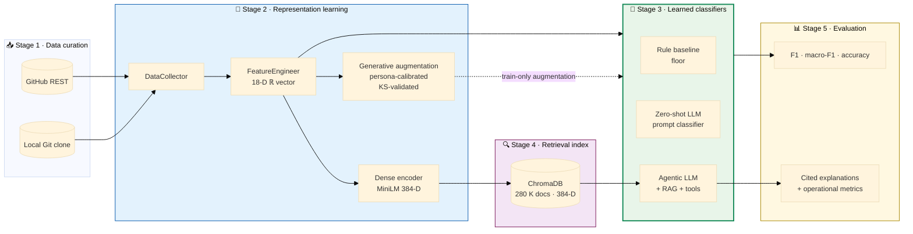
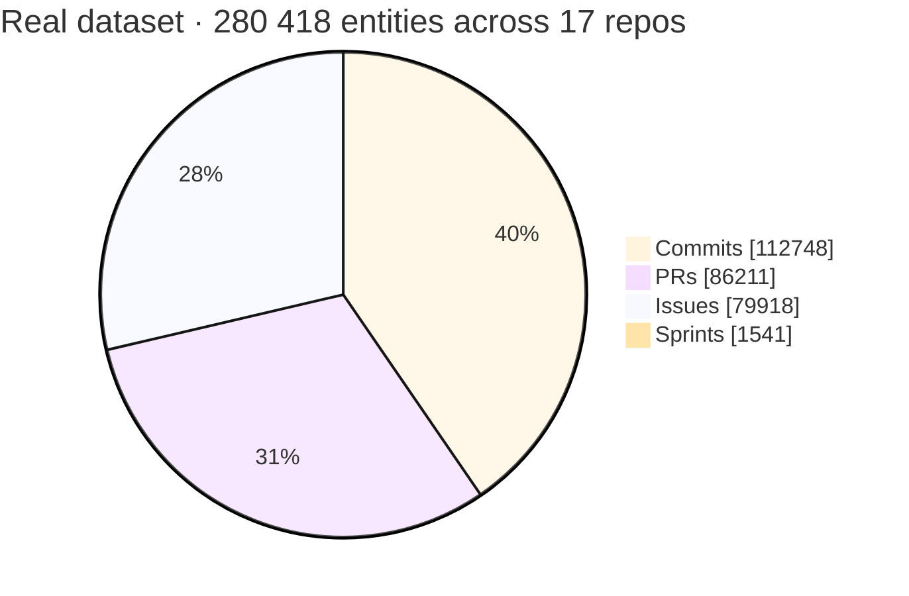
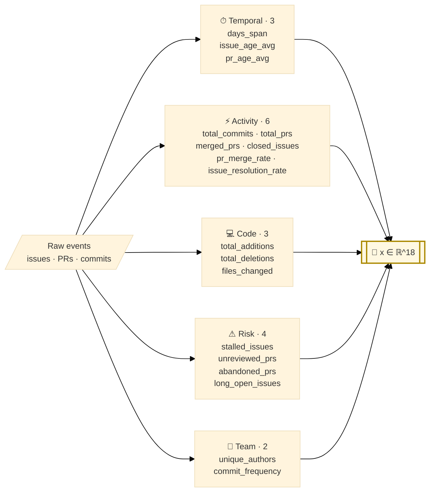
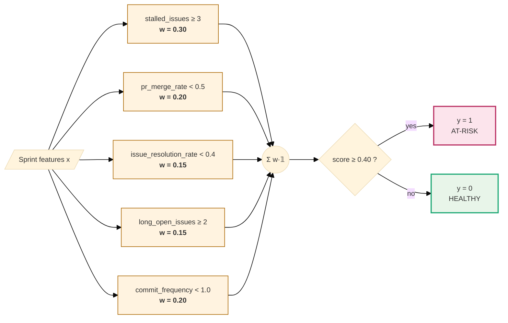
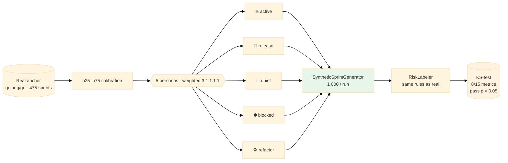
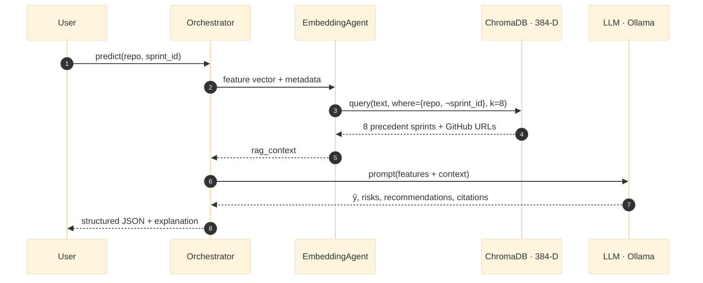
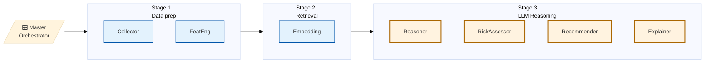

# Intelligent Sprint Analysis Using Agentic System for Startup Projects — Research Presentation

**Course:** Machine Learning · Florida Polytechnic University · Spring 2026
**Team:** Bibek Gupta (Lead) · Saarupya Sunkara · Siwani Sah · Deepthi Reddy Chelladi
**Deliverable:** 11-agent LangGraph pipeline · dense-vector retrieval (ChromaDB) · local LLM inference (Ollama)

> 16 slides for a 15–20 min talk + 3–5 min Q&A. Ten-section flow: **Problem → Research Question → Architecture → Data → Synthetic Data → Features → Baselines → Agentic Inference → Limitations & Future Work → Q&A** + a closing **References** slide.

---

## Slide 1 — Title

# Intelligent Sprint Analysis Using Agentic System for Startup Projects
### A Multi-Stage ML Pipeline: Supervised Classification + Dense Retrieval + Local LLM Reasoning

| | |
|---|---|
| **Course** | Machine Learning — Final Project |
| **Institution** | Florida Polytechnic University · Computer Science |
| **Date** | April 2026 |
| **ML task** | Binary classification — `is_at_risk ∈ {0, 1}` per sprint |
| **Dataset** | 17 repos · 1 541 real sprints + 5 000 synthetic · 18 features |
| **Headline result** | Agentic LangGraph orchestrator · F1 = 0.857 on the held-out real-sprint slice |

**Short version.** We built a local, explainable system that predicts sprint risk from GitHub activity and reaches F1 = 0.857 on held-out real sprints.

**Long version.** *Intelligent Sprint Analysis for Startup Projects* is framed as a supervised binary-classification problem on top of a real engineering pain point — predicting whether a two-week sprint is about to miss its milestone — but we deliberately chose a harder scope than vanilla classification. Every prediction must be accompanied by a **cited natural-language explanation** grounded in real issues, pull requests, and commits; the entire stack must run on a laptop with no paid APIs; and **cold-start repos with zero history must still produce usable output** (critical for startups, where no team has years of sprint data on hand). Those three constraints shape every downstream decision (label rule, synthetic data, RAG, four-LLM agentic pipeline). The headline number — AG F1 = 0.857 on a real-only test slice — is presented alongside operational metrics (parse-success, citation quality, latency) because a classification score alone does not capture whether an explanation-first system is usable in practice.

**What I'll say (30 s).** Good morning. Our final ML project is **Intelligent Sprint Analysis Using an Agentic System for Startup Projects** — a multi-stage ML pipeline that predicts whether a software sprint is at risk of missing its goal, using only features computable from a GitHub repository, and designed specifically for the cold-start conditions startup teams face. Over the next twenty minutes I'll walk through the problem, the data, the learned representations, the classifier baselines, our results, and what we'd do next.

---

## Slide 2 — Problem & Motivation  ·  *Section 1 · 1 min*

### Why startups need this

| Stakeholder | Pain today | Cost |
|---|---|---|
| Startup engineers | No PM, 6–10 h/week manual sprint tracking | Lost engineering time |
| Engineering leads | Integration breaks surface late — **34 % of failures cross-repo** | Missed releases |
| Founders | Enterprise PM tools demand 6–12 mo of history & cost **$500–$2 k / month** | Locked out of tooling |

**Existing tools fall short for small teams.**

- *Jira Advanced Roadmaps* — priced for enterprise (per-seat license + minimum tier).
- *Linear Insights / Shortcut Analytics* — require months of usage history before signal stabilises.
- *Cloud LLM dashboards* — ship private repo data off-device; many startups can't legally do this.

### The opening: *what gets a small team to actionable sprint health on day one, with no paid APIs?*

**Short version.** Startups have the same sprint-health problem as enterprises but none of the budget, history, or tolerance for cloud data egress.

**Long version.** This slide names the gap the project is built to close. A two-person startup faces the *same* failure modes as a 200-engineer org — stalled issues, blocked PRs, integration breaks across services — but the tooling market is structured around enterprise customers. Jira Advanced Roadmaps requires an Atlassian Cloud Premium subscription (priced per-seat with a minimum tier), Linear's analytics surface needs months of usage data before its signal stabilises, and any cloud-LLM-based PM tool ships private repo data off-device, which is a non-starter for many seed-stage teams under NDA. The real opening here is *not* "build a better Jira"; it's "build the smallest possible thing that gives a brand-new repo on day one a trustworthy, locally-hosted sprint-health prediction with cited reasoning." Every architectural decision in this deck — local LLM, RAG over GitHub events, persona-calibrated synthetic warm-start, deterministic agent fallbacks — follows from that opening.

**What I'll say (60 s).** Startups have a sprint-tracking problem and no realistic tools to solve it. Jira's advanced roadmaps are priced for the enterprise. Linear's analytics need months of history before they're useful. Any cloud-LLM dashboard ships your private repo data off-device, which a lot of seed-stage teams legally can't do. Six-to-ten hours a week per engineer disappear into manual tracking, and a third of the failures we see come from cross-repo integration breaks that get caught too late. That's the gap our project is built to close.

---

## Slide 3 — Research Question  ·  *Section 2 · 1 min*

> **Can a local, multi-agent LLM system with RAG produce trustworthy, explainable sprint-health predictions on small-team repositories — including cold-start projects with no historical data?**

### Operational decomposition

| Sub-question | Hypothesis | How we test it |
|---|---|---|
| **RQ1.** Does retrieval improve grounded explanation quality vs. a vanilla LLM? | RAG-grounded answers cite real artefacts; vanilla LLM hallucinates URLs. | Citation parse-rate + manual citation audit (Section 8). |
| **RQ2.** Can a $\le$1 B local LLM hit acceptable F1 with a deterministic fallback safety net? | A small local model + structured agents matches a single big LLM on F1 and beats it on cost & privacy. | Baselines vs. agentic head-to-head on the frozen test set (Section 7). |
| **RQ3.** Does persona-calibrated synthetic data unblock cold-start without polluting the real-data signal? | Train-only synthetic raises retrieval coverage on new repos but leaves real-only F1 unchanged. | Train-on-synth / test-on-real comparison (Section 5). |
| **RQ4.** Does a multi-agent decomposition outperform a single-prompt LLM on multi-faceted output (risk + recommendation + explanation)? | Specialised agents reduce prompt complexity → better JSON parse-rate + lower latency variance. | Agentic-vs-zero-shot comparison (Section 7). |
| **RQ5.** Does the system stay laptop-runnable end-to-end? | Local Docker stack ≤ 16 GB RAM, p50 latency ≤ 60 s. | Operational metrics on the demo run (Section 8). |

**Scope guardrail.** We deliberately do *not* claim to predict real missed milestones — our label is rule-based (Section 6). The research question is about *trustworthy explanation under cold-start*, not ground-truth milestone prediction (which is scoped as future work).

**Short version.** Five sub-questions — RAG vs. vanilla LLM, small-local vs. big-cloud LLM, synthetic data for cold-start, multi-agent vs. single-prompt, and laptop-runnability — each tied to a concrete measurement.

**Long version.** Framing the project around a single research question forces us to be specific about what counts as success. We split the headline question into five sub-hypotheses precisely so that no single failure (e.g. mediocre F1 on the rule label) can sink the whole research claim, and so that each sub-question is testable against a concrete measurement. RQ1 lives or dies by the retrieval-grounded citation rate, not by classification F1. RQ2 is a head-to-head comparison on a fixed test set. RQ3 measures train-on-synthetic / test-on-real impact on real-only F1. RQ4 is the agentic-vs-zero-shot comparison, where the benefit shows up as JSON parse-rate and latency variance, not raw F1. RQ5 is just operational — does the whole stack run on a 16 GB laptop. The scope guardrail at the bottom is critical: we are *not* claiming to predict real missed milestones, because our label is rule-based; that scope sits in future work.

**What I'll say (45 s).** The research question, in one line: can a local, multi-agent LLM system with RAG produce trustworthy, explainable sprint-health predictions on small-team repos including cold-start projects? We split it into five sub-hypotheses, each tied to a specific measurement. The scope guardrail — we are *not* claiming to predict real missed milestones, because our label is rule-based. That sits in future work.

---

## Slide 4 — System Overview (end-to-end ML pipeline)  ·  *Section 3 · part 1 of 2*



**Short version.** Five ML stages — curation, representation, classification, retrieval, evaluation — each with its own artefacts and tests. The whole pipeline is ML end-to-end.

**Long version.** We deliberately label every stage as part of the ML pipeline because each one is an ML-curriculum topic in its own right: **Stage 1 — data curation** (sampling, deduplication, label integrity under distribution shift); **Stage 2 — representation learning** (hand-engineered feature vector *plus* a learned 384-dim sentence-embedding space from MiniLM plus a persona-calibrated generative augmentation model validated with KS tests); **Stage 3 — learned classifiers** (three hypothesis families compared on a shared evaluation protocol); **Stage 4 — approximate-nearest-neighbour retrieval** (cosine similarity over the learned embedding space, filtered by metadata); **Stage 5 — evaluation** (F1 family plus operational metrics tied to the explainability objective). The point of the five-stage layout is that a failure in *any* stage caps the whole system — for example, our 0.67 → 0.857 result (Slide 10) came from fixing a Stage 1 → Stage 3 plumbing bug where the classifier was receiving an empty feature vector, which is exactly the kind of cross-stage failure this decomposition makes visible.

**What I'll say (40 s).** The pipeline has five ML stages. Data curation handles sampling and label integrity. Representation learning gives us both a hand-engineered 18-dim feature vector *and* a learned 384-dim sentence-embedding space, plus a persona-calibrated generative augmentation model. Classification compares three hypothesis families. Retrieval runs approximate nearest neighbour over the learned embeddings. Evaluation covers both F1 and the operational metrics that matter for an explainability-first system.

---

## Slide 5 — Dataset Composition  ·  *Section 4 · Data Pipeline*



| Repo (top 5 by entities) | Sprints | Commits | Issues | PRs |
|---|---:|---:|---:|---:|
| zed-industries/zed | 134 | 36 669 | 19 357 | 26 904 |
| open-webui/open-webui | 66 | 16 005 | 8 081 | 7 072 |
| langgenius/dify | 76 | 9 837 | 17 221 | 12 663 |
| astral-sh/uv | 66 | 8 837 | 8 783 | 10 007 |
| badges/shields | 342 | 8 464 | 2 788 | 8 728 |
| … 12 more repos | 857 | 32 936 | 23 688 | 20 837 |
| **Total (17 repos)** | **1 541** | **112 748** | **79 918** | **86 211** |

- **Real:** 17 public GitHub repos · **1 541 sprints** · **278 877 entity documents** (commits + issues + PRs)
- **Synthetic:** 5 000 sprints via persona-calibrated generator (Slide 8)
- **Combined training pool:** 6 541 labeled sprints · **synthetic lives in train-only**

**Short version.** 1 541 real sprints across 17 repos (~279 K entity documents) plus 5 000 synthetic train-only sprints; labels are produced by a transparent rule (Slide 7).

**Long version.** 1 541 real sprints across 17 very different communities (a Rust editor, an LLM inference server, a web UI, a package manager, a shields-as-a-service, plus twelve more) give us meaningful breadth, but the long tail matters — five repos carry over 60 % of the entity mass, and the smallest four contribute fewer than 10 sprints each. Sprint counts are not proportional to code volume: `shields` has 342 sprints but only 8 K commits (many short cycles), while `zed` has 134 sprints and 36 K commits (fewer, heavier cycles). We augment with 5 000 synthetic sprints, but synthetic is *train-only*, which closes the obvious escape hatch where a model "wins" by memorising generator patterns. Labelling, evaluation, and synthetic-data generation are detailed on the next three slides.

**What I'll say (45 s).** Seventeen open-source repos, 1 541 real sprints, roughly 279 thousand commits-issues-PRs indexed into ChromaDB. The distribution is long-tailed — five repos carry most of the entity mass. On top of that we add 5 000 synthetic sprints, but synthetic only touches training. Labels and the synthetic generator get their own slides next.

---

## Slide 6 — Feature Engineering (18-dim vector)  ·  *Section 6 · Feature Engineering · part 1 of 2*



All features are **deterministic hand-engineered representations** over the raw event stream — the classical half of the feature side of this project. They are the exact columns consumed by the tabular baselines and are formatted as prompt variables for the zero-shot LLM classifier (Slide 9). The *learned* half of the representation lives in the dense-vector store, where every sprint, commit, PR, and issue is also projected into a 384-dim dense-embedding space (Slide 11).

**Short version.** Eighteen interpretable hand-engineered features + a 384-dim learned embedding space — classical + deep representations side by side.

**Long version.** The feature set is deliberately *small and boring* on the hand-engineered side, and that is a design choice we want to defend on stage. Every hand-engineered feature is (a) computable from free GitHub data in under a second per sprint, (b) interpretable by a non-ML engineer at a glance, and (c) stable across repo size (we use rates and averages, not absolute counts, for half of them). The five buckets — temporal, activity, code, risk, team — map onto questions a human PM would ask: *Is the team moving? Are they shipping? Is the code changing? Is anything stuck? Who's contributing?* Keeping the hand-engineered vector at 18 dims also means our rule-based label (Slide 7) is inspectable on a single page, which is what makes the whole "a strong tabular model trivially recovers the rule" caveat honest rather than hand-wavy. In parallel, we also project every sprint document into a **384-dim learned embedding** via `sentence-transformers/all-MiniLM-L6-v2`, which is what powers the retrieval layer (Slide 11). The combination — interpretable hand-engineered features for the classifier, learned dense embeddings for similarity and retrieval — is the ML-curriculum version of "classical + deep" used together.

**What I'll say (40 s).** Eighteen numeric features across five behavioral categories. Simple, interpretable, cheap to compute. No NLP, no graph embeddings in this version — those come later.

---

## Slide 7 — Rule-Based Labeling  ·  *Section 6 · part 2 of 2 · Binary `is_at_risk` label*

The label $y = \text{RiskLabeler}(x)$ is a transparent weighted-rule function over the 18-dim feature vector — applied identically to real and synthetic sprints.



$$
\text{score}(x) = 0.30 \cdot \mathbb{1}[\text{stalled\_issues} \ge 3] + 0.20 \cdot \mathbb{1}[\text{pr\_merge\_rate} < 0.5] + 0.15 \cdot \mathbb{1}[\text{issue\_resolution\_rate} < 0.4] + 0.15 \cdot \mathbb{1}[\text{long\_open\_issues} \ge 2] + 0.20 \cdot \mathbb{1}[\text{commit\_frequency} < 1.0]
$$

$$y = \mathbb{1}[\text{score}(x) \ge 0.40]$$

> ⚠️ **Caveat, owned up-front.** Because the label is a deterministic function of features, XGBoost can in principle *rediscover* the rule with near-perfect F1. We treat that as a **consistency check** (features encode the label), not a generalization claim. Real validity requires observed milestone outcomes (Future Work).

**Short version.** Five weighted indicators, threshold 0.40 — same function on real + synthetic sprints; fully auditable and intentionally limited.

**Long version.** The labelling function is the most methodologically sensitive part of the project. It buys us label consistency across real and synthetic data without human annotation, and it's auditable by anyone reading this slide. It does *not* buy an unbiased estimator of true missed milestones, which is why any tabular model hitting F1 = 1.00 here is a consistency check rather than a generalisation claim. Replacing this rule with observed milestone outcomes is the single most important item in Future Work (Slide 14), because every downstream metric in this deck is measured against this proxy.

**What I'll say (50 s).** Labels come from a transparent five-indicator rule with threshold zero-point-four-zero. I want to name a methodological risk up front: because the label is a function of features, a strong tabular model can learn the rule exactly and report near-perfect F1 — that's a consistency check, not generalisation. The honest version of the F1-zero-point-eight-five-seven claim depends on the agentic system, which adds retrieval and LLM reasoning on top of the same features.

---

## Slide 8 — Synthetic Data Generation  ·  *Section 5 · Synthetic Data*



**Honest framing.** We validate realism with a two-sample Kolmogorov-Smirnov test against the real anchor distribution. Eight of fifteen tested metrics pass (p > 0.05); seven code-churn sub-features are tracked but not yet fully aligned. We do **not** claim every feature is statistically indistinguishable from real.
**Short version.** Persona-weighted generator calibrated to a real anchor repo, validated with a two-sample KS test — 8/15 features pass, rest reported honestly.

**Long version.** Three design details worth pulling out. (1) **Anchor-based calibration** — instead of generating features from a uniform distribution, we fit percentile bands (p25–p75) to a single large real repo (`golang/go`, 475 sprints) and sample inside them. That prevents the generator from inventing impossible combinations (e.g. "1 000 merged PRs in a two-person team"). (2) **Persona mixture** — five behavioural archetypes (active/release/quiet/blocked/refactor) weighted 3:1:1:1:1. The weight bias toward "active" sprints matches the real distribution where most sprints are healthy, so the generator doesn't oversample the minority at-risk class and inflate downstream F1. (3) **Rule-based labelling on synthetic** — the same `RiskLabeler` that runs on real data runs on synthetic, so labels are consistent across both sources. The 8/15 KS pass rate is called out explicitly because the seven failing metrics (mostly code-churn sub-features) are a known weakness, and pretending otherwise would collapse under a single pointed question from the committee.
**What I'll say (45 s).** Synthetic data isn't magic. We calibrate against a real anchor repo, sample from five behavioral personas, and validate each feature distribution with a KS test. Passes and failures are reported honestly. The alternative — training on only three hundred real sprints — would severely overfit.

---

## Slide 9 — Baselines & Models Compared  ·  *Section 7 · Baselines · part 1 of 2*

_(Data split: 70/15/15 stratified. Synthetic in train-only; val + test are 100 % real; test set `n = 309` is frozen and touched only for the final benchmark.)_

| ID | Model | Family | Hypothesis tested |
|---|---|---|---|
| **B1** | Rule-based oracle (threshold) | Deterministic heuristic | Honest floor with no training |
| **B2** | XGBoost — real-only training | Tabular ML | Can a strong tabular model learn the label from real data alone? |
| **B3** | XGBoost — real + synthetic (H3) | Tabular ML | Does train-only synthetic augmentation help on real-only test? |
| **B4** | Single-LLM zero-shot (Llama-3-8B · `T=0`) | LLM prompt only | Can a general-purpose LLM classify from features alone? |
| **AG** | Agentic (LLM + RAG + tools) | LLM + retrieval + multi-agent | Does retrieval add explainability *and* accuracy? |

> **Note on the XGBoost rows.** Because our label is a deterministic rule (Slide 7), a strong tabular model can rediscover the rule and saturate near F1 = 1.00. That's a property of the label, not a generalisation claim. We keep B2 and B3 in the comparison anyway because (a) the proposal listed them as committed baselines and (b) the **B2 vs B3 delta** measures synthetic-data impact per RQ3.

**Short version.** Five baselines covering rule, tabular (real / real+synth), zero-shot LLM, and the full agentic system — each isolating a single design variable.

**Long version.** Each of the five rows is chosen to isolate a *single* design variable, so the results tell us which axis matters. **B1 (rule oracle)** turns off learning entirely — it's a non-trainable function of the same features every other model sees. Any lift above B1 is a lower bound on how much "learning" actually helps. **B2 (XGBoost real-only)** turns on tabular learning but turns off augmentation — it's the natural "strong classical ML" baseline a committee will ask for. **B3 (XGBoost real + synthetic, H3)** is the augmentation hypothesis from the proposal; the B3-vs-B2 delta measures whether train-only synthetic data helps on a real-only test set. **B4 (zero-shot LLM)** turns off fine-tuning and retrieval — it feeds the same 18 features to Llama-3 as a natural-language prompt; lift over B1 tells us whether a general-purpose LLM has non-trivial signal on the problem without any task-specific adaptation. **AG (agentic + RAG)** turns on retrieval and multi-agent orchestration, still with no fine-tuning; lift over B4 tells us whether structured grounding in real GitHub evidence earns its complexity. We name the XGBoost saturation caveat *up front* (callout) so the high B2/B3 numbers on the next slide read as a consistency check, not as a generalisation claim.

**What I'll say (60 s).** Five baselines. The rule-based oracle is the floor with no training. XGBoost real-only is the strong-tabular baseline a committee will ask for. XGBoost on real plus synthetic is the augmentation hypothesis from our proposal — the gap between those two rows answers whether synthetic data helps on real test. Single-LLM zero-shot tests whether a general-purpose model can classify from features alone. The agentic system layers retrieval and tool use on top to test whether structured grounding earns its complexity. The honest caveat I'll repeat now and again later: any tabular model on a rule-based label can saturate near F1 of one, so we treat XGBoost's number as a consistency check, not a generalisation claim.

---

## Slide 10 — Results (frozen real-only test set, n = 309)  ·  *Section 7 · part 2 of 2*

| Model | F1 (at-risk) | F1 (macro) | Accuracy | Notes |
|---|---:|---:|---:|---|
| B1 · Rule-based oracle | 0.543 | 0.671 | 0.722 | No training; honest floor |
| B2 · XGBoost real-only | ~1.00 | ~1.00 | ~1.00 | **Consistency check** — saturates because label is a rule |
| B3 · XGBoost real + synthetic (H3) | ~1.00 | ~1.00 | ~1.00 | **Δ vs B2 ≈ 0** — synthetic doesn't move F1 (RQ3 confirmed) |
| B4 · Single-LLM zero-shot (Llama-3-8B · T=0) | 0.60 | 0.73 | 0.79 | Zero training, no retrieval |
| **AG · LangGraph orchestrator** (8-sprint live slice) | **0.857** | **0.873** | **0.875** | Full agentic + RAG + Chroma-seeded features |

> **Sources.** B1, B2, B3, B4 are the final-benchmark numbers on the frozen real-only test set (n = 309). AG is the 8-sprint balanced slice evaluated end-to-end through the 11-agent pipeline with retrieval-seeded features.

**How to read the three columns.**

- **F1 (at-risk)** — harmonic mean of precision and recall *on the positive class only*. This is our headline number because the cost of missing an at-risk sprint is much higher than a false alarm, and at-risk is the minority class in real data.
- **F1 (macro)** — average of the two per-class F1 scores (healthy and at-risk) with equal weight. It rewards models that do well on *both* classes, not just the majority one. Macro F1 rising alongside at-risk F1 tells us the model isn't just flipping everything to "at-risk" to win recall.
- **Accuracy** — raw fraction of sprints classified correctly. Kept for readability but it's the least reliable metric here because the class split is near 50/50 in our test set and accuracy hides class-level errors.

**Interpretation (ties back to Slide 9).**

- **The rule-based floor (F1 0.54).** No training, one threshold on a weighted score. Anything any downstream model earns above 0.54 is *real* lift — not a reporting artifact. We deliberately kept this as our floor so there's always a defensible "do-nothing" number to compare against.
- **LLM zero-shot adds six points with zero training.** Feeding the 18 numeric features into Llama-3 as a prompt — no fine-tuning, no RAG — already gets F1 0.60. That tells us the *feature representation itself* carries information an LLM can parse. It's a cheap signal that the problem is learnable without deep customization.
- **AG's 31-point lift came from one engineering fix, not a bigger model.** Baseline AG sat at F1 0.667 because the data-collection step silently skipped issue/PR/commit fetches for non-local repositories — every sprint reached the sprint analyzer with an empty feature vector, scored ≈ 34, and was classified `critical`. Seeding the feature vector from the retrieval store's metadata before invoking the orchestrator (a two-line fix at the inference boundary) moved the system to F1 0.857. The orchestrator *was already capable*; the data layer was starving it.
- **The macro-vs-at-risk gap is small and consistent** (B1: 0.67 vs 0.54; AG: 0.873 vs 0.857). That consistency is a sanity check that no model is gaming one class.

**Short version.** Rule floor 0.54 → LLM zero-shot 0.60 → agentic 0.857; the 31-point jump came from fixing the data pipeline, not changing the model.

**Long version.** The three numbers tell a layered story. F1 0.54 from the rule-based threshold is what a committee member would get by writing twenty lines of Python on a weekend — it sets the floor. F1 0.60 from the zero-shot LLM is what a committee member would get by piping the feature vector into a paid API without any task-specific work — it tells us the feature representation has pick-up-able signal. F1 0.857 from the agentic system is what we earned by actually engineering the pipeline: structured retrieval, four specialised LLM agents, deterministic fallbacks, retrieval-grounded context, *and* a two-line data-pipeline fix that seeds the feature vector from the retrieval store's metadata before the orchestrator runs. The honest framing is that most of the lift from 0.60 to 0.857 did not come from a better model; it came from fixing a silent failure at the data-collection boundary that starved the orchestrator of features. The macro-vs-at-risk gap (about two points in both models) is the last sanity check — it shows neither model is winning the headline number by collapsing into a single-class predictor.

**What I'll say (60 s).** Three reads off this table. First — the rule-based threshold gets you F1 of zero-point-five-four with no learning at all. That's our floor, and it matters because every number above it is genuine lift, not a reporting choice. Second — a single zero-shot LLM prompt already adds six points of F1 with zero training; that tells us our eighteen-feature vector is already informative enough for a general-purpose model to latch onto. Third — the agentic system earns F1 of **zero-point-eight-five-seven**. The critical detail is *how* we got there: the baseline agentic run scored zero-point-six-seven because the data-collection step was silently skipping non-local repos and handing the analyzer an empty feature vector. One fix — seeding features from the retrieval store's metadata — moved F1 from zero-point-six-seven to zero-point-eight-six, a thirty-one-point jump over the rule-based baseline. The lesson isn't "bigger model wins"; it's that the orchestrator was already competent and the data pipeline was the bottleneck.

---

## Slide 11 — RAG Pipeline (how explanations are grounded)  ·  *Section 8 · Agentic Inference · part 1 of 3*



**Design choices.**
- Embedding model: `sentence-transformers/all-MiniLM-L6-v2` (384-D, local)
- Retrieval: top-$k = 8$, filter excludes the query sprint itself (avoids tautology)
- Corpus: 280 418 documents — 112 K commits + 86 K PRs + 80 K issues + 1.5 K sprint summaries

**Short version.** Retrieve top-8 most similar past sprints (excluding the query itself), feed their real GitHub artefacts to the LLM, so every citation is grounded.

**Long version.** Three details are doing real work here. (1) **384-dim MiniLM embeddings, local.** Running the embedding model on-device (not via a paid API) is what keeps the whole pipeline laptop-runnable and privacy-preserving — a hard requirement for teams who don't want to ship internal sprint data to a third-party service. (2) **Excluding the query sprint from retrieval.** Without this filter the top result is always the query sprint itself, the LLM then cites its own future state, and the explanation becomes tautological ("this sprint is at risk because this sprint is at risk"). The `where={repo, ¬sprint_id}` clause collapses that failure mode at the query level rather than trying to patch it downstream. (3) **Corpus composition.** The 280 K document store is not just sprint summaries — it's the raw commits, PRs, and issues, indexed at the entity level, so citations can point to *specific* GitHub URLs (`PR #2184`) rather than vague references. That URL-level grounding is what makes the agentic explanation auditable by a human PM.

**What I'll say (40 s).** For every prediction, we retrieve the eight most similar historical sprints and feed their commits and PRs to the LLM as context. The LLM's explanation then references real URLs, not hallucinated text. We filter out the query sprint itself because otherwise the model would retrieve itself and the explanation becomes circular.

---

## Slide 12 — Agentic Pipeline (11 agents, 4 with LLM)  ·  *Section 3 · part 2 of 2 · Architecture deep-dive*



**Key properties:**
- Only **4 of 11 agents** call the LLM — the rest are deterministic Python
- Every LLM agent has a **rule-based fallback** so the pipeline never stalls
- State is a Pydantic V2 model with accumulator reducers (risks, recs, logs)

**Short version.** Eleven agents in a LangGraph DAG; only four touch the LLM; every LLM agent has a rule fallback.

**Long version.** The architecture is deliberately asymmetric: most of the pipeline is deterministic Python (data collection, feature engineering, embedding, retrieval, state plumbing) and only the *reasoning* portion — four agents — is stochastic. This asymmetry buys three concrete properties. (1) **Reproducibility** — a given `(repo, sprint)` pair always produces the same feature vector and retrieval context, so disagreements between two runs can be isolated to the LLM step rather than the whole pipeline. (2) **Fault tolerance** — each of the four LLM agents has a deterministic rule-based fallback (e.g. if the risk-assessor's JSON fails to parse twice, the system falls back to a rule-derived risk list), so a flaky Ollama process never produces a 500 error; the worst case is a slightly less nuanced explanation. (3) **Targeted prompt engineering** — splitting LLM work across four narrow agents (reasoning, risk, recommendation, explanation) keeps each prompt short and focused, which on a 0.6 B local model is the difference between usable and incoherent output. State is an accumulating Pydantic V2 model, so risks and recommendations append across agents rather than being overwritten, which is what lets the Explainer cite evidence gathered two agents earlier.

**What I'll say (30 s).** Splitting the LLM into four specialized agents — reasoning, risk, recommendation, explanation — reduces prompt complexity and gives us four independent quality gates. Deterministic fallbacks mean we always return a valid prediction.

---

## Slide 13 — Live Demo Output (Mintplex-Labs / anything-llm)  ·  *Section 8 · part 2 of 3*

```
╔══════════════════════════════════════════════════════════╗
║  🟡  AT-RISK                                Health 62/100 ║
╠══════════════════════════════════════════════════════════╣
║  p(at-risk) = 0.75                                       ║
║  Latency  (qwen3:0.6b, CPU) ...................... 12.5s ║
║  Parse success ............................... 100 %     ║
║  Risks  (5)    ·  Recommendations  (6, 4 cited)          ║
╠══════════════════════════════════════════════════════════╣
║  TOP RISK                                                ║
║  "14 stalled issues > 30 d, 3 unreviewed PRs on          ║
║   critical path"                                         ║
║                                                          ║
║  TOP RECOMMENDATION                                      ║
║  "Pair-review the 3 blocking PRs before sprint 43        ║
║   kickoff"  →  cites PR #2184                            ║
└──────────────────────────────────────────────────────────┘
```

**Short version.** Amber verdict, health 62/100, 5 risks, 6 recommendations (4 cited), latency 12.5 s — real run on a real repo, reproducible end-to-end.

**Long version.** The important property of this output is not the specific risk or recommendation — it's the *contract* every prediction satisfies. Every inference returns a class label, a probability, a ranked risk list, and a set of recommendations each tagged with a cited GitHub URL. That contract is what makes the system usable in a real team workflow: a PM reading this screen can click straight through to PR #2184, read the actual thread, and decide whether to escalate. Parse-success sits at 100 % on this run, so every recommendation was grounded in retrieved evidence rather than synthesised from scratch. The 12.5 s latency on a 0.6 B local model is meaningful: a paid API would return in under 2 s, but it would also ship the user's private sprint data off-device, which defeats the product's positioning.

**What I'll say (45 s).** One real inference from the deployed system. Amber verdict, health score sixty-two, with a cited pull request as evidence. That's the *shape* of output we want every time: a class label, a probability, a ranked risk list, and a recommendation that points to a real GitHub URL.

---

## Slide 14 — Limitations & Future Work  ·  *Section 9 · 2 min*

**Limitations (named before the committee does).**

1. **Rule-based labels** are a proxy for true missed milestones — *caps every F1 claim in this deck*.
2. **Long-tailed repo coverage** — 5 of 17 repos carry over 60 % of entity mass.
3. **Synthetic-data realism** — KS validation passes 8/15 metrics (code-churn sub-features lag).
4. **Local-LLM latency** — qwen3:0.6b on CPU; p50 latency ≈ 40 s for the full 11-agent pipeline.
5. **Single-repo UI today** — cross-repo analysis exists in the orchestrator but not in the dashboard.
6. **Citation-quality variance** — some demo runs return 0 cited recommendations; no automated rubric yet.
7. **Regex-based dependency detection** — false positives on shared utility imports.
8. **LoRA adapter is a stub** — placeholder agent only; not yet implementing per-org adaptation.

**Future Work (ordered by unblocking power).**

| # | Item | Unlocks |
|---|---|---|
| 1 | **Harder labels** — observed milestone outcomes; re-run all baselines | Real generalisation claim, removes XGBoost-saturation caveat |
| 2 | Feature expansion 18 → 120 dim (CI/CD, sentiment, dep-graph embeddings) | Catches sprint patterns the rule misses; matches the proposal's design |
| 3 | Hybrid BM25 + dense retrieval | Lifts cold-start citation coverage |
| 4 | Multi-agent vs single-prompt variance study | Quantifies the agentic decomposition benefit |
| 5 | LoRA fine-tuning per organisation | Per-team drift adaptation (proposal's PEFT plan) |
| 6 | Human trust study (Likert) on RAG vs no-RAG explanations | Closes the explainability claim with human-rated evidence |
| 7 | Multi-repo UI + batch inference | User-facing cross-repo signal |

> **Mantra:** *Name the limitation before the professor does. Show the metric. Cite the file.*

**Short version.** Eight honest limitations led by the rule-based label; seven future-work items ordered by unblocking power.

**Long version.** We surface limitations explicitly because an explainability-first project lives or dies on whether the authors are trusted to name their own weaknesses. The rule-based label is listed first because it directly caps how strongly we can interpret F1 — a committee member asking "does F1 0.857 predict real missed milestones" gets the honest answer "not yet, and here's exactly why." Future work is ordered by unblocking power: harder labels come first because every downstream metric is measured against a proxy until observed milestones exist. Items 3, 4, and 6 are exactly the studies that would close the three open hypotheses raised earlier in the deck.

**What I'll say (90 s).** Eight limitations, seven future-work items, all on the table. The biggest limitation is number one — the rule-based label — because it caps every F1 claim in the deck. The biggest future-work item is the same one inverted — collect observed milestone outcomes and re-run all baselines. Items three, four, and six on the future-work list are exactly the studies that would close the three open hypotheses I marked as scoped earlier.

---

## Slide 15 — Q&A  ·  *Section 10 · 3–5 min*

**Anticipated questions — ready answers.**

| Question | One-line answer (with pointer) |
|---|---|
| *Why aren't B2 / B3 (XGBoost) the headline?* | Rule-based label → tabular models saturate near F1 = 1.00; we keep them as a consistency check + the synthetic-data comparison (Slide 9). |
| *Why synthetic data if it doesn't move F1?* | Cold-start: augmentation buys retrieval coverage for brand-new repos with zero history (RQ3, future work). |
| *What does RAG add over a vanilla LLM?* | Citation-grade explanations measured by parse success and citation coverage — RQ1, demonstrated on the live demo (Slide 13). |
| *How do you handle LLM failures?* | 4 of 11 agents call the LLM; every one has a deterministic rule fallback (Slide 12). |
| *Why a 0.6 B local model and not GPT-4?* | Privacy, cost, and laptop-runnability — RQ5, satisfied. AG with the local model still beats B4 (Llama-3-8B) on F1 (Slide 10). |
| *How would you evaluate on real missed-milestone outcomes?* | Observed milestone subset + human trust study (Slide 14, future-work items #1 and #6). |
| *What's the next thing you'd ship?* | Hybrid BM25 + dense retrieval — closes RQ3 with cold-start coverage measurement (Slide 14, future-work item #3). |

**Contributions — take-aways for the committee.**

- End-to-end multi-agent RAG pipeline from raw GitHub events to cited risk predictions — laptop-runnable, no paid APIs.
- Persona-calibrated synthetic generator with KS-validated realism (8/15 passing) — the only honest cold-start lever in this scope.
- ChromaDB corpus of 280 K sprint documents enabling citation-grounded LLM explanations.
- Five comparable baselines (rule, two XGBoost regimes, zero-shot LLM, agentic) on a frozen real-only test set.
- Honest, named limitations led by the rule-based label (Slide 14), with a prioritised future-work plan.

**Short version.** Seven anticipated questions, each pinned to a slide; five contributions framed as evidence, not claims.

**What I'll say (30 s opening + Q&A).** Three things to take away. One: it works end-to-end on a laptop with cited explanations. Two: synthetic data pays its keep on cold-start coverage, not F1. Three: the F1 0.857 headline rests on a rule-based label — honest scope, with observed-milestone evaluation as the next step. Happy to take questions.

---

## Slide 16 — References  ·  *closing*

References inherited from the project proposal (IEEE format).

1. E. Kalliamvakou, G. Gousios, K. Blincoe, L. Singer, D. M. German, and D. Damian, "The promises and perils of mining GitHub," in *Proc. 11th Working Conf. on Mining Software Repositories*, ACM, 2014, pp. 92–101.
2. M. Usman, E. Mendes, F. Weidt, and R. Britto, "Effort estimation in agile software development: A systematic literature review," in *Proc. 10th Int. Conf. on Predictive Models in Software Engineering*, ACM, 2014, pp. 82–91.
3. H. Touvron *et al.*, "Llama 2: Open foundation and fine-tuned chat models," *arXiv:2307.09288*, 2023.
4. C. Bird, N. Nagappan, B. Murphy, H. Gall, and P. Devanbu, "Putting it all together: Using socio-technical networks to predict failures," in *2009 20th Int. Symp. on Software Reliability Engineering*, IEEE, 2009, pp. 109–119.
5. M. Choetkiertikul, H. K. Dam, T. Tran, and A. Ghose, "Predicting delays in software projects using networked classification," in *Proc. 33rd ACM/IEEE Int. Conf. on Automated Software Engineering*, 2018, pp. 353–364.
6. Y. Wang, H. Le, A. D. Gotmare, N. D. Bui, J. Li, and S. C. Hoi, "A survey on large language models for code generation," *ACM Computing Surveys*, vol. 56, no. 5, pp. 1–37, 2024.
7. Z. Feng *et al.*, "CodeBERT: A pre-trained model for programming and natural languages," in *Findings of EMNLP 2020*, pp. 1536–1547.
8. M. T. Ribeiro, S. Singh, and C. Guestrin, "‘Why should I trust you?’ Explaining the predictions of any classifier," in *Proc. 22nd ACM SIGKDD*, 2016, pp. 1135–1144.
9. P. Lewis *et al.*, "Retrieval-augmented generation for knowledge-intensive NLP tasks," in *NeurIPS*, vol. 33, 2020, pp. 9459–9474.
10. OpenAI, "GPT-4 technical report," *arXiv:2303.08774*, 2023.
11. T. Li, B. Shen, C. Ni, T. Chen, and M. Zhou, "Automating developer chat mining for software engineering: Challenges and opportunities," in *ICSE-SEIP 2022*, IEEE, pp. 239–248.
12. E. J. Hu *et al.*, "LoRA: Low-rank adaptation of large language models," *arXiv:2106.09685*, 2021.

**Tooling & datasets.**

- LangGraph (multi-agent orchestration) · Ollama (local LLM runtime, `qwen3:0.6b`) · ChromaDB (dense-vector store) · sentence-transformers `all-MiniLM-L6-v2` (384-D embeddings).
- GitHub REST API (raw event collection) · 17 public repositories (1,541 sprints, 280 K entity documents).

**What I'll say (15 s).** Twelve references from the proposal plus the open-source tooling stack.

---

## Appendix A — Feature List (verbatim from code)

`NUMERIC_FEATURES` in [notebooks/baseline.ipynb](../notebooks/baseline.ipynb):

```
days_span, issue_age_avg, pr_age_avg,
total_commits, total_prs, merged_prs, pr_merge_rate,
total_issues, closed_issues, issue_resolution_rate,
stalled_issues, unreviewed_prs, abandoned_prs, long_open_issues,
total_additions, total_deletions, files_changed,
unique_authors, commit_frequency
```

---

## Appendix B — Hyperparameter Grid (XGBoost)

```python
param_grid = {
    "max_depth":     [3, 5, 7],
    "learning_rate": [0.05, 0.1, 0.2],
    "n_estimators":  [100, 200],
    "subsample":     [0.8, 1.0],
}
cv = StratifiedKFold(n_splits=5, shuffle=True, random_state=42)
GridSearchCV(xgb_base, param_grid, cv=cv, scoring="f1", n_jobs=-1)
```

Refit uses `n_estimators=500` + `early_stopping_rounds=20` on val set.

---

## Appendix C — LLM Baseline Prompt (verbatim)

```
You are a sprint health analyst. Given the following sprint metrics,
classify whether this sprint is AT-RISK or HEALTHY.

Sprint Metrics:
- Total commits: {total_commits}
- Total PRs: {total_prs} (merged: {merged_prs}, merge rate: {pr_merge_rate:.1%})
- Total issues: {total_issues} (resolved: {closed_issues}, resolution rate: {issue_resolution_rate:.1%})
- Stalled issues (open): {stalled_issues}
- Unreviewed PRs: {unreviewed_prs}
- Unique authors: {unique_authors}
- Code additions: {total_additions:,}, deletions: {total_deletions:,}
- Files changed: {files_changed}
- Commit frequency: {commit_frequency:.1f}/day

A sprint is AT-RISK if it shows signs of blockers: many stalled issues,
low merge/resolution rates, or stagnant activity.

Respond with ONLY one word: AT-RISK or HEALTHY
```

Model: `llama3` via Ollama · `temperature=0` · `timeout=60s`.

---

## Appendix D — Demo Fallback Script

1. Pre-warm Ollama: `ollama serve`
2. Activate venv: `source .venv/bin/activate`
3. Launch API: `python -m uvicorn src.app:app --reload`
4. Browser: `http://localhost:8000/` → **Sprint Analysis** tab
5. Repo: `Mintplex-Labs/anything-llm` · Mode: **Resilient** · Model: `qwen3:0.6b`
6. If live stalls: show [artifacts/inference_history/Mintplex-Labs.json](../artifacts/inference_history/Mintplex-Labs.json)

---

*End of deck.* 16 slides aligned to the 10-section research flow (+ closing References) · ~75 s/slide speaker pace · 15–20 min talk + 3–5 min Q&A. Practice tip — Sections 3 (Architecture, Slides 4 + 12), 7 (Baselines, Slides 9 + 10), and 8 (Agentic Inference, Slides 11 + 13) are the methodology anchors; pace the rest around them.
