# Project Overview & Architecture Diagrams
# Lightweight Sprint Intelligence for Small Startups

**Visual Guide to System Components**  
**Target**: 2-3 Repository Startups | 16GB RAM Laptops | <10 Min Setup

---

## 📊 High-Level System Overview

```mermaid
graph TB
    subgraph "External Data Sources"
        GH[GitHub API<br/>2-3 Repos<br/>50-200 events/day]
        SYNTH[Synthetic Data<br/>Pre-generated scenarios<br/>Bootstrap training]
    end
    
    subgraph "Data Collection Layer"
        COLL[Lightweight Collector<br/>Real-time + Batch<br/>Minimal overhead]
    end
    
    subgraph "Multi-Modal Feature Engineering"
        CODE[Code Features<br/>Churn, Complexity<br/>Cross-repo imports (2-3 repos)]
        TEXT[Text Features<br/>Issue/PR semantics<br/>NLP embeddings]
        TEMP[Temporal Features<br/>Velocity, Trends<br/>Sprint patterns]
        GRAPH[Dependency Graph<br/>2-3 repo DAG<br/>Blocker chains]
        SENT[Sentiment<br/>Comment tone<br/>Small team morale]
        CICD[CI/CD Metrics<br/>Test pass rate<br/>Build times]
    end
    
    subgraph "AI/ML Processing (16GB RAM)"
        EMBED[Embedding Agent<br/>Sentence-BERT<br/>~500MB]
        FUSE[Feature Engineer<br/>Multi-Modal Fusion<br/>~1GB]
        LLM[LLM Reasoning<br/>Llama-3-8B Q4<br/>~5GB RAM]
        RAG[RAG Module<br/>ChromaDB Local<br/>~1GB]
    end
    
    subgraph "Analysis & Decision"
        SPRINT[Sprint Analyzer<br/>Health Score]
        RISK[Risk Assessor<br/>Blocker Detection]
        REC[Recommender<br/>Actionable Suggestions]
        EXPL[Explainer<br/>Evidence-Based Reasoning]
    end
    
    subgraph "Storage (Lightweight)"
        SQLITE[(SQLite<br/>Local Events<br/>~500MB)]
        PG[(PostgreSQL<br/>Analysis Results<br/>~200MB)]
        CHROMA[(ChromaDB<br/>Embeddings<br/>~1GB)]
        REDIS[(Redis Cache<br/>Sessions<br/>~100MB)]
    end
    
    subgraph "User Interface (Streamlit)"
        DASH[Dashboard<br/>3 Core Screens<br/>Sprint Health + Blockers + Recs]
    end
    
    subgraph "Feedback Loop (Optional)"
        FEEDBACK[Team Feedback<br/>Accept/Reject<br/>Improve over time]
    end
    
    GH --> COLL
    SYNTH --> COLL
    
    COLL --> CODE
    COLL --> TEXT
    COLL --> TEMP
    COLL --> GRAPH
    COLL --> SENT
    COLL --> CICD
    
    CODE --> FUSE
    TEXT --> FUSE
    TEMP --> FUSE
    GRAPH --> FUSE
    SENT --> FUSE
    CICD --> FUSE
    
    FUSE --> EMBED
    EMBED --> CHROMA
    
    FUSE --> LLM
    CHROMA --> RAG
    RAG --> LLM
    
    LLM --> SPRINT
    LLM --> RISK
    LLM --> REC
    LLM --> EXPL
    
    SPRINT --> PG
    RISK --> PG
    REC --> PG
    EXPL --> PG
    
    PG --> DASH
    CHROMA --> DASH
    REDIS --> DASH
    
    DASH --> FEEDBACK
    FEEDBACK -.->|Improves| LLM
    
    classDef external fill:#e2e8f0,stroke:#94a3b8,color:#000
    classDef data fill:#dbeafe,stroke:#3b82f6,color:#000
    classDef lightweight fill:#dcfce7,stroke:#16a34a,color:#000
    
    class GH,SYNTH external
    class COLL,CODE,TEXT,TEMP,GRAPH,SENT,CICD data
    class SQLITE,CHROMA,REDIS lightweight
    classDef feature fill:#fef3c7,stroke:#f59e0b,color:#000
    classDef ai fill:#d1fae5,stroke:#10b981,color:#000
    classDef analysis fill:#e9d5ff,stroke:#8b5cf6,color:#000
    classDef storage fill:#fecdd3,stroke:#f43f5e,color:#000
    classDef ui fill:#bfdbfe,stroke:#3b82f6,color:#000
    classDef feedback fill:#fed7aa,stroke:#ea580c,color:#000
    
    class GH,GA external
    class COLL data
    class CODE,TEXT,TEMP,GRAPH,SENT,CICD feature
    class EMBED,FUSE,LLM,RAG ai
    class SPRINT,RISK,REC,EXPL analysis
    class PG,CHROMA,REDIS storage
    class DASH ui
    class RLHF feedback
```

---

## 🏗️ Deployment Architecture


---

## 🔄 Data Flow - Real-Time Analysis


---

## 📋 Documentation Structure

```
doc/
├── README.md ────────────────────────┐
│   (Documentation Index)             │
│                                      │
├── planning/                          │
│   └── WBS.md ─────────┐              │
│       (14-week plan)   │              │
│                        │              │
├── architecture/        │              │
│   ├── system_architecture.md ────┐   │
│   ├── database_design.md ────────┤   │
│   └── ml_validation_architecture.md  │
│                                   │   │
├── deployment/                     │   │
│   └── deployment_guide.md ───────┤   │
│                                   │   │
├── design/                         │   │
│   └── figma_design_prompts.md ───┤   │
│                                   │   │
├── research/                       │   │
│   ├── gap_similar_research.md ───┤   │
│   ├── research_objectives.md ────┤   │
│   └── similar_papers_bibliography.md
│                                   │   │
├── experiments/                    │   │
│   └── [Experimental architectures]   │
│                                   │   │
├── thesis_proposal.md ─────────────┤   │
├── quick_reference.md ─────────────┤   │
└── DOCUMENTATION_COMPLETE.md ──────────┘
    (This summary)

Root Files:
├── docker-compose.yml ──────────────────┐
├── .env.example ────────────────────────┤
├── .editorconfig ───────────────────────┤
└── .cursorrules ────────────────────────┘
```

---

## 📊 Research Gaps & Our Solutions


---

## 🎯 14-Week Project Timeline


---

## 🔍 Technology Stack

```mermaid
graph TB
    subgraph "Frontend Layer"
        ST[Streamlit 1.30+]
        PL[Plotly 5.18+]
        MD[Material Design 3]
    end
    
    subgraph "Backend Layer"
        FA[FastAPI 0.109+]
        PY[Python 3.11+]
        LG[LangGraph 0.0.20+]
        PD[Pydantic 2.5+]
    end
    
    subgraph "AI/ML Layer"
        OL[Ollama + Llama-3-8B-Q4]
        SB[Sentence-BERT<br/>all-MiniLM-L6-v2]
        SK[scikit-learn 1.4+]
        PT[PyTorch 2.1+]
    end
    
    subgraph "Database Layer"
        PG[PostgreSQL 15+]
        CH[ChromaDB 0.4+]
        RD[Redis 7+]
        SA[SQLAlchemy 2.0+]
    end
    
    subgraph "Infrastructure Layer"
        DC[Docker Compose]
        AL[Alembic Migrations]
        NX[Nginx (Optional)]
    end
    
    subgraph "Development Tools"
        PT2[pytest]
        BK[Black Formatter]
        MY[Mypy Type Checker]
        PR[Pre-commit Hooks]
    end
    
    ST --> FA
    PL --> ST
    
    FA --> LG
    FA --> PD
    
    LG --> OL
    LG --> SB
    
    FA --> SA
    SA --> PG
    SA --> CH
    SA --> RD
    
    DC --> ST
    DC --> FA
    DC --> PG
    DC --> CH
    DC --> RD
    DC --> OL
    
    classDef frontend fill:#dbeafe,stroke:#3b82f6,color:#000
    classDef backend fill:#d1fae5,stroke:#10b981,color:#000
    classDef ai fill:#e9d5ff,stroke:#8b5cf6,color:#000
    classDef database fill:#fecdd3,stroke:#f43f5e,color:#000
    classDef infra fill:#fef3c7,stroke:#f59e0b,color:#000
    classDef dev fill:#e2e8f0,stroke:#94a3b8,color:#000
    
    class ST,PL,MD frontend
    class FA,PY,LG,PD backend
    class OL,SB,SK,PT ai
    class PG,CH,RD,SA database
    class DC,AL,NX infra
    class PT2,BK,MY,PR dev
```

---

## 📈 Performance Targets

```mermaid
graph LR
    subgraph "Metrics & Targets"
        M1[Sprint Success<br/>Prediction F1<br/>Target: >0.90<br/>Baseline: 0.74-0.87]
        M2[Blocker Detection<br/>F1<br/>Target: >0.88<br/>Baseline: N/A]
        M3[Analysis Latency<br/>Target: <60s<br/>Baseline: 15-30min]
        M4[Stakeholder Trust<br/>Target: >80%<br/>Baseline: 23%]
        M5[Cold-Start Time<br/>Target: <7 days<br/>Baseline: 6-12 months]
        M6[RAM Footprint<br/>Target: <16GB<br/>Baseline: Cloud-only]
    end
    
    M1 --> R1[+3-16%<br/>Improvement]
    M2 --> R2[Novel<br/>Capability]
    M3 --> R3[15-30×<br/>Faster]
    M4 --> R4[3.5×<br/>Increase]
    M5 --> R5[26-52×<br/>Faster]
    M6 --> R6[Startup<br/>Accessible]
    
    classDef metric fill:#dbeafe,stroke:#3b82f6,color:#000
    classDef result fill:#d1fae5,stroke:#10b981,color:#000
    
    class M1,M2,M3,M4,M5,M6 metric
    class R1,R2,R3,R4,R5,R6 result
```



---

## 🎨 UI/UX Design System


---

## 🧪 Testing Pyramid


---

**Document Version**: 1.0.0  
**Last Updated**: February 14, 2026  
**Purpose**: Visual reference for project architecture and workflows  

**Related Documents**:
- [System Architecture](architecture/system_architecture.md) - Detailed technical specs
- [WBS](planning/WBS.md) - Project timeline and tasks
- [Documentation Index](README.md) - Full navigation
