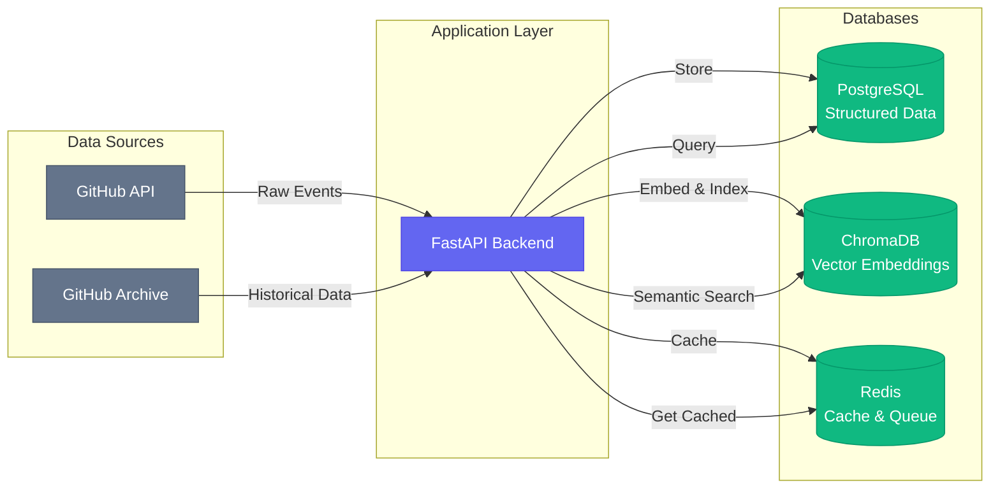
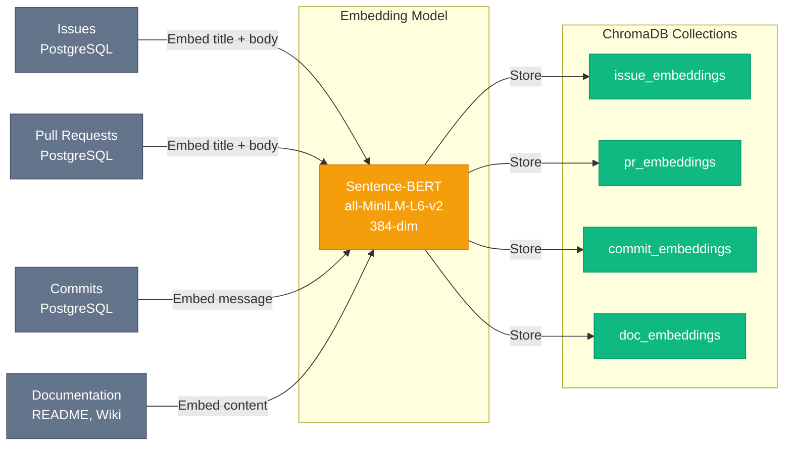

# Database Design & Architecture  
# Lightweight Sprint Intelligence for Small Startups

**Version**: 1.0.0  
**Last Updated**: February 15, 2026  
**Database**: PostgreSQL 15+ & ChromaDB 0.4+  
**Scale**: Optimized for 2-3 Repositories per Startup

---

## Table of Contents

1. [Database Strategy](#database-strategy)
2. [PostgreSQL Schema Design](#postgresql-schema-design)
3. [ChromaDB Collections Design](#chromadb-collections-design)
4. [Entity-Relationship Diagrams](#entity-relationship-diagrams)
5. [Data Models (SQLAlchemy)](#data-models-sqlalchemy)
6. [Indexing Strategy](#indexing-strategy)
7. [Data Migration Plan](#data-migration-plan)
8. [Backup & Recovery](#backup--recovery)

---

## Database Strategy

### Multi-Database Architecture



### Database Selection Rationale

| Database | Purpose | Why Chosen | Data Types |
|----------|---------|------------|------------|
| **PostgreSQL** | Primary structured storage | ACID compliance, JSON support, mature | Startup metadata, 2-3 repos, milestones, issues, PRs, commits, analyses, risks, recommendations |
| **ChromaDB** | Vector embeddings | Local-first, Python-native, semantic search | Issue embeddings, PR embeddings, commit message embeddings for 2-3 repos |
| **Redis** | Caching & queue | In-memory speed, pub/sub for real-time | API response cache, GitHub event queue for small teams, session storage |

---

## PostgreSQL Schema Design

### Schema Overview

```mermaid
erDiagram
    ORGANIZATION ||--o{ REPOSITORY : contains
    ORGANIZATION ||--o{ USER_ORGANIZATION : has
    USER ||--o{ USER_ORGANIZATION : belongs_to
    
    REPOSITORY ||--o{ MILESTONE : has
    REPOSITORY ||--o{ ISSUE : tracks
    REPOSITORY ||--o{ PULL_REQUEST : has
    REPOSITORY ||--o{ COMMIT : contains
    REPOSITORY ||--o{ WORKFLOW_RUN : has
    
    MILESTONE ||--o{ ISSUE : groups
    MILESTONE ||--o{ PULL_REQUEST : groups
    MILESTONE ||--o{ ANALYSIS_RESULT : analyzed_by
    
    PULL_REQUEST ||--o{ COMMIT : contains
    PULL_REQUEST ||--o{ REVIEW : has
    PULL_REQUEST ||--o{ COMMENT : has
    
    ISSUE ||--o{ COMMENT : has
    ISSUE ||--o{ ISSUE_DEPENDENCY : depends_on
    ISSUE ||--o{ ISSUE_DEPENDENCY : depended_by
    
    ANALYSIS_RESULT ||--o{ RISK_ASSESSMENT : identifies
    ANALYSIS_RESULT ||--o{ RECOMMENDATION : generates
    
    RISK_ASSESSMENT ||--o{ RECOMMENDATION : addresses
    
    ORGANIZATION {
        uuid id PK
        string github_org_id UK
        string name
        string avatar_url
        json metadata
        int repo_count "2-3 repos typical"
        timestamp created_at
        timestamp updated_at
    }
    
    USER {
        uuid id PK
        string github_user_id UK
        string username
        string email
        string avatar_url
        json preferences
        timestamp last_login
        timestamp created_at
    }
    
    USER_ORGANIZATION {
        uuid id PK
        uuid user_id FK
        uuid org_id FK
        string role
        timestamp created_at
    }
    
    REPOSITORY {
        uuid id PK
        uuid org_id FK
        string github_repo_id UK
        string name
        string full_name
        string description
        boolean is_private
        string default_branch
        int stars_count
        int forks_count
        json metadata
        timestamp created_at
        timestamp updated_at
    }
    
    MILESTONE {
        uuid id PK
        uuid repo_id FK
        string github_milestone_id UK
        string title
        text description
        string state
        date start_date
        date due_date
        int open_issues
        int closed_issues
        int total_issues
        float completion_percentage
        json metadata
        timestamp created_at
        timestamp updated_at
    }
    
    ISSUE {
        uuid id PK
        uuid repo_id FK
        uuid milestone_id FK
        string github_issue_id UK
        int issue_number
        string title
        text body
        string state
        json labels
        json assignees
        string author
        int comments_count
        timestamp closed_at
        timestamp created_at
        timestamp updated_at
    }
    
    PULL_REQUEST {
        uuid id PK
        uuid repo_id FK
        uuid milestone_id FK
        string github_pr_id UK
        int pr_number
        string title
        text body
        string state
        boolean draft
        int additions
        int deletions
        int changed_files
        string merge_commit_sha
        boolean mergeable
        string author
        json reviewers
        int review_comments
        timestamp merged_at
        timestamp created_at
        timestamp updated_at
    }
    
    COMMIT {
        uuid id PK
        uuid repo_id FK
        uuid pr_id FK
        string commit_sha UK
        text message
        string author
        int additions
        int deletions
        json files_changed
        timestamp committed_at
        timestamp created_at
    }
    
    WORKFLOW_RUN {
        uuid id PK
        uuid repo_id FK
        string github_run_id UK
        string commit_sha
        string workflow_name
        string status
        string conclusion
        int duration_seconds
        json test_results
        timestamp started_at
        timestamp completed_at
        timestamp created_at
    }
    
    COMMENT {
        uuid id PK
        uuid parent_id FK
        string parent_type
        string github_comment_id UK
        text body
        string author
        json reactions
        timestamp created_at
        timestamp updated_at
    }
    
    REVIEW {
        uuid id PK
        uuid pr_id FK
        string github_review_id UK
        string author
        string state
        text body
        timestamp submitted_at
        timestamp created_at
    }
    
    ISSUE_DEPENDENCY {
        uuid id PK
        uuid issue_id FK
        uuid depends_on_issue_id FK
        string dependency_type
        timestamp created_at
    }
    
    ANALYSIS_RESULT {
        uuid id PK
        uuid milestone_id FK
        float completion_probability
        date predicted_completion_date
        float confidence_lower
        float confidence_upper
        string status
        float health_score
        float velocity_current
        float velocity_required
        json burndown_ideal
        json burndown_actual
        string model_version
        text reasoning
        timestamp analyzed_at
        timestamp created_at
    }
    
    RISK_ASSESSMENT {
        uuid id PK
        uuid analysis_id FK
        string risk_type
        string severity
        float probability
        int impact_days
        string title
        text description
        json affected_issues
        json evidence
        float confidence
        timestamp detected_at
        timestamp created_at
    }
    
    RECOMMENDATION {
        uuid id PK
        uuid analysis_id FK
        uuid risk_id FK
        string category
        int priority
        text action
        text rationale
        text expected_impact
        int effort_estimate
        boolean accepted
        timestamp accepted_at
        string accepted_by
        timestamp created_at
        timestamp updated_at
    }
```



### Table Definitions

#### Core Entities

##### `organizations` Table

```sql
CREATE TABLE organizations (
    id UUID PRIMARY KEY DEFAULT gen_random_uuid(),
    github_org_id VARCHAR(100) UNIQUE NOT NULL,
    name VARCHAR(255) NOT NULL,
    avatar_url TEXT,
    metadata JSONB,
    created_at TIMESTAMP WITH TIME ZONE DEFAULT NOW(),
    updated_at TIMESTAMP WITH TIME ZONE DEFAULT NOW()
);

CREATE INDEX idx_orgs_github_id ON organizations(github_org_id);
CREATE INDEX idx_orgs_name ON organizations(name);
```

##### `users` Table

```sql
CREATE TABLE users (
    id UUID PRIMARY KEY DEFAULT gen_random_uuid(),
    github_user_id VARCHAR(100) UNIQUE NOT NULL,
    username VARCHAR(255) NOT NULL,
    email VARCHAR(255),
    avatar_url TEXT,
    preferences JSONB DEFAULT '{}',
    last_login TIMESTAMP WITH TIME ZONE,
    created_at TIMESTAMP WITH TIME ZONE DEFAULT NOW()
);

CREATE INDEX idx_users_github_id ON users(github_user_id);
CREATE INDEX idx_users_username ON users(username);
```

##### `user_organizations` Table (Many-to-Many)

```sql
CREATE TABLE user_organizations (
    id UUID PRIMARY KEY DEFAULT gen_random_uuid(),
    user_id UUID NOT NULL REFERENCES users(id) ON DELETE CASCADE,
    org_id UUID NOT NULL REFERENCES organizations(id) ON DELETE CASCADE,
    role VARCHAR(50) DEFAULT 'member', -- 'member', 'admin', 'owner'
    created_at TIMESTAMP WITH TIME ZONE DEFAULT NOW(),
    UNIQUE(user_id, org_id)
);

CREATE INDEX idx_user_orgs_user ON user_organizations(user_id);
CREATE INDEX idx_user_orgs_org ON user_organizations(org_id);
```

##### `repositories` Table

```sql
CREATE TABLE repositories (
    id UUID PRIMARY KEY DEFAULT gen_random_uuid(),
    org_id UUID NOT NULL REFERENCES organizations(id) ON DELETE CASCADE,
    github_repo_id VARCHAR(100) UNIQUE NOT NULL,
    name VARCHAR(255) NOT NULL,
    full_name VARCHAR(500) NOT NULL,
    description TEXT,
    is_private BOOLEAN DEFAULT FALSE,
    default_branch VARCHAR(100) DEFAULT 'main',
    stars_count INTEGER DEFAULT 0,
    forks_count INTEGER DEFAULT 0,
    metadata JSONB,
    created_at TIMESTAMP WITH TIME ZONE DEFAULT NOW(),
    updated_at TIMESTAMP WITH TIME ZONE DEFAULT NOW()
);

CREATE INDEX idx_repos_org ON repositories(org_id);
CREATE INDEX idx_repos_github_id ON repositories(github_repo_id);
CREATE INDEX idx_repos_full_name ON repositories(full_name);
```

##### `milestones` Table

```sql
CREATE TABLE milestones (
    id UUID PRIMARY KEY DEFAULT gen_random_uuid(),
    repo_id UUID NOT NULL REFERENCES repositories(id) ON DELETE CASCADE,
    github_milestone_id VARCHAR(100) UNIQUE NOT NULL,
    title VARCHAR(255) NOT NULL,
    description TEXT,
    state VARCHAR(20) NOT NULL, -- 'open', 'closed'
    start_date DATE,
    due_date DATE,
    open_issues INTEGER DEFAULT 0,
    closed_issues INTEGER DEFAULT 0,
    total_issues INTEGER DEFAULT 0,
    completion_percentage NUMERIC(5,2) DEFAULT 0.00,
    metadata JSONB,
    created_at TIMESTAMP WITH TIME ZONE DEFAULT NOW(),
    updated_at TIMESTAMP WITH TIME ZONE DEFAULT NOW()
);

CREATE INDEX idx_milestones_repo ON milestones(repo_id);
CREATE INDEX idx_milestones_github_id ON milestones(github_milestone_id);
CREATE INDEX idx_milestones_state ON milestones(state);
CREATE INDEX idx_milestones_due_date ON milestones(due_date);
```

#### GitHub Activity Entities

##### `issues` Table

```sql
CREATE TABLE issues (
    id UUID PRIMARY KEY DEFAULT gen_random_uuid(),
    repo_id UUID NOT NULL REFERENCES repositories(id) ON DELETE CASCADE,
    milestone_id UUID REFERENCES milestones(id) ON DELETE SET NULL,
    github_issue_id VARCHAR(100) UNIQUE NOT NULL,
    issue_number INTEGER NOT NULL,
    title VARCHAR(500) NOT NULL,
    body TEXT,
    state VARCHAR(20) NOT NULL, -- 'open', 'closed'
    labels JSONB DEFAULT '[]',
    assignees JSONB DEFAULT '[]',
    author VARCHAR(255),
    comments_count INTEGER DEFAULT 0,
    closed_at TIMESTAMP WITH TIME ZONE,
    created_at TIMESTAMP WITH TIME ZONE DEFAULT NOW(),
    updated_at TIMESTAMP WITH TIME ZONE DEFAULT NOW()
);

CREATE INDEX idx_issues_repo ON issues(repo_id);
CREATE INDEX idx_issues_milestone ON issues(milestone_id);
CREATE INDEX idx_issues_github_id ON issues(github_issue_id);
CREATE INDEX idx_issues_state ON issues(state);
CREATE INDEX idx_issues_author ON issues(author);
CREATE INDEX idx_issues_created ON issues(created_at DESC);
```

##### `pull_requests` Table

```sql
CREATE TABLE pull_requests (
    id UUID PRIMARY KEY DEFAULT gen_random_uuid(),
    repo_id UUID NOT NULL REFERENCES repositories(id) ON DELETE CASCADE,
    milestone_id UUID REFERENCES milestones(id) ON DELETE SET NULL,
    github_pr_id VARCHAR(100) UNIQUE NOT NULL,
    pr_number INTEGER NOT NULL,
    title VARCHAR(500) NOT NULL,
    body TEXT,
    state VARCHAR(20) NOT NULL, -- 'open', 'merged', 'closed'
    draft BOOLEAN DEFAULT FALSE,
    additions INTEGER DEFAULT 0,
    deletions INTEGER DEFAULT 0,
    changed_files INTEGER DEFAULT 0,
    merge_commit_sha VARCHAR(40),
    mergeable BOOLEAN,
    author VARCHAR(255),
    reviewers JSONB DEFAULT '[]',
    review_comments INTEGER DEFAULT 0,
    merged_at TIMESTAMP WITH TIME ZONE,
    created_at TIMESTAMP WITH TIME ZONE DEFAULT NOW(),
    updated_at TIMESTAMP WITH TIME ZONE DEFAULT NOW()
);

CREATE INDEX idx_prs_repo ON pull_requests(repo_id);
CREATE INDEX idx_prs_milestone ON pull_requests(milestone_id);
CREATE INDEX idx_prs_github_id ON pull_requests(github_pr_id);
CREATE INDEX idx_prs_state ON pull_requests(state);
CREATE INDEX idx_prs_author ON pull_requests(author);
CREATE INDEX idx_prs_created ON pull_requests(created_at DESC);
```

##### `commits` Table

```sql
CREATE TABLE commits (
    id UUID PRIMARY KEY DEFAULT gen_random_uuid(),
    repo_id UUID NOT NULL REFERENCES repositories(id) ON DELETE CASCADE,
    pr_id UUID REFERENCES pull_requests(id) ON DELETE SET NULL,
    commit_sha VARCHAR(40) UNIQUE NOT NULL,
    message TEXT,
    author VARCHAR(255),
    additions INTEGER DEFAULT 0,
    deletions INTEGER DEFAULT 0,
    files_changed JSONB DEFAULT '[]',
    committed_at TIMESTAMP WITH TIME ZONE,
    created_at TIMESTAMP WITH TIME ZONE DEFAULT NOW()
);

CREATE INDEX idx_commits_repo ON commits(repo_id);
CREATE INDEX idx_commits_pr ON commits(pr_id);
CREATE INDEX idx_commits_sha ON commits(commit_sha);
CREATE INDEX idx_commits_author ON commits(author);
CREATE INDEX idx_commits_committed ON commits(committed_at DESC);
```

##### `workflow_runs` Table (CI/CD)

```sql
CREATE TABLE workflow_runs (
    id UUID PRIMARY KEY DEFAULT gen_random_uuid(),
    repo_id UUID NOT NULL REFERENCES repositories(id) ON DELETE CASCADE,
    github_run_id VARCHAR(100) UNIQUE NOT NULL,
    commit_sha VARCHAR(40),
    workflow_name VARCHAR(255),
    status VARCHAR(50), -- 'queued', 'in_progress', 'completed'
    conclusion VARCHAR(50), -- 'success', 'failure', 'cancelled', 'skipped'
    duration_seconds INTEGER,
    test_results JSONB,
    started_at TIMESTAMP WITH TIME ZONE,
    completed_at TIMESTAMP WITH TIME ZONE,
    created_at TIMESTAMP WITH TIME ZONE DEFAULT NOW()
);

CREATE INDEX idx_workflow_runs_repo ON workflow_runs(repo_id);
CREATE INDEX idx_workflow_runs_github_id ON workflow_runs(github_run_id);
CREATE INDEX idx_workflow_runs_commit ON workflow_runs(commit_sha);
CREATE INDEX idx_workflow_runs_conclusion ON workflow_runs(conclusion);
```

##### `comments` Table (Polymorphic)

```sql
CREATE TABLE comments (
    id UUID PRIMARY KEY DEFAULT gen_random_uuid(),
    parent_id UUID NOT NULL, -- issue_id or pr_id
    parent_type VARCHAR(20) NOT NULL, -- 'issue' or 'pull_request'
    github_comment_id VARCHAR(100) UNIQUE NOT NULL,
    body TEXT,
    author VARCHAR(255),
    reactions JSONB DEFAULT '{}',
    created_at TIMESTAMP WITH TIME ZONE DEFAULT NOW(),
    updated_at TIMESTAMP WITH TIME ZONE DEFAULT NOW()
);

CREATE INDEX idx_comments_parent ON comments(parent_id, parent_type);
CREATE INDEX idx_comments_github_id ON comments(github_comment_id);
CREATE INDEX idx_comments_author ON comments(author);
```

##### `reviews` Table

```sql
CREATE TABLE reviews (
    id UUID PRIMARY KEY DEFAULT gen_random_uuid(),
    pr_id UUID NOT NULL REFERENCES pull_requests(id) ON DELETE CASCADE,
    github_review_id VARCHAR(100) UNIQUE NOT NULL,
    author VARCHAR(255),
    state VARCHAR(50), -- 'approved', 'changes_requested', 'commented'
    body TEXT,
    submitted_at TIMESTAMP WITH TIME ZONE,
    created_at TIMESTAMP WITH TIME ZONE DEFAULT NOW()
);

CREATE INDEX idx_reviews_pr ON reviews(pr_id);
CREATE INDEX idx_reviews_github_id ON reviews(github_review_id);
CREATE INDEX idx_reviews_author ON reviews(author);
CREATE INDEX idx_reviews_state ON reviews(state);
```

##### `issue_dependencies` Table

```sql
CREATE TABLE issue_dependencies (
    id UUID PRIMARY KEY DEFAULT gen_random_uuid(),
    issue_id UUID NOT NULL REFERENCES issues(id) ON DELETE CASCADE,
    depends_on_issue_id UUID NOT NULL REFERENCES issues(id) ON DELETE CASCADE,
    dependency_type VARCHAR(50) DEFAULT 'blocks', -- 'blocks', 'blocked_by', 'related'
    created_at TIMESTAMP WITH TIME ZONE DEFAULT NOW(),
    UNIQUE(issue_id, depends_on_issue_id)
);

CREATE INDEX idx_issue_deps_issue ON issue_dependencies(issue_id);
CREATE INDEX idx_issue_deps_depends_on ON issue_dependencies(depends_on_issue_id);
```

#### Analysis & Output Entities

##### `analysis_results` Table

```sql
CREATE TABLE analysis_results (
    id UUID PRIMARY KEY DEFAULT gen_random_uuid(),
    milestone_id UUID NOT NULL REFERENCES milestones(id) ON DELETE CASCADE,
    completion_probability NUMERIC(5,2), -- 0-100
    predicted_completion_date DATE,
    confidence_lower NUMERIC(5,2),
    confidence_upper NUMERIC(5,2),
    status VARCHAR(50), -- 'on_track', 'at_risk', 'off_track'
    health_score NUMERIC(5,2), -- 0-100
    velocity_current NUMERIC(6,2),
    velocity_required NUMERIC(6,2),
    burndown_ideal JSONB, -- Array of remaining issues per day
    burndown_actual JSONB, -- Actual burndown data
    model_version VARCHAR(100),
    reasoning TEXT,
    analyzed_at TIMESTAMP WITH TIME ZONE DEFAULT NOW(),
    created_at TIMESTAMP WITH TIME ZONE DEFAULT NOW()
);

CREATE INDEX idx_analysis_milestone ON analysis_results(milestone_id);
CREATE INDEX idx_analysis_analyzed ON analysis_results(analyzed_at DESC);
CREATE INDEX idx_analysis_status ON analysis_results(status);
```

##### `risk_assessments` Table

```sql
CREATE TABLE risk_assessments (
    id UUID PRIMARY KEY DEFAULT gen_random_uuid(),
    analysis_id UUID NOT NULL REFERENCES analysis_results(id) ON DELETE CASCADE,
    risk_type VARCHAR(100), -- 'dependency_blocker', 'velocity_decline', etc.
    severity VARCHAR(20), -- 'low', 'medium', 'high', 'critical'
    probability NUMERIC(5,2), -- 0-100
    impact_days INTEGER, -- Estimated delay in days
    title VARCHAR(255),
    description TEXT,
    affected_issues JSONB DEFAULT '[]',
    evidence JSONB, -- References to PRs, issues, commits
    confidence NUMERIC(5,2), -- Model confidence 0-100
    detected_at TIMESTAMP WITH TIME ZONE DEFAULT NOW(),
    created_at TIMESTAMP WITH TIME ZONE DEFAULT NOW()
);

CREATE INDEX idx_risks_analysis ON risk_assessments(analysis_id);
CREATE INDEX idx_risks_type ON risk_assessments(risk_type);
CREATE INDEX idx_risks_severity ON risk_assessments(severity);
CREATE INDEX idx_risks_detected ON risk_assessments(detected_at DESC);
```

##### `recommendations` Table

```sql
CREATE TABLE recommendations (
    id UUID PRIMARY KEY DEFAULT gen_random_uuid(),
    analysis_id UUID NOT NULL REFERENCES analysis_results(id) ON DELETE CASCADE,
    risk_id UUID REFERENCES risk_assessments(id) ON DELETE SET NULL,
    category VARCHAR(100), -- 'prioritization', 'resource_allocation', etc.
    priority INTEGER, -- 1-5, 5=highest
    action TEXT,
    rationale TEXT,
    expected_impact TEXT,
    effort_estimate INTEGER, -- Person-hours
    accepted BOOLEAN DEFAULT FALSE,
    accepted_at TIMESTAMP WITH TIME ZONE,
    accepted_by VARCHAR(255),
    created_at TIMESTAMP WITH TIME ZONE DEFAULT NOW(),
    updated_at TIMESTAMP WITH TIME ZONE DEFAULT NOW()
);

CREATE INDEX idx_recommendations_analysis ON recommendations(analysis_id);
CREATE INDEX idx_recommendations_risk ON recommendations(risk_id);
CREATE INDEX idx_recommendations_priority ON recommendations(priority DESC);
CREATE INDEX idx_recommendations_accepted ON recommendations(accepted);
```

---

## ChromaDB Collections Design

### Collections Overview

ChromaDB stores vector embeddings for semantic search and RAG (Retrieval-Augmented Generation).



### Collection Schemas

#### 1. `issue_embeddings` Collection

**Purpose**: Semantic search for similar issues across sprints/repos

```python
# ChromaDB Collection Configuration
collection = client.create_collection(
    name="issue_embeddings",
    metadata={"hnsw:space": "cosine"},  # Cosine similarity
    embedding_function=sentence_bert_embedding_function
)

# Document Structure
{
    "id": "issue_<uuid>",  # Links to PostgreSQL issues.id
    "embedding": [0.123, -0.456, ...],  # 384-dim vector
    "metadata": {
        "repo_full_name": "microsoft/vscode",
        "milestone_id": "uuid",
        "issue_number": 1542,
        "state": "open",
        "labels": ["bug", "performance"],
        "created_at": "2026-02-05T11:20:00Z"
    },
    "document": "Fix memory leak in extension host\n\nWhen loading large workspaces..."
}
```

#### 2. `pr_embeddings` Collection

**Purpose**: Find similar PRs for context/recommendations

```python
collection = client.create_collection(
    name="pr_embeddings",
    metadata={"hnsw:space": "cosine"},
    embedding_function=sentence_bert_embedding_function
)

# Document Structure
{
    "id": "pr_<uuid>",
    "embedding": [0.234, -0.567, ...],
    "metadata": {
        "repo_full_name": "microsoft/vscode",
        "milestone_id": "uuid",
        "pr_number": 890,
        "state": "merged",
        "additions": 342,
        "deletions": 128,
        "merged_at": "2026-02-12T17:00:00Z"
    },
    "document": "Optimize memory usage in renderer\n\nThis PR addresses issue #1542..."
}
```

#### 3. `commit_embeddings` Collection

**Purpose**: Code change semantic search

```python
collection = client.create_collection(
    name="commit_embeddings",
    metadata={"hnsw:space": "cosine"},
    embedding_function=sentence_bert_embedding_function
)

# Document Structure
{
    "id": "commit_<uuid>",
    "embedding": [0.345, -0.678, ...],
    "metadata": {
        "repo_full_name": "microsoft/vscode",
        "commit_sha": "a1b2c3d4e5f6...",
        "author": "alice",
        "committed_at": "2026-02-11T14:30:00Z"
    },
    "document": "fix: reduce memory allocation in parser\n\nFiles: src/parser.ts, test/parser.test.ts"
}
```

#### 4. `doc_embeddings` Collection

**Purpose**: Retrieve project documentation/README context

```python
collection = client.create_collection(
    name="doc_embeddings",
    metadata={"hnsw:space": "cosine"},
    embedding_function=sentence_bert_embedding_function
)

# Document Structure
{
    "id": "doc_<uuid>",
    "embedding": [0.456, -0.789, ...],
    "metadata": {
        "repo_full_name": "microsoft/vscode",
        "doc_type": "README",
        "section": "Performance Guidelines"
    },
    "document": "## Performance Guidelines\n\nAvoid synchronous file I/O..."
}
```

### ChromaDB Query Examples

```python
# Example: Find similar issues to current blocker
results = collection.query(
    query_texts=["Memory leak when loading large workspace"],
    n_results=5,
    where={"repo_full_name": "microsoft/vscode"},
    include=["metadatas", "documents", "distances"]
)

# Example: Retrieve past successful interventions
results = collection.query(
    query_texts=["How to resolve CI/CD pipeline failures?"],
    n_results=10,
    where={"state": "merged"},  # Only successful PRs
    include=["metadatas", "documents"]
)
```

---

## Data Models (SQLAlchemy)

### Example Model Implementation

```python
# apps/backend/models/milestone.py
from sqlalchemy import Column, String, Text, Integer, Numeric, Date, Boolean, ForeignKey, TIMESTAMP, JSON
from sqlalchemy.dialects.postgresql import UUID
from sqlalchemy.orm import relationship
from datetime import datetime
import uuid

from core.database import Base

class Milestone(Base):
    __tablename__ = "milestones"
    
    # Primary Key
    id = Column(UUID(as_uuid=True), primary_key=True, default=uuid.uuid4)
    
    # Foreign Keys
    repo_id = Column(UUID(as_uuid=True), ForeignKey("repositories.id", ondelete="CASCADE"), nullable=False)
    
    # GitHub Data
    github_milestone_id = Column(String(100), unique=True, nullable=False, index=True)
    title = Column(String(255), nullable=False)
    description = Column(Text)
    state = Column(String(20), nullable=False, index=True)  # 'open', 'closed'
    
    # Dates
    start_date = Column(Date)
    due_date = Column(Date, index=True)
    
    # Metrics
    open_issues = Column(Integer, default=0)
    closed_issues = Column(Integer, default=0)
    total_issues = Column(Integer, default=0)
    completion_percentage = Column(Numeric(5, 2), default=0.00)
    
    # Metadata
    metadata = Column(JSON)
    
    # Timestamps
    created_at = Column(TIMESTAMP(timezone=True), default=datetime.utcnow)
    updated_at = Column(TIMESTAMP(timezone=True), default=datetime.utcnow, onupdate=datetime.utcnow)
    
    # Relationships
    repository = relationship("Repository", back_populates="milestones")
    issues = relationship("Issue", back_populates="milestone", cascade="all, delete-orphan")
    pull_requests = relationship("PullRequest", back_populates="milestone", cascade="all, delete-orphan")
    analyses = relationship("AnalysisResult", back_populates="milestone", cascade="all, delete-orphan")
    
    def __repr__(self):
        return f"<Milestone(id={self.id}, title='{self.title}', repo='{self.repository.full_name}')>"
    
    @property
    def is_overdue(self):
        if self.due_date and self.state == 'open':
            return datetime.now().date() > self.due_date
        return False
    
    @property
    def days_remaining(self):
        if self.due_date:
            delta = self.due_date - datetime.now().date()
            return delta.days
        return None
```

---

## Indexing Strategy

### Index Categories

| Index Type | Purpose | Performance Impact |
|------------|---------|-------------------|
| **Primary Key (UUID)** | Unique identification | Auto-indexed |
| **Foreign Key** | Join optimization | Essential for queries |
| **Unique Constraint** | Prevent duplicates (GitHub IDs) | Auto-indexed |
| **Composite Index** | Multi-column queries | Reduce query time by 50-80% |
| **Partial Index** | Filter-specific queries | Save space, faster lookups |
| **GIN Index (JSONB)** | JSON field queries | Enable JSON querying |
| **Full-Text Search** | Text search in issues/PRs | Alternative to ChromaDB for keywords |

### Critical Indexes

```sql
-- Composite index for milestone analysis queries
CREATE INDEX idx_milestones_repo_state_due 
ON milestones(repo_id, state, due_date DESC);

-- Partial index for open issues only
CREATE INDEX idx_issues_open 
ON issues(repo_id, milestone_id) 
WHERE state = 'open';

-- GIN index for JSONB label search
CREATE INDEX idx_issues_labels_gin 
ON issues USING GIN (labels);

-- Full-text search on issue titles/bodies
CREATE INDEX idx_issues_fts 
ON issues USING GIN (to_tsvector('english', title || ' ' || COALESCE(body, '')));
```

---

## Data Migration Plan

### Alembic Migration Workflow

```bash
# Initialize Alembic
alembic init migrations

# Create initial migration
alembic revision --autogenerate -m "Initial schema"

# Apply migrations
alembic upgrade head

# Rollback last migration
alembic downgrade -1
```

### Seed Data Script

```python
# scripts/seed_data.py
"""
Seed database with initial data for development/testing
"""
from apps.backend.core.database import SessionLocal
from apps.backend.models import Organization, Repository, User

def seed_organizations():
    db = SessionLocal()
    try:
        # Create test organization
        org = Organization(
            github_org_id="987654321",
            name="Test Startup",
            avatar_url="https://avatars.githubusercontent.com/u/987654321"
        )
        db.add(org)
        db.commit()
        print(f"Created organization: {org.name}")
        
        # Create test repositories
        repos = [
            Repository(
                org_id=org.id,
                github_repo_id="123456789",
                name="backend-api",
                full_name="test-startup/backend-api",
                description="Backend API service"
            ),
            Repository(
                org_id=org.id,
                github_repo_id="123456790",
                name="frontend-app",
                full_name="test-startup/frontend-app",
                description="Frontend React app"
            )
        ]
        db.add_all(repos)
        db.commit()
        print(f"Created {len(repos)} repositories")
        
    finally:
        db.close()

if __name__ == "__main__":
    seed_organizations()
```

---

## Backup & Recovery

### Backup Strategy

```bash
#!/bin/bash
# scripts/backup_postgres.sh

DATE=$(date +%Y%m%d_%H%M%S)
BACKUP_DIR="backups/postgres"
DB_NAME="sprint_intelligence"

mkdir -p $BACKUP_DIR

# Full database dump
docker exec postgres-db pg_dump -U postgres $DB_NAME > \
    $BACKUP_DIR/${DB_NAME}_${DATE}.sql

# Compress backup
gzip $BACKUP_DIR/${DB_NAME}_${DATE}.sql

# Delete backups older than 30 days
find $BACKUP_DIR -name "*.sql.gz" -mtime +30 -delete

echo "Backup completed: ${DB_NAME}_${DATE}.sql.gz"
```

### Restore Procedure

```bash
#!/bin/bash
# scripts/restore_postgres.sh

BACKUP_FILE=$1

if [ -z "$BACKUP_FILE" ]; then
    echo "Usage: ./restore_postgres.sh <backup_file.sql.gz>"
    exit 1
fi

# Decompress
gunzip -c $BACKUP_FILE > /tmp/restore.sql

# Restore
docker exec -i postgres-db psql -U postgres -d sprint_intelligence < /tmp/restore.sql

echo "Restore completed from $BACKUP_FILE"
```

---

**Document Version**: 1.0.0  
**Status**: 🟢 Active  
**Next Review**: March 1, 2026  
**Owner**: Database Architect
