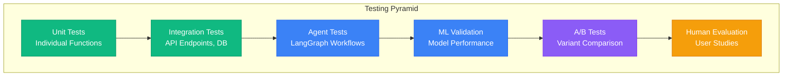
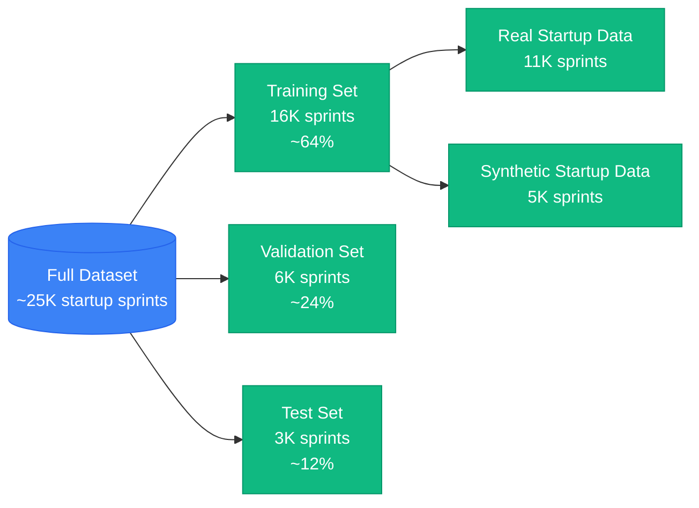
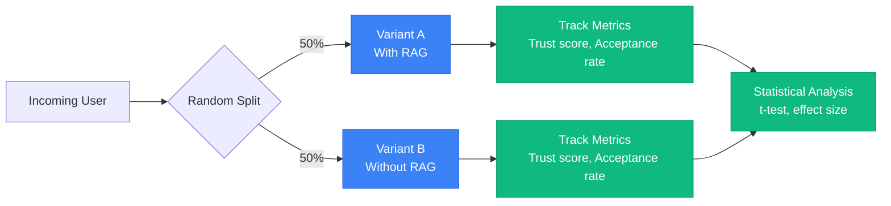

# ML Validation & Testing Architecture
# Lightweight Sprint Intelligence for Small Startups

**Version**: 1.0.0  
**Last Updated**: February 15, 2026  
**Focus**: Rigorous evaluation for 2-3 repo startup systems

---

## Table of Contents

1. [Testing Strategy Overview](#testing-strategy-overview)
2. [ML Model Validation](#ml-model-validation)
3. [Agent Testing](#agent-testing)
4. [A/B Testing Framework](#ab-testing-framework)
5. [Human Evaluation](#human-evaluation)
6. [Continuous Monitoring](#continuous-monitoring)
7. [Reproducibility & Artifacts](#reproducibility--artifacts)

---

## Testing Strategy Overview

### Multi-Level Testing Pyramid



### Testing Scope by Phase

| Phase | Testing Type | Coverage | Tools |
|-------|-------------|----------|-------|
| **Development** | Unit, Integration | >80% code | pytest, pytest-asyncio |
| **Pre-Release** | ML Validation, Agent | 100% agents | Custom eval scripts |
| **Launch** | A/B Testing | 20% users | Redis + custom tracker |
| **Post-Launch** | Human Evaluation | 10 PMs | Surveys, interviews |

---

## ML Model Validation

### 1. Dataset Splits



#### Temporal Split (Critical for Time-Series Data)

```python
# Avoid data leakage: Train on past, test on future
def temporal_split(df, train_end_date, val_end_date):
    """
    Split data chronologically to simulate real-world deployment.
    
    Example:
    - Train: Jan 2025 - Dec 2025
    - Validation: Jan 2026
    - Test: Feb 2026
    """
    train = df[df['milestone_start_date'] < train_end_date]
    val = df[(df['milestone_start_date'] >= train_end_date) & 
             (df['milestone_start_date'] < val_end_date)]
    test = df[df['milestone_start_date'] >= val_end_date]
    return train, val, test
```

#### Project-Level Leave-One-Out

```python
def project_level_split(df, test_project):
    """
    Test generalization to new organizations.
    Train on org A, B; test on org C.
    """
    train_val = df[df['org_id'] != test_org]
    test = df[df['org_id'] == test_org]
    return train_val, test
```

### 2. Evaluation Metrics

#### Classification Metrics (Sprint Success Prediction)

```python
from sklearn.metrics import accuracy_score, precision_score, recall_score, f1_score, roc_auc_score

def evaluate_classification(y_true, y_pred, y_prob):
    """
    y_true: Ground truth labels (1=success, 0=failure)
    y_pred: Predicted labels
    y_prob: Predicted probabilities
    """
    metrics = {
        'accuracy': accuracy_score(y_true, y_pred),
        'precision': precision_score(y_true, y_pred),
        'recall': recall_score(y_true, y_pred),
        'f1': f1_score(y_true, y_pred),
        'auc_roc': roc_auc_score(y_true, y_prob),
    }
    return metrics

# Target: F1 > 0.90
```

#### Regression Metrics (Completion Probability, Health Score)

```python
from sklearn.metrics import mean_absolute_error, mean_squared_error, r2_score

def evaluate_regression(y_true, y_pred):
    """
    y_true: Actual values (e.g., completion probability 0-100)
    y_pred: Predicted values
    """
    metrics = {
        'mae': mean_absolute_error(y_true, y_pred),
        'rmse': np.sqrt(mean_squared_error(y_true, y_pred)),
        'r2': r2_score(y_true, y_pred),
    }
    return metrics

# Target: MAE < 5% (for completion probability)
```

#### Ranking Metrics (Recommendation Quality)

```python
from sklearn.metrics import ndcg_score

def evaluate_recommendations(y_true_relevance, y_pred_scores):
    """
    y_true_relevance: Ground truth relevance (1-5 scale, from human raters)
    y_pred_scores: Model-predicted scores
    """
    ndcg = ndcg_score([y_true_relevance], [y_pred_scores])
    return {'ndcg': ndcg}

# Target: NDCG > 0.85
```

#### Explanation Quality (BLEU Score)

```python
from nltk.translate.bleu_score import sentence_bleu

def evaluate_explanations(reference_explanations, generated_explanations):
    """
    reference_explanations: Expert-written explanations
    generated_explanations: LLM-generated explanations
    """
    bleu_scores = []
    for ref, gen in zip(reference_explanations, generated_explanations):
        score = sentence_bleu([ref.split()], gen.split())
        bleu_scores.append(score)
    return {'bleu_mean': np.mean(bleu_scores), 'bleu_std': np.std(bleu_scores)}

# Target: BLEU > 0.70
```

### 3. Ablation Studies

#### Modality Ablation (Remove Each Data Source)

```python
modalities = ['code', 'text', 'temporal', 'graph', 'sentiment', 'cicd']

ablation_results = {}
for modality_to_remove in modalities:
    # Train model without this modality
    features = compute_features(exclude=modality_to_remove)
    model = train_model(features)
    f1 = evaluate(model, test_set)
    
    ablation_results[f1'-{modality_to_remove}'] = f1

# Expected: Each modality contributes 3-10% F1 improvement
```

#### Agent Ablation (Remove Each Agent)

```python
agents = ['data_collector', 'feature_engineer', 'llm_reasoner', 
          'sprint_analyzer', 'risk_assessor', 'recommender', 'explainer']

for agent_to_skip in agents:
    # Run workflow without this agent
    workflow_without_agent = build_workflow(exclude=agent_to_skip)
    results = run_workflow(workflow_without_agent, test_cases)
    
    print(f"Without {agent_to_skip}: F1 = {results['f1']}")
```

#### RAG Ablation (With/Without Retrieval)

```python
# Baseline: LLM without RAG
baseline_results = llm_generate(prompt, context=None)

# With RAG: LLM with retrieved context
rag_context = retrieve_similar_cases(query, top_k=5)
rag_results = llm_generate(prompt, context=rag_context)

# Compare accuracy and trust scores
```

### 4. Cross-Validation

#### K-Fold Cross-Validation

```python
from sklearn.model_selection import KFold

kf = KFold(n_splits=5, shuffle=True, random_state=42)
f1_scores = []

for train_idx, val_idx in kf.split(X):
    X_train, X_val = X[train_idx], X[val_idx]
    y_train, y_val = y[train_idx], y[val_idx]
    
    model = train_model(X_train, y_train)
    y_pred = model.predict(X_val)
    f1 = f1_score(y_val, y_pred)
    f1_scores.append(f1)

print(f"Mean F1: {np.mean(f1_scores):.3f} ± {np.std(f1_scores):.3f}")
```

### 5. Baseline Comparisons

```python
baselines = {
    'random': RandomClassifier(),
    'rule_based': RuleBasedClassifier(),  # e.g., if velocity < required → failure
    'lstm': LSTMModel(),
    'random_forest': RandomForestClassifier(),
    'gpt4': GPT4Baseline(),  # OpenAI API call (cost-aware)
}

results = {}
for name, model in baselines.items():
    model.fit(X_train, y_train)
    y_pred = model.predict(X_test)
    results[name] = f1_score(y_test, y_pred)

# Proposed model should outperform all baselines
```

---

## Agent Testing

### Agent Unit Tests

```python
# tests/agents/test_feature_engineer.py
import pytest
from services.agents.feature_engineer import feature_engineer_node

def test_feature_engineer_computes_all_features():
    state = {
        'milestone_id': 'test-milestone-123',
        'repo_data': {...},
        'issues': [...],
        'prs': [...],
        'commits': [...]
    }
    
    result = feature_engineer_node(state)
    
    assert 'features' in result
    assert 'code_features' in result['features']
    assert 'text_features' in result['features']
    assert 'temporal_features' in result['features']
    assert 'graph_features' in result['features']
    assert 'sentiment_features' in result['features']
    assert 'cicd_features' in result['features']
    assert len(result['features']) == 524  # Total feature dimensions
```

### Agent Integration Tests (LangGraph Workflow)

```python
# tests/agents/test_workflow.py
def test_full_analysis_workflow():
    # Arrange
    workflow = build_analysis_workflow()
    input_state = {
        'milestone_id': 'MDk6TWlsZXN0b25lMTIz',
        'org_id': 'microsoft'
    }
    
    # Act
    output_state = workflow.invoke(input_state)
    
    # Assert
    assert 'analysis_result' in output_state
    assert output_state['analysis_result']['completion_probability'] >= 0
    assert output_state['analysis_result']['completion_probability'] <= 100
    assert 'risks' in output_state
    assert 'recommendations' in output_state
    assert len(output_state['recommendations']) > 0
```

### Agent Performance Tests

```python
# tests/agents/test_performance.py
import time

def test_analysis_latency_under_60_seconds():
    workflow = build_analysis_workflow()
    input_state = {'milestone_id': 'test-123'}
    
    start_time = time.time()
    result = workflow.invoke(input_state)
    end_time = time.time()
    
    latency = end_time - start_time
    assert latency < 60, f"Latency {latency}s exceeds 60s target"
```

---

## A/B Testing Framework

### Experiment Design



### A/B Test Implementation

```python
# apps/backend/services/ab_testing/experiment.py
import random
import redis

class ABTestManager:
    def __init__(self, redis_client):
        self.redis = redis_client
    
    def assign_variant(self, user_id, experiment_name):
        """
        Consistently assign user to variant (sticky assignment).
        """
        key = f"ab_test:{experiment_name}:{user_id}"
        variant = self.redis.get(key)
        
        if variant is None:
            # First time: random assignment
            variant = 'A' if random.random() < 0.5 else 'B'
            self.redis.set(key, variant, ex=30*24*60*60)  # 30 days
        
        return variant.decode()
    
    def track_event(self, user_id, experiment_name, variant, event_name, value=None):
        """
        Track user interaction (e.g., "recommendation_accepted").
        """
        event = {
            'user_id': user_id,
            'experiment': experiment_name,
            'variant': variant,
            'event': event_name,
            'value': value,
            'timestamp': datetime.utcnow().isoformat()
        }
        
        # Store in PostgreSQL or Redis Stream
        self.redis.xadd(f"events:{experiment_name}", event)
```

### A/B Test Analysis

```python
# scripts/analyze_ab_test.py
from scipy import stats

def analyze_experiment(experiment_name):
    # Fetch data for both variants
    variant_a_data = fetch_events(experiment_name, 'A')
    variant_b_data = fetch_events(experiment_name, 'B')
    
    # Metric: Recommendation Acceptance Rate
    acceptance_a = variant_a_data['accepted'].mean()
    acceptance_b = variant_b_data['accepted'].mean()
    
    # Statistical significance (t-test)
    t_stat, p_value = stats.ttest_ind(
        variant_a_data['accepted'],
        variant_b_data['accepted']
    )
    
    # Effect size (Cohen's d)
    pooled_std = np.sqrt((variant_a_data['accepted'].var() + variant_b_data['accepted'].var()) / 2)
    cohens_d = (acceptance_a - acceptance_b) / pooled_std
    
    results = {
        'variant_a_mean': acceptance_a,
        'variant_b_mean': acceptance_b,
        'p_value': p_value,
        'cohens_d': cohens_d,
        'significant': p_value < 0.05,
        'winner': 'A' if acceptance_a > acceptance_b else 'B'
    }
    
    return results

# Example:
# Variant A (with RAG): 72% acceptance
# Variant B (without RAG): 61% acceptance
# p-value: 0.003 → Statistically significant
# Effect size: 0.45 (medium effect)
# Winner: A (RAG improves acceptance by 11%)
```

---

## Human Evaluation

### Study Design

#### Participants
- **Recruitment**: 5-10 project managers from startup community
- **Criteria**: Active GitHub users, managing 2+ repos, 6+ months experience
- **Compensation**: $50 gift card or co-authorship acknowledgment

#### Tasks
1. **Sprint health assessment**: Review AI-generated health scores, compare with own judgment
2. **Blocker detection**: Identify which AI-detected blockers are accurate
3. **Recommendation evaluation**: Rate recommendations (relevance, actionability, trust)
4. **Explanation quality**: Decide if explanations are clear and evidence-based

### Evaluation Questionnaire

```markdown
# Sprint Intelligence System Evaluation

## Part 1: Sprint Health Assessment (5 scenarios)

For each scenario, the AI predicts sprint health. Rate your agreement:

**Scenario 1**: Sprint 24 - backend-api
- AI Health Score: 78% (At Risk)
- AI Reasoning: "Velocity declining, 2 blockers detected"

Your assessment:
- [ ] Strongly Disagree (1)
- [ ] Disagree (2)
- [ ] Neutral (3)
- [ ] Agree (4)
- [ ] Strongly Agree (5)

Comments: _______________

## Part 2: Recommendation Evaluation (10 recommendations)

Rate each recommendation on:
1. **Relevance** (1-5): Does this address a real problem?
2. **Actionability** (1-5): Can I act on this today?
3. **Trust** (1-5): Do I trust this advice?

**Recommendation**: "Assign additional reviewer to PR #890"
- Relevance: [ 1 | 2 | 3 | 4 | 5 ]
- Actionability: [ 1 | 2 | 3 | 4 | 5 ]
- Trust: [ 1 | 2 | 3 | 4 | 5 ]

Would you accept this recommendation?
- [ ] Yes
- [ ] No
- [ ] Maybe (need more info)

## Part 3: Explanation Quality

Rate the clarity and usefulness of AI explanations:
- [ ] Very unclear (1)
- [ ] Somewhat unclear (2)
- [ ] Neutral (3)
- [ ] Somewhat clear (4)
- [ ] Very clear (5)

Comments: _______________

## Part 4: Overall Satisfaction

1. How likely are you to use this system in production?
   - [ ] Very Unlikely (1)
   - [ ] Unlikely (2)
   - [ ] Neutral (3)
   - [ ] Likely (4)
   - [ ] Very Likely (5)

2. What features would you add/change?
   _______________

3. What concerns do you have about AI-driven sprint intelligence?
   _______________
```

### Inter-Annotator Agreement

```python
from sklearn.metrics import cohen_kappa_score

def calculate_agreement(rater1_scores, rater2_scores):
    """
    Measure agreement between two human raters.
    Cohen's Kappa > 0.6 = substantial agreement
    """
    kappa = cohen_kappa_score(rater1_scores, rater2_scores)
    return kappa

# If agreement is low, refine guidelines and re-evaluate
```

---

## Continuous Monitoring

### Production Metrics Dashboard

```python
# Real-time monitoring with Prometheus-style metrics

@app.get("/metrics")
def metrics():
    return {
        'analysis_latency_p50': get_metric('latency_p50'),
        'analysis_latency_p95': get_metric('latency_p95'),
        'llm_token_generation_speed': get_metric('tokens_per_second'),
        'recommendation_acceptance_rate': get_metric('acceptance_rate'),
        'error_rate': get_metric('error_rate'),
        'github_api_rate_limit_remaining': get_metric('gh_rate_limit'),
    }
```

### Alerting Rules

```yaml
# alerts.yml
alerts:
  - name: HighLatency
    condition: latency_p95 > 90s
    severity: warning
    notification: slack
    
  - name: LowAcceptanceRate
    condition: acceptance_rate < 0.5
    severity: critical
    notification: email
    
  - name: HighErrorRate
    condition: error_rate > 0.05
    severity: critical
    notification: pagerduty
```

---

## Reproducibility & Artifacts

### Experiment Tracking (MLflow)

```python
import mlflow

def train_and_log_model(features, labels, params):
    with mlflow.start_run():
        # Log parameters
        mlflow.log_params(params)
        
        # Train model
        model = train(features, labels, **params)
        
        # Log metrics
        metrics = evaluate(model, test_set)
        mlflow.log_metrics(metrics)
        
        # Log model
        mlflow.sklearn.log_model(model, "sprint_predictor")
        
        # Log artifacts (plots, confusion matrix)
        mlflow.log_artifact("plots/confusion_matrix.png")

# Later: Load exact model version
model = mlflow.sklearn.load_model("runs:/<run_id>/sprint_predictor")
```

### Versioning Strategy

```
models/
├── sprint_predictor_v1.0/
│   ├── model.pkl
│   ├── metadata.json
│   └── performance.json
├── sprint_predictor_v1.1/
└── sprint_predictor_v1.2/
```

### Reproducibility Checklist

- [ ] Random seed fixed (`random.seed(42)`, `np.random.seed(42)`, `torch.manual_seed(42)`)
- [ ] Dependencies locked (`requirements.txt` with exact versions)
- [ ] Data splits saved (`train_ids.txt`, `val_ids.txt`, `test_ids.txt`)
- [ ] Hyperparameters logged (MLflow, config files)
- [ ] Evaluation scripts provided (`scripts/evaluate.py`)
- [ ] Docker image tagged (`v1.0.0`)

---

## Testing Execution Plan

### Week 13: ML Validation

```bash
# Day 1-2: Dataset preparation
python scripts/prepare_dataset.py --split temporal

# Day 3-4: Baseline evaluations
python scripts/evaluate_baselines.py --output results/baselines.json

# Day 5-6: Proposed model evaluation
python scripts/evaluate_proposed_model.py --output results/proposed.json

# Day 7: Ablation studies
python scripts/run_ablation_studies.py --output results/ablations.json
```

### Week 14: Human Evaluation

```bash
# Day 1: Recruit participants
# Day 2-5: User testing sessions (2 per day)
# Day 6-7: Analyze qualitative feedback
python scripts/analyze_user_studies.py --input surveys/ --output results/human_eval.json
```

---

**Document Version**: 1.0.0  
**Status**: 🟢 Active Testing Plan  
**Next Review**: March 1, 2026  
**Owner**: ML Engineer / Research Lead
