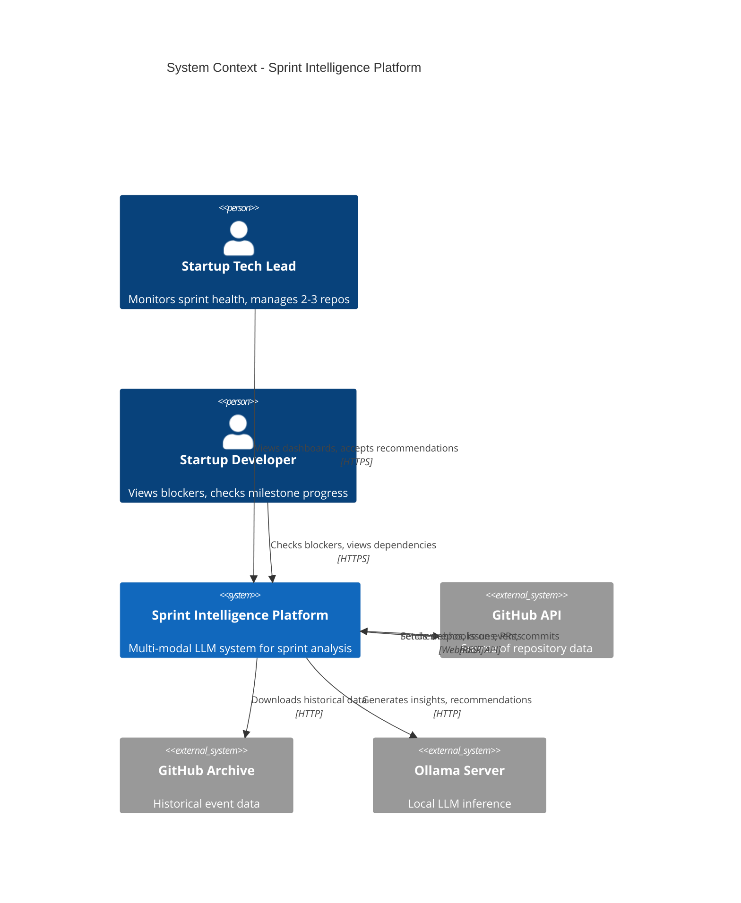
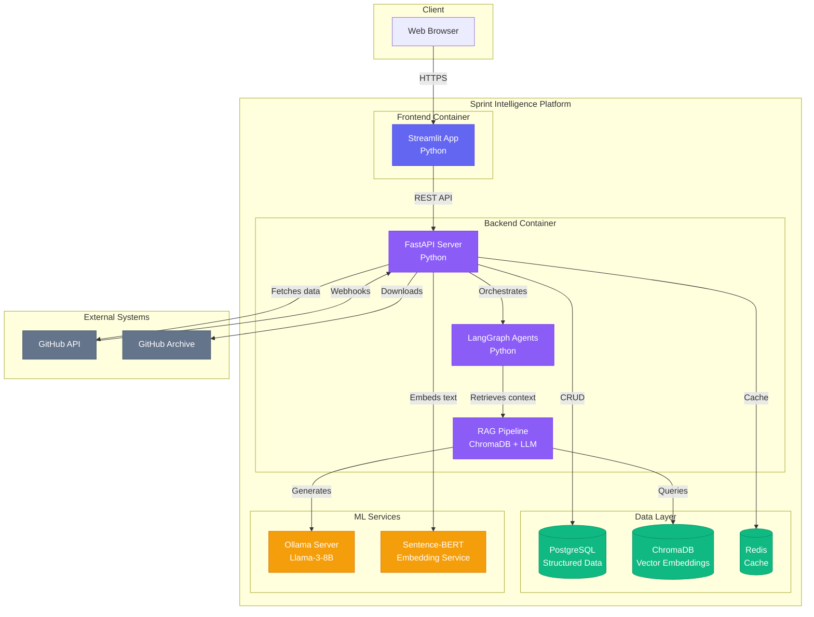
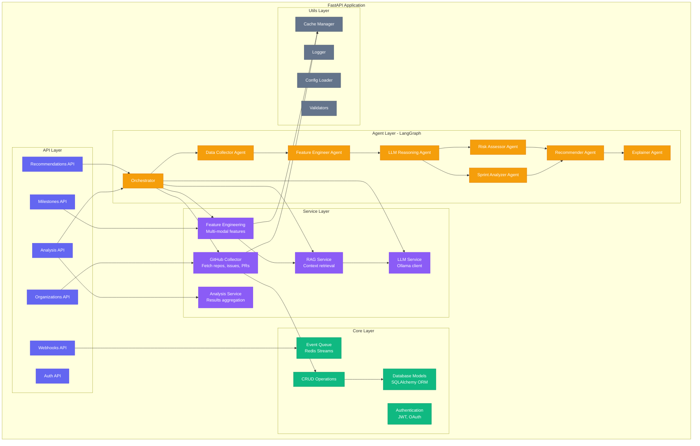
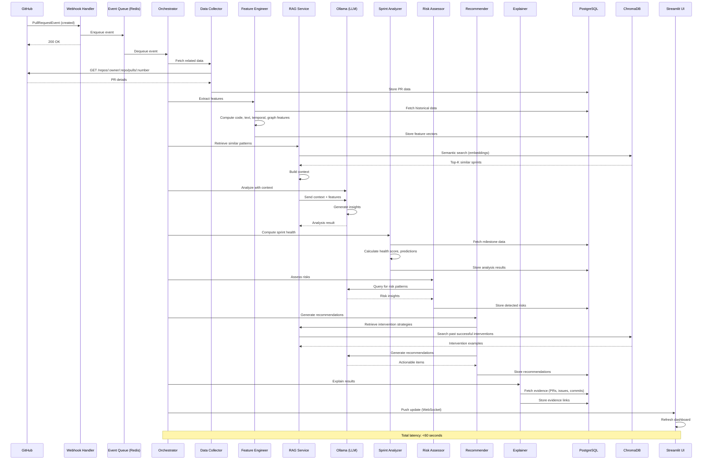
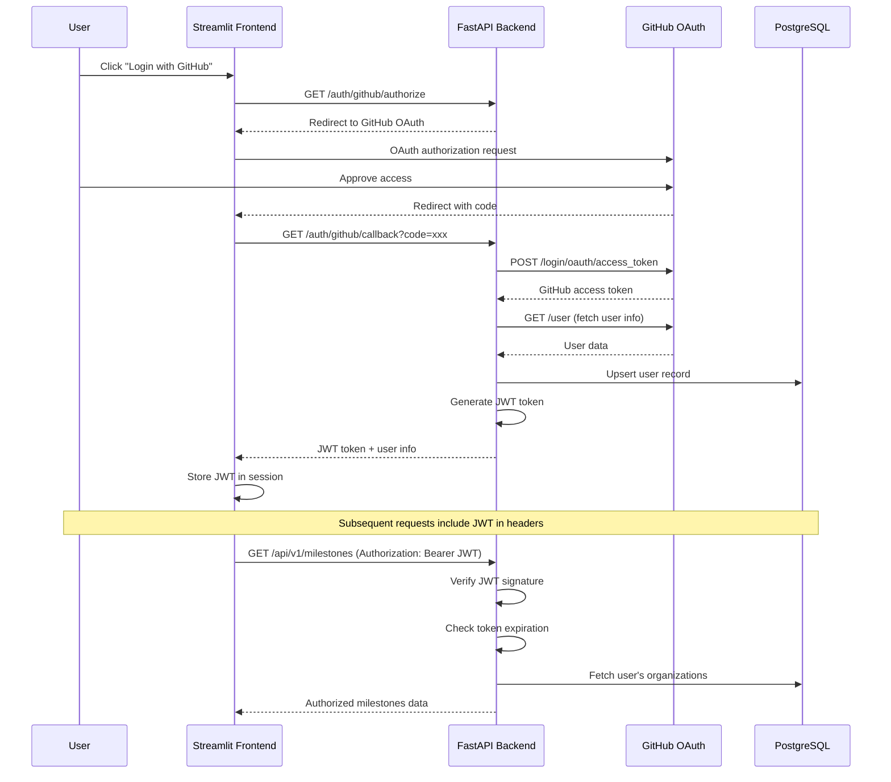
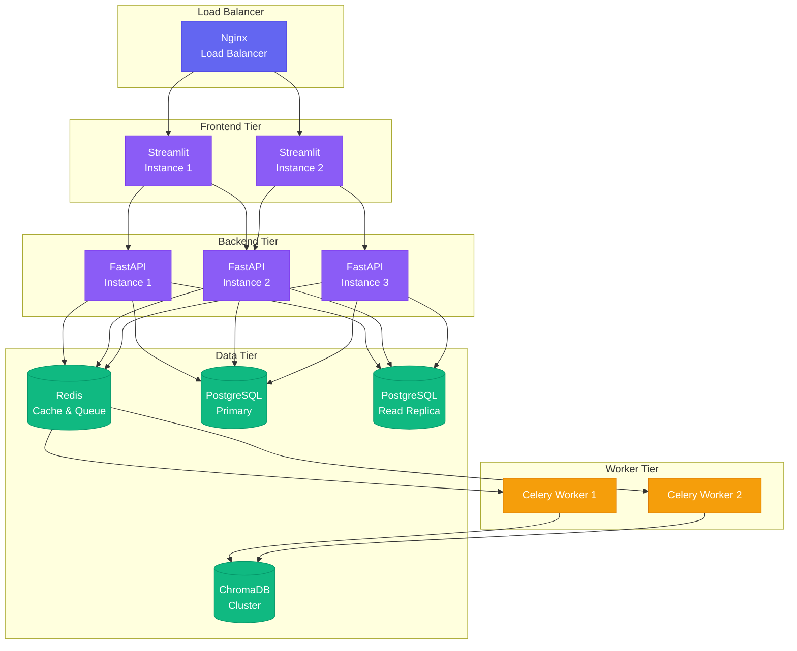

# System Architecture
# Lightweight Sprint Intelligence for Small Startups

**Version**: 2.0.0  
**Last Updated**: February 15, 2026  
**Target**: Small Startups with 2-3 GitHub Repositories  
**Resource Profile**: 16GB RAM Laptop, No Cloud Required

---

## Table of Contents

1. [System Overview](#system-overview)
2. [High-Level Architecture](#high-level-architecture)
3. [Component Architecture](#component-architecture)
4. [Deployment Architecture](#deployment-architecture)
5. [Data Flow Architecture](#data-flow-architecture)
6. [Security Architecture](#security-architecture)
7. [Scalability Considerations](#scalability-considerations)

---

## System Overview

### Purpose
The Lightweight Sprint Intelligence Platform provides instant, explainable sprint insights for small startup teams managing 2-3 core GitHub repositories without requiring historical data, extensive setup, or cloud infrastructure. Designed for lean startup teams (3-10 developers) who need ML-powered project intelligence but lack enterprise resources or dedicated project managers.

### Key Characteristics
- **Instant Setup**: <10 minute installation, zero configuration required
- **Laptop-Native**: Runs entirely on 16GB RAM laptop (M1/M2/M4, or equivalent Intel/AMD)
- **No Historical Data Required**: Bootstraps with synthetic data, learns from first week
- **Ultra-Fast**: <30 second latency from GitHub event to recommendation
- **Explainable**: RAG-based evidence citing specific commits/issues/PRs
- **Cost-Free**: No cloud APIs, no monthly fees, fully local deployment
- **Startup-Optimized**: Designed for 2-3 tightly coupled repositories

### Technology Stack

| Layer | Technology | Purpose | Resource Usage |
|-------|------------|---------|----------------|
| **Frontend** | Streamlit | Interactive dashboard | ~500MB RAM |
| **Backend API** | FastAPI | REST endpoints, webhooks | ~800MB RAM |
| **Agent Orchestration** | LangGraph | Multi-agent workflow | ~500MB RAM |
| **LLM** | Ollama (Llama-3-8B Q4) | Local language model | ~5GB RAM |
| **Embedding** | Sentence-BERT | Text vectorization | ~500MB RAM |
| **Vector Store** | ChromaDB | Semantic search | ~1GB RAM |
| **Database** | SQLite + PostgreSQL | Structured data | ~500MB RAM |
| **Cache** | Redis (optional) | Query cache | ~200MB RAM |
| **Total Peak** | - | - | **~14GB RAM** |
| **Deployment** | Docker Compose | Container orchestration | Single laptop |

---

## High-Level Architecture

### System Context Diagram



### Container Diagram



---

## Component Architecture

### Frontend Architecture (Streamlit)

```mermaid
graph TB
    subgraph "Streamlit App"
        subgraph "Pages"
            P1[Dashboard<br/>Startup Overview (2-3 Repos)]
            P2[Sprint Analysis<br/>Predictions & Risks]
            P3[Cross-Repo Dependencies<br/>Dependency Graph]
            P4[Recommendations<br/>Action Items]
            P5[Settings<br/>Configuration]
        end
        
        subgraph "Components"
            C1[Chart Components<br/>Plotly Visualizations]
            C2[Data Tables<br/>Interactive Grids]
            C3[Filters & Controls<br/>Date, Repo, Milestone Pickers]
            C4[Real-time Updates<br/>WebSocket Client]
        end
        
        subgraph "Utils"
            U1[API Client<br/>FastAPI Connector]
            U2[Auth Manager<br/>JWT Handler]
            U3[State Manager<br/>Session State]
            U4[Theme Config<br/>Custom Styling]
        end
    end
    
    P1 --> C1
    P1 --> C2
    P2 --> C1
    P2 --> C3
    P3 --> C1
    P4 --> C2
    P5 --> C3
    
    C1 --> U1
    C2 --> U1
    C4 --> U1
    
    U1 --> U2
    U1 --> U3
    
    classDef page fill:#6366f1,stroke:#4f46e5,color:#fff
    classDef comp fill:#8b5cf6,stroke:#7c3aed,color:#fff
    classDef util fill:#10b981,stroke:#059669,color:#fff
    
    class P1,P2,P3,P4,P5 page
    class C1,C2,C3,C4 comp
    class U1,U2,U3,U4 util
```

#### File Structure
```
apps/frontend/
├── app.py                      # Main entry point
├── config/
│   ├── settings.py             # Environment configuration
│   └── theme.py                # Custom theme (colors, fonts)
├── pages/
│   ├── 1_📊_Dashboard.py       # Organization overview
│   ├── 2_🎯_Milestone_Analysis.py
│   ├── 3_🔗_Dependencies.py
│   ├── 4_💡_Recommendations.py
│   └── 5_⚙️_Settings.py
├── components/
│   ├── charts.py               # Reusable chart components
│   ├── tables.py               # Data table components
│   ├── filters.py              # Filter controls
│   └── realtime.py             # WebSocket handlers
├── utils/
│   ├── api_client.py           # FastAPI connector
│   ├── auth.py                 # Authentication
│   └── state.py                # Session state management
└── requirements.txt
```

### Backend Architecture (FastAPI + LangGraph)



#### File Structure
```
apps/backend/
├── main.py                     # FastAPI app entry point
├── api/
│   ├── __init__.py
│   ├── routes/
│   │   ├── organizations.py    # /api/v1/organizations
│   │   ├── milestones.py       # /api/v1/milestones
│   │   ├── analysis.py         # /api/v1/analysis
│   │   ├── recommendations.py  # /api/v1/recommendations
│   │   ├── webhooks.py         # /api/v1/webhooks
│   │   └── auth.py             # /api/v1/auth
│   └── dependencies.py         # Dependency injection
├── services/
│   ├── github/
│   │   ├── collector.py        # GitHub API client
│   │   └── webhook_handler.py
│   ├── feature_engineering/
│   │   ├── code_features.py
│   │   ├── text_features.py
│   │   ├── temporal_features.py
│   │   ├── graph_features.py
│   │   ├── sentiment_features.py
│   │   └── cicd_features.py
│   ├── rag/
│   │   ├── indexer.py          # ChromaDB indexing
│   │   ├── retriever.py        # Semantic search
│   │   ├── context_builder.py
│   │   └── citation_tracker.py
│   ├── llm/
│   │   ├── ollama_client.py
│   │   ├── prompts/            # Prompt templates
│   │   │   ├── pattern_recognition.txt
│   │   │   ├── recommendation.txt
│   │   │   └── risk_assessment.txt
│   │   └── parser.py
│   ├── agents/
│   │   ├── graph.py            # LangGraph workflow
│   │   ├── orchestrator.py
│   │   ├── data_collector.py
│   │   ├── feature_engineer.py
│   │   ├── llm_reasoner.py
│   │   ├── sprint_analyzer.py
│   │   ├── risk_assessor.py
│   │   ├── recommender.py
│   │   └── explainer.py
│   └── analysis/
│       ├── sprint_health.py
│       └── prediction.py
├── core/
│   ├── config.py               # Settings (Pydantic)
│   ├── database.py             # DB connection
│   ├── cache.py                # Redis connection
│   ├── auth.py                 # JWT, OAuth
│   └── event_queue.py          # Redis Streams
├── models/
│   ├── organization.py         # SQLAlchemy models
│   ├── repository.py
│   ├── milestone.py
│   ├── issue.py
│   ├── pull_request.py
│   ├── commit.py
│   ├── analysis.py
│   ├── risk.py
│   └── recommendation.py
├── schemas/
│   ├── organization.py         # Pydantic schemas
│   ├── milestone.py
│   ├── analysis.py
│   └── recommendation.py
├── crud/
│   ├── organization.py         # CRUD operations
│   ├── milestone.py
│   └── analysis.py
├── utils/
│   ├── cache_manager.py
│   ├── logger.py
│   ├── validators.py
│   └── helpers.py
├── tests/
│   ├── unit/
│   ├── integration/
│   └── agents/
├── migrations/                 # Alembic migrations
└── requirements.txt
```

---

## Deployment Architecture

### Local Development (Docker Compose)

```mermaid
graph TB
    subgraph "Host Machine - MacBook M4 Pro"
        
        subgraph "Docker Network - sprint_intelligence"
            
            C1[streamlit-app<br/>Port: 8501<br/>Mem: 1GB]
            C2[fastapi-backend<br/>Port: 8000<br/>Mem: 2GB]
            C3[postgres-db<br/>Port: 5432<br/>Mem: 1GB<br/>Volume: postgres_data]
            C4[chromadb<br/>Port: 8001<br/>Mem: 2GB<br/>Volume: chroma_data]
            C5[redis-cache<br/>Port: 6379<br/>Mem: 500MB]
            C6[ollama-server<br/>Port: 11434<br/>Mem: 5GB<br/>Model: llama3:8b-q4]
            
            C1 -->|HTTP| C2
            C2 -->|PostgreSQL| C3
            C2 -->|HTTP| C4
            C2 -->|Redis| C5
            C2 -->|HTTP| C6
        end
        
        V1[/postgres_data/<br/>Persistent Volume]
        V2[/chroma_data/<br/>Persistent Volume]
        V3[/ollama_models/<br/>Persistent Volume]
        
        C3 -.->|Mounts| V1
        C4 -.->|Mounts| V2
        C6 -.->|Mounts| V3
    end
    
    EXT[GitHub API] -->|Webhooks| C2
    USER[Browser] -->|localhost:8501| C1
    
    classDef container fill:#6366f1,stroke:#4f46e5,color:#fff
    classDef volume fill:#10b981,stroke:#059669,color:#fff
    classDef external fill:#64748b,stroke:#475569,color:#fff
    
    class C1,C2,C3,C4,C5,C6 container
    class V1,V2,V3 volume
    class EXT,USER external
```

### Resource Allocation

| Container | CPU | RAM | Storage | Image Size |
|-----------|-----|-----|---------|------------|
| **streamlit-app** | 1 core | 1GB | - | ~500MB |
| **fastapi-backend** | 2 cores | 2GB | - | ~800MB |
| **postgres-db** | 1 core | 1GB | 5GB (persistent) | ~300MB |
| **chromadb** | 1 core | 2GB | 2GB (persistent) | ~400MB |
| **redis-cache** | 0.5 core | 500MB | - | ~100MB |
| **ollama-server** | 4 cores | 5GB | 10GB (model) | ~5GB |
| **Total** | **9.5 cores** | **11.5GB** | **17GB** | **~7.1GB** |

**Host Requirements**:
- **CPU**: 10+ cores (M4 Pro has 12-14 cores)
- **RAM**: 24GB (11.5GB containers + 4GB macOS system + 8.5GB buffer)
- **Storage**: 50GB free (17GB data + 7GB images + 26GB buffer)

---

## Data Flow Architecture

### Real-Time Analysis Pipeline



### Batch Processing Pipeline (Historical Data)

```mermaid
flowchart LR
    START([Start Batch Job])
    
    START --> FETCH[Fetch GitHub Archive]
    FETCH --> EXTRACT[Extract Events<br/>Issues, PRs, Commits]
    EXTRACT --> FILTER[Filter by Target Repos]
    FILTER --> EMBED[Generate Embeddings<br/>Sentence-BERT]
    EMBED --> INDEX[Index in ChromaDB]
    INDEX --> STORE[Store in PostgreSQL]
    STORE --> COMPUTE[Compute Features<br/>Offline]
    COMPUTE --> END([End])
    
    classDef process fill:#6366f1,stroke:#4f46e5,color:#fff
    classDef storage fill:#10b981,stroke:#059669,color:#fff
    
    class FETCH,EXTRACT,FILTER,EMBED,COMPUTE process
    class INDEX,STORE storage
```



---

## Security Architecture

### Authentication & Authorization Flow



### Security Measures

| Layer | Security Control | Implementation |
|-------|------------------|----------------|
| **Transport** | HTTPS/TLS | Nginx reverse proxy (production) |
| **Authentication** | GitHub OAuth 2.0 | Authorization code flow |
| **Authorization** | JWT tokens | HS256, 24-hour expiry |
| **API Security** | Rate limiting | 100 requests/minute per user |
| **Data Protection** | Field-level encryption | Sensitive fields encrypted at rest |
| **Secrets Management** | Environment variables | `.env` files (not committed) |
| **CORS** | Restricted origins | Only allow Streamlit frontend |
| **Input Validation** | Pydantic schemas | All API inputs validated |
| **SQL Injection** | ORM (SQLAlchemy) | Parameterized queries only |
| **XSS** | Output encoding | Streamlit auto-escaping |

---

## Scalability Considerations

### Current Scale (Target)
- **Organizations**: 1-3 small companies
- **Repositories**: 2-3 per organization
- **GitHub Events**: ~1K events/day
- **Active Milestones**: ~10 concurrent
- **Users**: 5-20 project managers/developers

### Scaling Strategies (Future)

#### Horizontal Scaling (if needed)



#### Vertical Scaling (Model Upgrades)

| Component | Current | Upgraded | Impact |
|-----------|---------|----------|--------|
| **LLM Model** | Llama-3-8B-Q4 (5GB) | Llama-3-70B-Q4 (35GB) | Better reasoning, requires 64GB+ RAM |
| **Embedding Model** | all-MiniLM-L6-v2 (384-dim) | bge-large-en (1024-dim) | Better retrieval, 3x storage |
| **Vector DB** | ChromaDB (local) | Qdrant/Weaviate | Better performance, clustering |
| **Database** | PostgreSQL (single) | PostgreSQL (replicated) | Read scaling, high availability |

---

## Technology Decisions

### Why These Technologies?

#### Backend: FastAPI
- **Pros**: High performance, async support, auto OpenAPI docs, type hints
- **Cons**: Younger ecosystem than Flask/Django
- **Alternative Considered**: Flask (too basic), Django (too heavy)

#### Agent Framework: LangGraph
- **Pros**: Graph-based workflows, state management, built for agents
- **Cons**: Relatively new framework
- **Alternative Considered**: LangChain (less structure), custom (more work)

#### LLM: Ollama (Llama-3-8B)
- **Pros**: Local, privacy, no API costs, quantized for efficiency
- **Cons**: Less capable than GPT-4, requires local resources
- **Alternative Considered**: OpenAI API (expensive), Anthropic (no local option)

#### Vector DB: ChromaDB
- **Pros**: Simple, local-first, Python-native, persistent storage
- **Cons**: Not production-scale for huge datasets
- **Alternative Considered**: Pinecone (cloud only), Qdrant (more complex)

#### Frontend: Streamlit
- **Pros**: Pure Python, rapid prototyping, built-in components
- **Cons**: Limited customization vs React, performance at scale
- **Alternative Considered**: React (more dev time), Gradio (less flexible)

#### Deployment: Docker Compose
- **Pros**: Local dev/prod parity, easy setup, reproducible
- **Cons**: Not Kubernetes (overkill for 2-3 repos)
- **Alternative Considered**: Kubernetes (over-engineered), bare metal (hard to replicate)

---

## Monitoring & Observability

### Key Metrics to Track

| Metric | Target | Alerting Threshold | Tool |
|--------|--------|-------------------|------|
| **API Latency (p95)** | <500ms | >1000ms | FastAPI middleware |
| **Analysis Pipeline Latency** | <60s | >90s | Custom timer |
| **LLM Token Generation Speed** | >30 tokens/s | <15 tokens/s | Ollama metrics |
| **ChromaDB Query Time** | <100ms | >300ms | ChromaDB client |
| **PostgreSQL Query Time** | <50ms | >200ms | SQLAlchemy logging |
| **RAM Usage** | <16GB | >20GB | Docker stats |
| **CPU Usage** | <70% | >90% | Docker stats |
| **GitHub API Rate Limit** | >1000 remaining | <500 remaining | GitHub headers |

### Logging Strategy

```python
# Structured logging example
import structlog

logger = structlog.get_logger()

logger.info(
    "analysis_completed",
    milestone_id="MDk6TWlsZXN0b25lMTIz",
    repo="microsoft/vscode",
    latency_seconds=45.2,
    completion_probability=0.87,
    risks_detected=2,
    recommendations_generated=4
)
```

**Log Aggregation**: Store logs in `logs/` directory with rotation (1 file per day, keep 30 days)

---

## Disaster Recovery

### Backup Strategy

| Data | Frequency | Retention | Storage |
|------|-----------|-----------|---------|
| **PostgreSQL** | Daily | 30 days | Local backups/ folder |
| **ChromaDB** | Weekly | 4 weeks | Compressed archives |
| **Configuration** | On change | Git history | GitHub repo |
| **LLM Model** | Once | Indefinite | Ollama models/ |

### Recovery Procedures

1. **Database Corruption**: Restore from daily PostgreSQL dump
2. **ChromaDB Loss**: Re-embed from PostgreSQL raw data (2-4 hours)
3. **Configuration Loss**: Restore from Git repository
4. **Complete System Loss**: Docker Compose up + restore backups (<1 hour)

---

## Future Enhancements

### Phase 2 (Post-3 Months)
- [ ] Support for 10+ repositories
- [ ] Fine-tuned LoRA adapters for project-specific contexts
- [ ] RLHF (Reinforcement Learning from Human Feedback) loop
- [ ] Advanced dependency graph analysis (cross-repo)
- [ ] Slack/Teams integration for notifications
- [ ] Mobile-responsive redesign

### Phase 3 (Research Contributions)
- [ ] Multi-organization transfer learning
- [ ] Synthetic data generation for cold-start scenarios
- [ ] Automated A/B testing framework
- [ ] Causality detection (beyond correlation)
- [ ] Interactive explanation interface (counterfactuals)

---

**Document Version**: 1.0.0  
**Status**: 🟢 Active  
**Next Review**: March 1, 2026  
**Owner**: System Architect
