# Deep LLM Agent Architecture for Small Startup Sprint Intelligence
# Research-Grade Multi-Agent System for 2-3 Repository Management

**Project**: Sprint Intelligence for Small Startup Teams  
**Focus**: LLM Agent Decomposition for 2-3 Repo Systems  
**Model**: Llama-3-8B-Q4 with LoRA Adapters  
**Framework**: LangGraph with Multi-Agent Orchestration  
**Date**: February 15, 2026

---

## Table of Contents

1. [Architecture Philosophy](#architecture-philosophy)
2. [Master Orchestrator Architecture](#master-orchestrator-architecture)
3. [Data Collector Agent - Deep Dive](#data-collector-agent---deep-dive)
4. [Feature Engineering Agent - Deep Dive](#feature-engineering-agent---deep-dive)
5. [Embedding Agent - Deep Dive](#embedding-agent---deep-dive)
6. [LLM Reasoning Agent - Deep Dive](#llm-reasoning-agent---deep-dive)
7. [Sprint Analyzer Agent - Deep Dive](#sprint-analyzer-agent---deep-dive)
8. [Risk Assessment Agent - Deep Dive](#risk-assessment-agent---deep-dive)
9. [Recommender Agent - Deep Dive](#recommender-agent---deep-dive)
10. [Explainer Agent - Deep Dive](#explainer-agent---deep-dive)
11. [Inter-Agent Communication Protocol](#inter-agent-communication-protocol)
12. [State Management & Memory Architecture](#state-management--memory-architecture)
13. [Prompt Engineering Strategy](#prompt-engineering-strategy)
14. [Error Handling & Recovery](#error-handling--recovery)
15. [Evaluation Metrics for Each Agent](#evaluation-metrics-for-each-agent)

---

## Architecture Philosophy

### Design Principles

1. **Modularity**: Each agent is independently testable and replaceable
2. **Composability**: Agents can be chained in different workflows
3. **Explainability**: Every decision is traceable to evidence
4. **Efficiency**: Memory-conscious design for M4 Pro (24GB RAM)
5. **Adaptability**: LoRA-based fine-tuning for startup-specific patterns
6. **Lightweight**: Optimized for 2-3 repository workloads

### Agent Hierarchy

```mermaid
graph TB
    subgraph "Layer 1: Orchestration"
        MASTER[Master Orchestrator<br/>Workflow Manager]
    end
    
    subgraph "Layer 2: Data Acquisition"
        DC[Data Collector Agent]
        DC_API[Sub: API Client]
        DC_CACHE[Sub: Cache Manager]
        DC_RATE[Sub: Rate Limiter]
    end
    
    subgraph "Layer 3: Feature Engineering"
        FE[Feature Engineering Agent]
        FE_CODE[Sub: Code Analyzer]
        FE_TEXT[Sub: Text Processor]
        FE_TEMP[Sub: Temporal Analyzer]
        FE_GRAPH[Sub: Graph Builder]
        FE_SENT[Sub: Sentiment Analyzer]
        FE_CICD[Sub: CI/CD Analyzer]
    end
    
    subgraph "Layer 4: Embedding & Retrieval"
        EMB[Embedding Agent]
        EMB_ENC[Sub: Encoder]
        EMB_STORE[Sub: Vector Store]
        EMB_RET[Sub: Retriever]
    end
    
    subgraph "Layer 5: LLM Reasoning"
        LLM[LLM Reasoning Agent]
        LLM_PLAN[Sub: Planner]
        LLM_REASON[Sub: Reasoner]
        LLM_SYNTH[Sub: Synthesizer]
    end
    
    subgraph "Layer 6: Analysis"
        SA[Sprint Analyzer]
        SA_PRED[Sub: Predictor]
        SA_HEALTH[Sub: Health Scorer]
        
        RA[Risk Assessor]
        RA_DET[Sub: Detector]
        RA_SEVER[Sub: Severity Scorer]
    end
    
    subgraph "Layer 7: Output Generation"
        REC[Recommender Agent]
        REC_GEN[Sub: Rec Generator]
        REC_RANK[Sub: Ranker]
        
        EXP[Explainer Agent]
        EXP_EVID[Sub: Evidence Collector]
        EXP_NARR[Sub: Narrative Generator]
    end
    
    MASTER --> DC
    DC --> DC_API
    DC --> DC_CACHE
    DC --> DC_RATE
    
    DC --> FE
    FE --> FE_CODE
    FE --> FE_TEXT
    FE --> FE_TEMP
    FE --> FE_GRAPH
    FE --> FE_SENT
    FE --> FE_CICD
    
    FE --> EMB
    EMB --> EMB_ENC
    EMB --> EMB_STORE
    EMB --> EMB_RET
    
    EMB --> LLM
    LLM --> LLM_PLAN
    LLM --> LLM_REASON
    LLM --> LLM_SYNTH
    
    LLM --> SA
    SA --> SA_PRED
    SA --> SA_HEALTH
    
    LLM --> RA
    RA --> RA_DET
    RA --> RA_SEVER
    
    SA --> REC
    RA --> REC
    REC --> REC_GEN
    REC --> REC_RANK
    
    SA --> EXP
    RA --> EXP
    REC --> EXP
    EXP --> EXP_EVID
    EXP --> EXP_NARR
    
    classDef layer1 fill:#e9d5ff,stroke:#8b5cf6,color:#000
    classDef layer2 fill:#dbeafe,stroke:#3b82f6,color:#000
    classDef layer3 fill:#fef3c7,stroke:#f59e0b,color:#000
    classDef layer4 fill:#d1fae5,stroke:#10b981,color:#000
    classDef layer5 fill:#fed7aa,stroke:#ea580c,color:#000
    classDef layer6 fill:#fecdd3,stroke:#f43f5e,color:#000
    classDef layer7 fill:#e0e7ff,stroke:#6366f1,color:#000
    
    class MASTER layer1
    class DC,DC_API,DC_CACHE,DC_RATE layer2
    class FE,FE_CODE,FE_TEXT,FE_TEMP,FE_GRAPH,FE_SENT,FE_CICD layer3
    class EMB,EMB_ENC,EMB_STORE,EMB_RET layer4
    class LLM,LLM_PLAN,LLM_REASON,LLM_SYNTH layer5
    class SA,SA_PRED,SA_HEALTH,RA,RA_DET,RA_SEVER layer6
    class REC,REC_GEN,REC_RANK,EXP,EXP_EVID,EXP_NARR layer7
```



---

## Master Orchestrator Architecture

### Purpose
Coordinates workflow execution, manages state transitions, and handles agent communication.

### Architecture

```python
from langgraph.graph import StateGraph, END
from typing import TypedDict, Annotated, List
import operator

# State schema
class OrchestratorState(TypedDict):
    # Input
    milestone_id: str
    org_id: str
    repo_id: str
    
    # Data collection
    raw_events: List[dict]
    milestone_data: dict
    issues: List[dict]
    prs: List[dict]
    commits: List[dict]
    
    # Feature engineering
    features: dict
    feature_vector: List[float]
    
    # Embeddings
    embeddings: dict
    similar_cases: List[dict]
    
    # LLM reasoning
    llm_insights: dict
    pattern_analysis: dict
    
    # Analysis
    sprint_analysis: dict
    risks: List[dict]
    
    # Recommendations
    recommendations: List[dict]
    
    # Explanation
    explanation: str
    evidence: List[dict]
    
    # Metadata
    workflow_id: str
    timestamp: str
    errors: Annotated[List[str], operator.add]
```

### Workflow Definition

```python
class MasterOrchestrator:
    def __init__(self, llm_client, db_client, cache_client):
        self.llm = llm_client
        self.db = db_client
        self.cache = cache_client
        self.graph = self._build_graph()
    
    def _build_graph(self) -> StateGraph:
        workflow = StateGraph(OrchestratorState)
        
        # Add nodes (agents)
        workflow.add_node("data_collector", self.data_collector_node)
        workflow.add_node("feature_engineer", self.feature_engineer_node)
        workflow.add_node("embedding_agent", self.embedding_agent_node)
        workflow.add_node("llm_reasoner", self.llm_reasoner_node)
        workflow.add_node("sprint_analyzer", self.sprint_analyzer_node)
        workflow.add_node("risk_assessor", self.risk_assessor_node)
        workflow.add_node("recommender", self.recommender_node)
        workflow.add_node("explainer", self.explainer_node)
        
        # Define edges (workflow sequence)
        workflow.set_entry_point("data_collector")
        workflow.add_edge("data_collector", "feature_engineer")
        workflow.add_edge("feature_engineer", "embedding_agent")
        workflow.add_edge("embedding_agent", "llm_reasoner")
        
        # Parallel analysis branches
        workflow.add_conditional_edges(
            "llm_reasoner",
            self._route_analysis,
            {
                "sprint_analyzer": "sprint_analyzer",
                "risk_assessor": "risk_assessor"
            }
        )
        
        workflow.add_edge("sprint_analyzer", "recommender")
        workflow.add_edge("risk_assessor", "recommender")
        workflow.add_edge("recommender", "explainer")
        workflow.add_edge("explainer", END)
        
        return workflow.compile()
    
    def _route_analysis(self, state: OrchestratorState) -> List[str]:
        """Determine which analysis branches to execute."""
        return ["sprint_analyzer", "risk_assessor"]
    
    async def execute(self, milestone_id: str) -> dict:
        """Execute the full analysis workflow."""
        initial_state = {
            "milestone_id": milestone_id,
            "workflow_id": str(uuid.uuid4()),
            "timestamp": datetime.utcnow().isoformat(),
            "errors": []
        }
        
        result = await self.graph.ainvoke(initial_state)
        return result
```

### Error Recovery Strategy

```python
class ErrorHandler:
    def __init__(self, max_retries: int = 3):
        self.max_retries = max_retries
    
    async def retry_with_backoff(self, func, *args, **kwargs):
        """Exponential backoff retry."""
        for attempt in range(self.max_retries):
            try:
                return await func(*args, **kwargs)
            except Exception as e:
                if attempt == self.max_retries - 1:
                    raise
                wait_time = 2 ** attempt
                await asyncio.sleep(wait_time)
    
    def safe_execute(self, agent_func):
        """Decorator for safe agent execution."""
        @functools.wraps(agent_func)
        async def wrapper(state: OrchestratorState) -> OrchestratorState:
            try:
                return await agent_func(state)
            except Exception as e:
                state["errors"].append(f"{agent_func.__name__}: {str(e)}")
                # Return state with partial results
                return state
        return wrapper
```

---

## Data Collector Agent - Deep Dive

### Purpose
Fetch all relevant data from GitHub API with intelligent caching and rate limiting.

### Sub-Agents

#### 1. API Client Sub-Agent

```python
class GitHubAPIClient:
    """Handles all GitHub API interactions."""
    
    def __init__(self, token: str):
        self.client = Github(token)
        self.rate_limiter = RateLimiter()
    
    async def fetch_milestone(self, repo_full_name: str, milestone_number: int) -> dict:
        """Fetch milestone with all related data."""
        repo = self.client.get_repo(repo_full_name)
        milestone = repo.get_milestone(milestone_number)
        
        return {
            "id": milestone.number,
            "title": milestone.title,
            "description": milestone.description,
            "state": milestone.state,
            "open_issues": milestone.open_issues,
            "closed_issues": milestone.closed_issues,
            "due_on": milestone.due_on.isoformat() if milestone.due_on else None,
            "created_at": milestone.created_at.isoformat(),
            "updated_at": milestone.updated_at.isoformat(),
        }
    
    async def fetch_issues(self, repo_full_name: str, milestone_number: int) -> List[dict]:
        """Fetch all issues linked to milestone."""
        await self.rate_limiter.acquire()
        
        repo = self.client.get_repo(repo_full_name)
        milestone = repo.get_milestone(milestone_number)
        
        issues = []
        for issue in milestone.get_issues(state="all"):
            issues.append({
                "id": issue.id,
                "number": issue.number,
                "title": issue.title,
                "body": issue.body,
                "state": issue.state,
                "labels": [label.name for label in issue.labels],
                "assignees": [user.login for user in issue.assignees],
                "created_at": issue.created_at.isoformat(),
                "closed_at": issue.closed_at.isoformat() if issue.closed_at else None,
                "comments_count": issue.comments,
                "author": issue.user.login,
            })
        
        return issues
    
    async def fetch_pull_requests(self, repo_full_name: str, milestone_number: int) -> List[dict]:
        """Fetch all PRs linked to milestone."""
        await self.rate_limiter.acquire()
        
        repo = self.client.get_repo(repo_full_name)
        
        prs = []
        for pr in repo.get_pulls(state="all"):
            if pr.milestone and pr.milestone.number == milestone_number:
                prs.append({
                    "id": pr.id,
                    "number": pr.number,
                    "title": pr.title,
                    "body": pr.body,
                    "state": pr.state,
                    "merged": pr.merged,
                    "draft": pr.draft,
                    "additions": pr.additions,
                    "deletions": pr.deletions,
                    "changed_files": pr.changed_files,
                    "created_at": pr.created_at.isoformat(),
                    "merged_at": pr.merged_at.isoformat() if pr.merged_at else None,
                    "author": pr.user.login,
                    "reviewers": [user.login for user in pr.requested_reviewers],
                    "review_comments": pr.review_comments,
                })
        
        return prs
```

#### 2. Cache Manager Sub-Agent

```python
class CacheManager:
    """Intelligent caching to reduce API calls."""
    
    def __init__(self, redis_client):
        self.redis = redis_client
        self.ttl = {
            "milestone": 300,      # 5 minutes
            "issues": 180,         # 3 minutes
            "prs": 180,            # 3 minutes
            "commits": 600,        # 10 minutes
        }
    
    async def get_or_fetch(self, key: str, fetch_func, ttl: int = None):
        """Get from cache or fetch and cache."""
        cached = await self.redis.get(key)
        if cached:
            return json.loads(cached)
        
        data = await fetch_func()
        await self.redis.setex(
            key,
            ttl or self.ttl.get(key.split(":")[0], 300),
            json.dumps(data)
        )
        return data
    
    async def invalidate_milestone(self, milestone_id: str):
        """Invalidate all cached data for a milestone."""
        pattern = f"*:{milestone_id}:*"
        keys = await self.redis.keys(pattern)
        if keys:
            await self.redis.delete(*keys)
```

#### 3. Rate Limiter Sub-Agent

```python
class RateLimiter:
    """Token bucket rate limiter for GitHub API."""
    
    def __init__(self, max_requests: int = 5000, window_seconds: int = 3600):
        self.max_requests = max_requests
        self.window_seconds = window_seconds
        self.tokens = max_requests
        self.last_update = time.time()
        self.lock = asyncio.Lock()
    
    async def acquire(self):
        """Acquire a token, waiting if necessary."""
        async with self.lock:
            now = time.time()
            elapsed = now - self.last_update
            
            # Refill tokens
            refill = (elapsed / self.window_seconds) * self.max_requests
            self.tokens = min(self.max_requests, self.tokens + refill)
            self.last_update = now
            
            if self.tokens < 1:
                wait_time = (1 - self.tokens) * (self.window_seconds / self.max_requests)
                await asyncio.sleep(wait_time)
                self.tokens = 1
            
            self.tokens -= 1
```

### Data Collector Main Agent

```python
async def data_collector_node(state: OrchestratorState) -> OrchestratorState:
    """
    Main data collection agent that coordinates sub-agents.
    """
    milestone_id = state["milestone_id"]
    repo_id = state["repo_id"]
    
    api_client = GitHubAPIClient(os.getenv("GITHUB_TOKEN"))
    cache_manager = CacheManager(redis_client)
    
    # Fetch milestone data (with caching)
    milestone_data = await cache_manager.get_or_fetch(
        f"milestone:{milestone_id}",
        lambda: api_client.fetch_milestone(repo_id, milestone_id)
    )
    
    # Fetch related data in parallel
    issues, prs, commits = await asyncio.gather(
        cache_manager.get_or_fetch(
            f"issues:{milestone_id}",
            lambda: api_client.fetch_issues(repo_id, milestone_id)
        ),
        cache_manager.get_or_fetch(
            f"prs:{milestone_id}",
            lambda: api_client.fetch_pull_requests(repo_id, milestone_id)
        ),
        cache_manager.get_or_fetch(
            f"commits:{milestone_id}",
            lambda: api_client.fetch_commits(repo_id, milestone_id)
        ),
    )
    
    # Update state
    state["milestone_data"] = milestone_data
    state["issues"] = issues
    state["prs"] = prs
    state["commits"] = commits
    
    return state
```

---

## Feature Engineering Agent - Deep Dive

### Purpose
Transform raw GitHub data into multi-modal feature vectors for ML models and LLM reasoning.

### Sub-Agents

#### 1. Code Analyzer Sub-Agent

```python
class CodeAnalyzer:
    """Analyzes code changes for complexity and churn metrics."""
    
    def compute_churn_features(self, commits: List[dict]) -> dict:
        """Compute code churn metrics."""
        total_additions = sum(c["additions"] for c in commits)
        total_deletions = sum(c["deletions"] for c in commits)
        total_files_changed = sum(len(c["files_changed"]) for c in commits)
        
        # Churn rate per day
        if commits:
            time_span_days = (
                datetime.fromisoformat(commits[-1]["timestamp"]) - 
                datetime.fromisoformat(commits[0]["timestamp"])
            ).days or 1
        else:
            time_span_days = 1
        
        return {
            "total_additions": total_additions,
            "total_deletions": total_deletions,
            "net_change": total_additions - total_deletions,
            "churn_rate": (total_additions + total_deletions) / time_span_days,
            "files_changed_count": total_files_changed,
            "avg_commit_size": (total_additions + total_deletions) / len(commits) if commits else 0,
        }
    
    def compute_complexity_features(self, prs: List[dict]) -> dict:
        """Compute code complexity indicators."""
        if not prs:
            return {
                "avg_pr_size": 0,
                "max_pr_size": 0,
                "large_pr_ratio": 0,
                "avg_files_per_pr": 0,
            }
        
        pr_sizes = [pr["additions"] + pr["deletions"] for pr in prs]
        large_threshold = 500
        
        return {
            "avg_pr_size": np.mean(pr_sizes),
            "max_pr_size": max(pr_sizes),
            "large_pr_ratio": sum(1 for s in pr_sizes if s > large_threshold) / len(prs),
            "avg_files_per_pr": np.mean([pr["changed_files"] for pr in prs]),
        }
```

#### 2. Text Processor Sub-Agent

```python
class TextProcessor:
    """Processes natural language text from issues, PRs, comments."""
    
    def __init__(self):
        self.nlp = spacy.load("en_core_web_sm")
    
    def extract_text_features(self, issues: List[dict], prs: List[dict]) -> dict:
        """Extract linguistic features."""
        all_text = []
        
        # Collect text
        for issue in issues:
            all_text.append(issue["title"])
            if issue["body"]:
                all_text.append(issue["body"])
        
        for pr in prs:
            all_text.append(pr["title"])
            if pr["body"]:
                all_text.append(pr["body"])
        
        # Compute features
        total_words = sum(len(text.split()) for text in all_text)
        avg_words_per_item = total_words / len(all_text) if all_text else 0
        
        # Keyword extraction
        combined_text = " ".join(all_text)
        doc = self.nlp(combined_text)
        
        keywords = Counter([
            token.lemma_.lower() 
            for token in doc 
            if token.is_alpha and not token.is_stop
        ]).most_common(20)
        
        return {
            "total_text_items": len(all_text),
            "avg_words_per_item": avg_words_per_item,
            "top_keywords": [kw for kw, _ in keywords],
            "keyword_counts": {kw: count for kw, count in keywords},
        }
```

#### 3. Temporal Analyzer Sub-Agent

```python
class TemporalAnalyzer:
    """Analyzes time-based patterns and trends."""
    
    def compute_velocity_features(self, issues: List[dict], milestone_data: dict) -> dict:
        """Compute issue closure velocity."""
        closed_issues = [i for i in issues if i["state"] == "closed"]
        
        # Sort by closure time
        closed_issues.sort(key=lambda x: x["closed_at"] if x["closed_at"] else "9999")
        
        # Compute daily closure rate
        if closed_issues:
            start_date = datetime.fromisoformat(milestone_data["created_at"])
            end_date = datetime.utcnow()
            days_elapsed = (end_date - start_date).days or 1
            
            daily_closure_rate = len(closed_issues) / days_elapsed
        else:
            daily_closure_rate = 0
        
        # Burndown analysis
        total_issues = len(issues)
        open_issues = total_issues - len(closed_issues)
        
        due_date = datetime.fromisoformat(milestone_data["due_on"]) if milestone_data.get("due_on") else None
        if due_date:
            days_remaining = (due_date - datetime.utcnow()).days
            required_daily_rate = open_issues / days_remaining if days_remaining > 0 else float('inf')
        else:
            required_daily_rate = 0
        
        return {
            "daily_closure_rate": daily_closure_rate,
            "required_daily_rate": required_daily_rate,
            "velocity_gap": required_daily_rate - daily_closure_rate,
            "open_issues_count": open_issues,
            "closed_issues_count": len(closed_issues),
            "completion_percentage": (len(closed_issues) / total_issues * 100) if total_issues > 0 else 0,
        }
    
    def compute_pr_merge_velocity(self, prs: List[dict]) -> dict:
        """Compute PR merge rate."""
        merged_prs = [pr for pr in prs if pr["merged"]]
        
        if merged_prs:
            merge_times = []
            for pr in merged_prs:
                created = datetime.fromisoformat(pr["created_at"])
                merged = datetime.fromisoformat(pr["merged_at"])
                merge_times.append((merged - created).total_seconds() / 3600)  # hours
            
            avg_merge_time_hours = np.mean(merge_times)
            median_merge_time_hours = np.median(merge_times)
        else:
            avg_merge_time_hours = 0
            median_merge_time_hours = 0
        
        return {
            "merged_pr_count": len(merged_prs),
            "open_pr_count": len([pr for pr in prs if pr["state"] == "open"]),
            "avg_merge_time_hours": avg_merge_time_hours,
            "median_merge_time_hours": median_merge_time_hours,
            "pr_merge_rate": len(merged_prs) / len(prs) if prs else 0,
        }
```

#### 4. Graph Builder Sub-Agent

```python
class GraphBuilder:
    """Builds and analyzes dependency and collaboration graphs."""
    
    def build_issue_dependency_graph(self, issues: List[dict]) -> nx.DiGraph:
        """Build directed graph of issue dependencies."""
        G = nx.DiGraph()
        
        # Add nodes
        for issue in issues:
            G.add_node(issue["number"], **issue)
        
        # Add edges (dependencies extracted from text)
        for issue in issues:
            text = f"{issue['title']} {issue['body']}"
            # Pattern: "depends on #123", "blocks #456"
            dependencies = re.findall(r'(?:depends on|blocked by|requires)\s+#(\d+)', text, re.IGNORECASE)
            for dep_num in dependencies:
                if int(dep_num) in [i["number"] for i in issues]:
                    G.add_edge(issue["number"], int(dep_num))
        
        return G
    
    def compute_graph_features(self, G: nx.DiGraph) -> dict:
        """Compute graph-based features."""
        if G.number_of_nodes() == 0:
            return {
                "avg_degree": 0,
                "max_degree": 0,
                "graph_density": 0,
                "num_connected_components": 0,
                "longest_path_length": 0,
            }
        
        # Compute centrality measures
        in_degrees = dict(G.in_degree())
        out_degrees = dict(G.out_degree())
        
        # Find blockers (high out-degree = blocking many issues)
        blockers = sorted(out_degrees.items(), key=lambda x: x[1], reverse=True)[:5]
        
        try:
            longest_path = nx.dag_longest_path_length(G)
        except:
            longest_path = 0
        
        return {
            "avg_degree": np.mean(list(dict(G.degree()).values())),
            "max_degree": max(dict(G.degree()).values()) if G.nodes() else 0,
            "graph_density": nx.density(G),
            "num_connected_components": nx.number_weakly_connected_components(G),
            "longest_path_length": longest_path,
            "top_blockers": [issue_num for issue_num, _ in blockers],
        }
    
    def build_collaboration_graph(self, issues: List[dict], prs: List[dict]) -> nx.Graph:
        """Build undirected graph of contributor collaboration."""
        G = nx.Graph()
        
        # Add edges between co-assignees on same issue
        for issue in issues:
            assignees = issue["assignees"]
            for i, assignee1 in enumerate(assignees):
                for assignee2 in assignees[i+1:]:
                    if G.has_edge(assignee1, assignee2):
                        G[assignee1][assignee2]["weight"] += 1
                    else:
                        G.add_edge(assignee1, assignee2, weight=1)
        
        # Add edges between PR author and reviewers
        for pr in prs:
            author = pr["author"]
            for reviewer in pr["reviewers"]:
                if G.has_edge(author, reviewer):
                    G[author][reviewer]["weight"] += 1
                else:
                    G.add_edge(author, reviewer, weight=1)
        
        return G
    
    def compute_collaboration_features(self, G: nx.Graph) -> dict:
        """Compute collaboration metrics."""
        if G.number_of_nodes() == 0:
            return {
                "team_size": 0,
                "avg_collaboration_score": 0,
                "core_team_size": 0,
            }
        
        # PageRank to identify key contributors
        pagerank = nx.pagerank(G, weight="weight")
        top_contributors = sorted(pagerank.items(), key=lambda x: x[1], reverse=True)[:5]
        
        return {
            "team_size": G.number_of_nodes(),
            "avg_collaboration_score": np.mean([d["weight"] for u, v, d in G.edges(data=True)]),
            "core_team_size": len([score for _, score in pagerank.items() if score > 0.1]),
            "top_contributors": [user for user, _ in top_contributors],
        }
```

#### 5. Sentiment Analyzer Sub-Agent

```python
class SentimentAnalyzer:
    """Analyzes sentiment in comments and communication."""
    
    def __init__(self):
        self.vader = SentimentIntensityAnalyzer()
    
    def analyze_comments(self, comments: List[dict]) -> dict:
        """Compute sentiment metrics for comments."""
        if not comments:
            return {
                "avg_sentiment_compound": 0,
                "positive_ratio": 0,
                "negative_ratio": 0,
                "neutral_ratio": 0,
            }
        
        sentiments = []
        for comment in comments:
            scores = self.vader.polarity_scores(comment["body"])
            sentiments.append(scores)
        
        positive_count = sum(1 for s in sentiments if s["compound"] > 0.05)
        negative_count = sum(1 for s in sentiments if s["compound"] < -0.05)
        neutral_count = len(sentiments) - positive_count - negative_count
        
        return {
            "avg_sentiment_compound": np.mean([s["compound"] for s in sentiments]),
            "positive_ratio": positive_count / len(sentiments),
            "negative_ratio": negative_count / len(sentiments),
            "neutral_ratio": neutral_count / len(sentiments),
            "sentiment_variance": np.var([s["compound"] for s in sentiments]),
        }
```

#### 6. CI/CD Analyzer Sub-Agent

```python
class CICDAnalyzer:
    """Analyzes CI/CD pipeline metrics."""
    
    def compute_cicd_features(self, workflow_runs: List[dict]) -> dict:
        """Compute CI/CD health metrics."""
        if not workflow_runs:
            return {
                "build_success_rate": 1.0,
                "avg_build_duration_minutes": 0,
                "test_pass_rate": 1.0,
                "recent_failures": 0,
            }
        
        successful_runs = [r for r in workflow_runs if r["conclusion"] == "success"]
        failed_runs = [r for r in workflow_runs if r["conclusion"] == "failure"]
        
        # Recent trend (last 10 runs)
        recent_runs = sorted(workflow_runs, key=lambda x: x["started_at"], reverse=True)[:10]
        recent_failures = sum(1 for r in recent_runs if r["conclusion"] == "failure")
        
        # Test metrics
        total_tests = sum(r["test_results"]["total"] for r in workflow_runs if "test_results" in r)
        passed_tests = sum(r["test_results"]["passed"] for r in workflow_runs if "test_results" in r)
        
        return {
            "build_success_rate": len(successful_runs) / len(workflow_runs),
            "avg_build_duration_minutes": np.mean([r["duration_seconds"] / 60 for r in workflow_runs]),
            "test_pass_rate": passed_tests / total_tests if total_tests > 0 else 1.0,
            "recent_failures": recent_failures,
            "flaky_test_indicator": recent_failures / len(recent_runs) if recent_runs else 0,
        }
```

### Feature Engineering Main Agent

```python
async def feature_engineer_node(state: OrchestratorState) -> OrchestratorState:
    """
    Main feature engineering agent that coordinates sub-agents.
    """
    issues = state["issues"]
    prs = state["prs"]
    commits = state["commits"]
    milestone_data = state["milestone_data"]
    
    # Initialize sub-agents
    code_analyzer = CodeAnalyzer()
    text_processor = TextProcessor()
    temporal_analyzer = TemporalAnalyzer()
    graph_builder = GraphBuilder()
    sentiment_analyzer = SentimentAnalyzer()
    cicd_analyzer = CICDAnalyzer()
    
    # Compute features in parallel
    code_features = code_analyzer.compute_churn_features(commits)
    code_features.update(code_analyzer.compute_complexity_features(prs))
    
    text_features = text_processor.extract_text_features(issues, prs)
    
    temporal_features = temporal_analyzer.compute_velocity_features(issues, milestone_data)
    temporal_features.update(temporal_analyzer.compute_pr_merge_velocity(prs))
    
    issue_graph = graph_builder.build_issue_dependency_graph(issues)
    graph_features = graph_builder.compute_graph_features(issue_graph)
    
    collab_graph = graph_builder.build_collaboration_graph(issues, prs)
    collab_features = graph_builder.compute_collaboration_features(collab_graph)
    graph_features.update(collab_features)
    
    # Fetch comments for sentiment analysis
    comments = state.get("comments", [])
    sentiment_features = sentiment_analyzer.analyze_comments(comments)
    
    workflow_runs = state.get("workflow_runs", [])
    cicd_features = cicd_analyzer.compute_cicd_features(workflow_runs)
    
    # Combine all features
    features = {
        "code": code_features,
        "text": text_features,
        "temporal": temporal_features,
        "graph": graph_features,
        "sentiment": sentiment_features,
        "cicd": cicd_features,
    }
    
    # Create feature vector (524-dimensional)
    feature_vector = self._flatten_features(features)
    
    state["features"] = features
    state["feature_vector"] = feature_vector
    
    return state

def _flatten_features(features: dict) -> List[float]:
    """Flatten nested feature dict into vector."""
    vector = []
    for category, feats in features.items():
        for key, value in feats.items():
            if isinstance(value, (int, float)):
                vector.append(float(value))
            elif isinstance(value, list) and all(isinstance(x, (int, float)) for x in value):
                vector.extend([float(x) for x in value])
    return vector
```

---

## Embedding Agent - Deep Dive

### Purpose
Convert text and features into dense vector representations for similarity search and RAG.

### Sub-Agents

#### 1. Encoder Sub-Agent

```python
class TextEncoder:
    """Encodes text using Sentence-BERT."""
    
    def __init__(self, model_name: str = "all-MiniLM-L6-v2"):
        self.model = SentenceTransformer(model_name)
        self.dimension = 384  # Model output dimension
    
    def encode_milestone(self, milestone_data: dict, issues: List[dict], prs: List[dict]) -> np.ndarray:
        """Create comprehensive milestone embedding."""
        # Combine all descriptive text
        texts = [
            milestone_data["title"],
            milestone_data["description"] or "",
        ]
        
        # Add issue titles (top 10 by relevance)
        issue_titles = [i["title"] for i in issues[:10]]
        texts.extend(issue_titles)
        
        # Add PR titles (top 5 by size)
        pr_titles = [pr["title"] for pr in sorted(prs, key=lambda x: x["additions"] + x["deletions"], reverse=True)[:5]]
        texts.extend(pr_titles)
        
        # Encode and average
        embeddings = self.model.encode(texts)
        milestone_embedding = np.mean(embeddings, axis=0)
        
        return milestone_embedding
    
    def encode_issues(self, issues: List[dict]) -> List[np.ndarray]:
        """Encode individual issues."""
        issue_texts = [f"{issue['title']} {issue['body'][:500]}" for issue in issues]
        return self.model.encode(issue_texts)
    
    def encode_prs(self, prs: List[dict]) -> List[np.ndarray]:
        """Encode individual PRs."""
        pr_texts = [f"{pr['title']} {pr['body'][:500]}" for pr in prs]
        return self.model.encode(pr_texts)
```

#### 2. Vector Store Sub-Agent

```python
class VectorStoreManager:
    """Manages ChromaDB vector storage."""
    
    def __init__(self, persist_directory: str = "./data/processed/chromadb"):
        self.client = chromadb.PersistentClient(path=persist_directory)
        self.collections = {
            "milestones": self.client.get_or_create_collection("milestone_embeddings"),
            "issues": self.client.get_or_create_collection("issue_embeddings"),
            "prs": self.client.get_or_create_collection("pr_embeddings"),
        }
    
    async def store_milestone_embedding(
        self, 
        milestone_id: str, 
        embedding: np.ndarray, 
        metadata: dict
    ):
        """Store milestone embedding with metadata."""
        self.collections["milestones"].add(
            ids=[milestone_id],
            embeddings=[embedding.tolist()],
            metadatas=[metadata]
        )
    
    async def store_issue_embeddings(
        self, 
        issues: List[dict], 
        embeddings: List[np.ndarray]
    ):
        """Batch store issue embeddings."""
        ids = [str(issue["id"]) for issue in issues]
        metadatas = [
            {
                "issue_number": issue["number"],
                "title": issue["title"],
                "state": issue["state"],
                "milestone_id": issue.get("milestone_id"),
            }
            for issue in issues
        ]
        
        self.collections["issues"].add(
            ids=ids,
            embeddings=[emb.tolist() for emb in embeddings],
            metadatas=metadatas
        )
```

#### 3. Retriever Sub-Agent

```python
class SimilarityRetriever:
    """Retrieves similar cases for RAG."""
    
    def __init__(self, vector_store: VectorStoreManager):
        self.vector_store = vector_store
    
    async def retrieve_similar_milestones(
        self, 
        query_embedding: np.ndarray, 
        top_k: int = 5,
        filters: dict = None
    ) -> List[dict]:
        """Retrieve similar past milestones."""
        results = self.vector_store.collections["milestones"].query(
            query_embeddings=[query_embedding.tolist()],
            n_results=top_k,
            where=filters or {}
        )
        
        # Format results
        similar_cases = []
        for i in range(len(results["ids"][0])):
            similar_cases.append({
                "milestone_id": results["ids"][0][i],
                "metadata": results["metadatas"][0][i],
                "distance": results["distances"][0][i],
                "similarity": 1 / (1 + results["distances"][0][i]),  # Convert distance to similarity
            })
        
        return similar_cases
    
    async def retrieve_similar_issues(
        self, 
        query_text: str, 
        encoder: TextEncoder,
        top_k: int = 10
    ) -> List[dict]:
        """Retrieve similar issues for context."""
        query_embedding = encoder.model.encode([query_text])[0]
        
        results = self.vector_store.collections["issues"].query(
            query_embeddings=[query_embedding.tolist()],
            n_results=top_k
        )
        
        return [
            {
                "issue_id": results["ids"][0][i],
                "metadata": results["metadatas"][0][i],
                "similarity": 1 / (1 + results["distances"][0][i]),
            }
            for i in range(len(results["ids"][0]))
        ]
```

### Embedding Main Agent

```python
async def embedding_agent_node(state: OrchestratorState) -> OrchestratorState:
    """
    Main embedding agent that coordinates encoding and retrieval.
    """
    milestone_data = state["milestone_data"]
    issues = state["issues"]
    prs = state["prs"]
    features = state["features"]
    
    # Initialize sub-agents
    encoder = TextEncoder()
    vector_store = VectorStoreManager()
    retriever = SimilarityRetriever(vector_store)
    
    # Encode milestone
    milestone_embedding = encoder.encode_milestone(milestone_data, issues, prs)
    
    # Encode issues and PRs
    issue_embeddings = encoder.encode_issues(issues)
    pr_embeddings = encoder.encode_prs(prs)
    
    # Store embeddings
    await vector_store.store_milestone_embedding(
        milestone_id=state["milestone_id"],
        embedding=milestone_embedding,
        metadata={
            "title": milestone_data["title"],
            "state": milestone_data["state"],
            "completion_percentage": features["temporal"]["completion_percentage"],
        }
    )
    
    await vector_store.store_issue_embeddings(issues, issue_embeddings)
    
    # Retrieve similar historical cases for RAG
    similar_cases = await retriever.retrieve_similar_milestones(
        query_embedding=milestone_embedding,
        top_k=5,
        filters={"state": "closed"}  # Only retrieve completed milestones
    )
    
    state["embeddings"] = {
        "milestone": milestone_embedding.tolist(),
        "issues": [emb.tolist() for emb in issue_embeddings],
        "prs": [emb.tolist() for emb in pr_embeddings],
    }
    state["similar_cases"] = similar_cases
    
    return state
```

---

## LLM Reasoning Agent - Deep Dive

### Purpose
Perform deep contextual analysis using Llama-3-8B-Q4 with organization-specific LoRA adapters.

### Sub-Agents

#### 1. Planner Sub-Agent

```python
class ReasoningPlanner:
    """Plans the reasoning strategy based on input complexity."""
    
    def create_reasoning_plan(self, state: OrchestratorState) -> dict:
        """Determine reasoning steps needed."""
        features = state["features"]
        
        plan = {
            "steps": [],
            "complexity": "simple",  # simple, medium, complex
        }
        
        # Determine complexity
        if features["temporal"]["velocity_gap"] > 2:
            plan["complexity"] = "complex"
            plan["steps"].extend([
                "analyze_velocity_deficit",
                "identify_blockers",
                "assess_team_capacity",
                "evaluate_scope_options",
            ])
        elif features["graph"]["longest_path_length"] > 3:
            plan["complexity"] = "medium"
            plan["steps"].extend([
                "analyze_dependencies",
                "identify_critical_path",
                "assess_blocker_impact",
            ])
        else:
            plan["complexity"] = "simple"
            plan["steps"].extend([
                "analyze_current_state",
                "predict_outcome",
            ])
        
        return plan
```

#### 2. Reasoner Sub-Agent

```python
class LLMReasoner:
    """Executes LLM inference with structured prompts."""
    
    def __init__(self, ollama_client, model_name: str = "llama3:8b-q4"):
        self.client = ollama_client
        self.model = model_name
        self.max_tokens = 2048
    
    async def reason_about_sprint(
        self, 
        milestone_data: dict, 
        features: dict, 
        similar_cases: List[dict]
    ) -> dict:
        """Main reasoning step using LLM."""
        
        # Construct prompt
        prompt = self._build_reasoning_prompt(milestone_data, features, similar_cases)
        
        # Call LLM
        response = await self.client.generate(
            model=self.model,
            prompt=prompt,
            options={
                "temperature": 0.3,  # Lower for more deterministic reasoning
                "top_p": 0.9,
                "num_predict": self.max_tokens,
            }
        )
        
        # Parse structured output
        reasoning = self._parse_reasoning_output(response["response"])
        
        return reasoning
    
    def _build_reasoning_prompt(
        self, 
        milestone_data: dict, 
        features: dict, 
        similar_cases: List[dict]
    ) -> str:
        """Construct detailed reasoning prompt."""
        
        similar_summaries = "\n".join([
            f"  - Case {i+1}: {case['metadata']['title']} "
            f"(Similarity: {case['similarity']:.2f}, "
            f"Completed: {case['metadata'].get('completion_percentage', 'N/A')}%)"
            for i, case in enumerate(similar_cases[:3])
        ])
        
        prompt = f"""You are an expert software project analyst. Analyze this GitHub sprint and provide structured insights.

**Sprint Context:**
- Title: {milestone_data['title']}
- Due Date: {milestone_data.get('due_on', 'Not set')}
- Open Issues: {milestone_data['open_issues']}
- Closed Issues: {milestone_data['closed_issues']}

**Current Metrics:**
- Completion: {features['temporal']['completion_percentage']:.1f}%
- Daily Closure Rate: {features['temporal']['daily_closure_rate']:.2f} issues/day
- Required Rate: {features['temporal']['required_daily_rate']:.2f} issues/day
- Velocity Gap: {features['temporal']['velocity_gap']:.2f} issues/day
- PR Merge Rate: {features['temporal']['pr_merge_rate']:.2%}
- Build Success Rate: {features['cicd']['build_success_rate']:.2%}
- Team Sentiment: {features['sentiment']['avg_sentiment_compound']:.2f}

**Dependency Analysis:**
- Graph Density: {features['graph']['graph_density']:.3f}
- Longest Dependency Chain: {features['graph']['longest_path_length']} issues
- Top Blockers: {', '.join(['#' + str(b) for b in features['graph']['top_blockers'][:3]])}

**Similar Past Sprints (RAG Context):**
{similar_summaries}

**Your Task:**
Provide a comprehensive analysis in the following JSON format:

{{
  "completion_probability": <0-100>,
  "predicted_completion_date": "YYYY-MM-DD",
  "confidence": <0-100>,
  "status": "<on_track|at_risk|critical>",
  "key_insights": [
    "<insight 1>",
    "<insight 2>",
    "<insight 3>"
  ],
  "positive_indicators": [
    "<positive 1>",
    "<positive 2>"
  ],
  "concerns": [
    "<concern 1>",
    "<concern 2>"
  ],
  "reasoning": "<detailed step-by-step analysis>",
  "recommendations_hint": [
    "<brief suggestion 1>",
    "<brief suggestion 2>"
  ]
}}

Provide your analysis:"""
        
        return prompt
    
    def _parse_reasoning_output(self, llm_response: str) -> dict:
        """Parse LLM JSON output with error handling."""
        try:
            # Extract JSON from response (may have markdown code blocks)
            json_match = re.search(r'```json\n(.*?)\n```', llm_response, re.DOTALL)
            if json_match:
                json_str = json_match.group(1)
            else:
                # Try to find JSON object directly
                json_match = re.search(r'\{.*\}', llm_response, re.DOTALL)
                json_str = json_match.group(0) if json_match else llm_response
            
            reasoning = json.loads(json_str)
            return reasoning
            
        except json.JSONDecodeError:
            # Fallback: extract key information with regex
            return {
                "completion_probability": self._extract_probability(llm_response),
                "reasoning": llm_response,
                "status": "unknown",
                "confidence": 50,
            }
    
    def _extract_probability(self, text: str) -> float:
        """Extract probability from text if JSON parsing fails."""
        match = re.search(r'(\d+)%?\s*(?:probability|chance|likelihood)', text, re.IGNORECASE)
        if match:
            return float(match.group(1))
        return 50.0  # Default neutral
```

#### 3. Synthesizer Sub-Agent

```python
class InsightSynthesizer:
    """Combines LLM reasoning with statistical analysis."""
    
    def synthesize_insights(
        self, 
        llm_reasoning: dict, 
        features: dict, 
        similar_cases: List[dict]
    ) -> dict:
        """Combine LLM insights with quantitative analysis."""
        
        # Baseline statistical prediction
        statistical_prediction = self._compute_statistical_baseline(features)
        
        # Weighted combination: 70% LLM, 30% stats
        combined_probability = (
            0.7 * llm_reasoning["completion_probability"] + 
            0.3 * statistical_prediction
        )
        
        # Adjust confidence based on agreement
        agreement = abs(llm_reasoning["completion_probability"] - statistical_prediction)
        if agreement < 10:
            confidence_boost = 20
        elif agreement < 20:
            confidence_boost = 10
        else:
            confidence_boost = 0
        
        final_confidence = min(100, llm_reasoning.get("confidence", 70) + confidence_boost)
        
        # Synthesize insights
        synthesized = {
            "completion_probability": combined_probability,
            "statistical_baseline": statistical_prediction,
            "llm_prediction": llm_reasoning["completion_probability"],
            "confidence": final_confidence,
            "status": llm_reasoning.get("status", "unknown"),
            "key_insights": llm_reasoning.get("key_insights", []),
            "reasoning": llm_reasoning.get("reasoning", ""),
            "agreement_score": 100 - agreement,
        }
        
        return synthesized
    
    def _compute_statistical_baseline(self, features: dict) -> float:
        """Simple logistic model baseline."""
        # Feature weights (learned from historical data)
        weights = {
            "completion_percentage": 0.8,
            "velocity_gap": -0.15,
            "build_success_rate": 0.1,
            "sentiment": 0.05,
        }
        
        score = (
            weights["completion_percentage"] * features["temporal"]["completion_percentage"] +
            weights["velocity_gap"] * max(-50, min(50, features["temporal"]["velocity_gap"] * 10)) +
            weights["build_success_rate"] * features["cicd"]["build_success_rate"] * 100 +
            weights["sentiment"] * (50 + features["sentiment"]["avg_sentiment_compound"] * 50)
        )
        
        # Sigmoid normalization
        probability = 100 / (1 + np.exp(-score / 50))
        
        return probability
```

### LLM Reasoning Main Agent

```python
async def llm_reasoner_node(state: OrchestratorState) -> OrchestratorState:
    """
    Main LLM reasoning agent with sub-agent orchestration.
    """
    milestone_data = state["milestone_data"]
    features = state["features"]
    similar_cases = state["similar_cases"]
    
    # Initialize sub-agents
    planner = ReasoningPlanner()
    reasoner = LLMReasoner(ollama_client)
    synthesizer = InsightSynthesizer()
    
    # Plan reasoning approach
    plan = planner.create_reasoning_plan(state)
    
    # Execute LLM reasoning
    llm_insights = await reasoner.reason_about_sprint(
        milestone_data, 
        features, 
        similar_cases
    )
    
    # Synthesize with statistical analysis
    final_insights = synthesizer.synthesize_insights(
        llm_insights, 
        features, 
        similar_cases
    )
    
    state["llm_insights"] = llm_insights
    state["pattern_analysis"] = final_insights
    
    return state
```

---

## Sprint Analyzer Agent - Deep Dive

### Purpose
Compute precise sprint health metrics and completion predictions.

### Sub-Agents

#### 1. Predictor Sub-Agent

```python
class CompletionPredictor:
    """Predicts sprint completion probability and date."""
    
    def predict_completion(
        self, 
        milestone_data: dict, 
        features: dict, 
        llm_insights: dict
    ) -> dict:
        """Predict completion metrics."""
        
        # Extract temporal features
        daily_rate = features["temporal"]["daily_closure_rate"]
        required_rate = features["temporal"]["required_daily_rate"]
        open_issues = features["temporal"]["open_issues_count"]
        
        # Calculate expected completion date
        if daily_rate > 0:
            days_to_completion = open_issues / daily_rate
            expected_date = datetime.utcnow() + timedelta(days=days_to_completion)
        else:
            expected_date = None
        
        # Parse due date
        due_date = datetime.fromisoformat(milestone_data["due_on"]) if milestone_data.get("due_on") else None
        
        # Combine statistical and LLM predictions
        statistical_prob = self._statistical_probability(features)
        llm_prob = llm_insights.get("completion_probability", statistical_prob)
        
        # Weighted average (60% LLM, 40% statistical)
        final_probability = 0.6 * llm_prob + 0.4 * statistical_prob
        
        # Confidence intervals
        std_dev = abs(llm_prob - statistical_prob) / 2
        lower_bound = max(0, final_probability - 1.96 * std_dev)
        upper_bound = min(100, final_probability + 1.96 * std_dev)
        
        return {
            "completion_probability": final_probability,
            "predicted_completion_date": expected_date.isoformat() if expected_date else None,
            "due_date": due_date.isoformat() if due_date else None,
            "days_until_due": (due_date - datetime.utcnow()).days if due_date else None,
            "expected_delay_days": (expected_date - due_date).days if (expected_date and due_date) else 0,
            "confidence_interval": {
                "lower": lower_bound,
                "upper": upper_bound,
            },
            "prediction_methods": {
                "statistical": statistical_prob,
                "llm": llm_prob,
                "combined": final_probability,
            }
        }
    
    def _statistical_probability(self, features: dict) -> float:
        """Statistical model for completion probability."""
        # Monte Carlo simulation
        simulations = 1000
        successes = 0
        
        current_rate = features["temporal"]["daily_closure_rate"]
        required_rate = features["temporal"]["required_daily_rate"]
        open_issues = features["temporal"]["open_issues_count"]
        days_remaining = max(1, features["temporal"].get("days_remaining", 14))
        
        # Simulate with rate variance
        rate_variance = current_rate * 0.2  # 20% variance
        
        for _ in range(simulations):
            simulated_rate = np.random.normal(current_rate, rate_variance)
            simulated_completion = simulated_rate * days_remaining
            
            if simulated_completion >= open_issues:
                successes += 1
        
        return (successes / simulations) * 100
```

#### 2. Health Scorer Sub-Agent

```python
class HealthScorer:
    """Computes multidimensional health score."""
    
    def compute_health_score(self, features: dict, llm_insights: dict) -> dict:
        """Calculate composite health score."""
        
        # Component scores (0-100)
        velocity_score = self._score_velocity(features["temporal"])
        quality_score = self._score_quality(features["cicd"])
        collaboration_score = self._score_collaboration(features["graph"], features["sentiment"])
        risk_score = self._score_risks(features["graph"])
        
        # Weighted combination
        weights = {
            "velocity": 0.35,
            "quality": 0.25,
            "collaboration": 0.20,
            "risk": 0.20,
        }
        
        overall_health = (
            weights["velocity"] * velocity_score +
            weights["quality"] * quality_score +
            weights["collaboration"] * collaboration_score +
            weights["risk"] * risk_score
        )
        
        # Status determination
        if overall_health >= 80:
            status = "healthy"
            status_emoji = "🟢"
        elif overall_health >= 60:
            status = "at_risk"
            status_emoji = "🟡"
        else:
            status = "critical"
            status_emoji = "🔴"
        
        return {
            "overall_health": overall_health,
            "status": status,
            "status_emoji": status_emoji,
            "component_scores": {
                "velocity": velocity_score,
                "quality": quality_score,
                "collaboration": collaboration_score,
                "risk": risk_score,
            },
            "trend": self._compute_trend(features),
        }
    
    def _score_velocity(self, temporal_features: dict) -> float:
        """Score based on velocity metrics."""
        gap = temporal_features["velocity_gap"]
        
        if gap <= 0:
            # Meeting or exceeding required velocity
            return 100
        elif gap < 0.5:
            return 90
        elif gap < 1.0:
            return 75
        elif gap < 2.0:
            return 50
        else:
            return max(0, 30 - gap * 5)
    
    def _score_quality(self, cicd_features: dict) -> float:
        """Score based on CI/CD quality metrics."""
        build_success = cicd_features["build_success_rate"] * 100
        test_pass = cicd_features["test_pass_rate"] * 100
        
        # Penalize recent failures
        recent_failures = cicd_features["recent_failures"]
        failure_penalty = recent_failures * 5
        
        quality_score = (build_success + test_pass) / 2 - failure_penalty
        return max(0, min(100, quality_score))
    
    def _score_collaboration(self, graph_features: dict, sentiment_features: dict) -> float:
        """Score based on team collaboration."""
        # Team size adequacy (sweet spot: 3-7 people)
        team_size = graph_features["team_size"]
        if 3 <= team_size <= 7:
            size_score = 100
        elif team_size < 3:
            size_score = 60
        else:
            size_score = max(50, 100 - (team_size - 7) * 5)
        
        # Sentiment score
        sentiment = sentiment_features["avg_sentiment_compound"]
        sentiment_score = 50 + sentiment * 50  # Map -1 to 1 → 0 to 100
        
        # Collaboration intensity
        collab_score = min(100, graph_features["avg_collaboration_score"] * 10)
        
        return (size_score + sentiment_score + collab_score) / 3
    
    def _score_risks(self, graph_features: dict) -> float:
        """Score based on dependency risks (inverse)."""
        # Long dependency chains are risky
        path_length = graph_features["longest_path_length"]
        if path_length == 0:
            return 100
        elif path_length <= 2:
            return 90
        elif path_length <= 4:
            return 70
        else:
            return max(30, 70 - (path_length - 4) * 10)
    
    def _compute_trend(self, features: dict) -> str:
        """Determine health trend (improving, stable, declining)."""
        # Simplified: compare current vs required velocity
        gap = features["temporal"]["velocity_gap"]
        
        if gap < -0.5:
            return "improving"
        elif gap > 1.0:
            return "declining"
        else:
            return "stable"
```

### Sprint Analyzer Main Agent

```python
async def sprint_analyzer_node(state: OrchestratorState) -> OrchestratorState:
    """
    Main sprint analyzer agent.
    """
    milestone_data = state["milestone_data"]
    features = state["features"]
    llm_insights = state["llm_insights"]
    
    # Initialize sub-agents
    predictor = CompletionPredictor()
    health_scorer = HealthScorer()
    
    # Compute predictions
    completion_prediction = predictor.predict_completion(
        milestone_data, 
        features, 
        llm_insights
    )
    
    # Compute health score
    health_metrics = health_scorer.compute_health_score(features, llm_insights)
    
    # Combine results
    sprint_analysis = {
        **completion_prediction,
        **health_metrics,
        "analyzed_at": datetime.utcnow().isoformat(),
    }
    
    state["sprint_analysis"] = sprint_analysis
    
    return state
```

---

## Risk Assessment Agent - Deep Dive

### Purpose
Detect and quantify risks, blockers, and potential delays.

### Sub-Agents

#### 1. Detector Sub-Agent

```python
class RiskDetector:
    """Identifies various types of risks."""
    
    def detect_dependency_blockers(self, features: dict, issues: List[dict]) -> List[dict]:
        """Detect issues blocked by dependencies."""
        blockers = []
        
        top_blocker_nums = features["graph"]["top_blockers"]
        
        for blocker_num in top_blocker_nums:
            blocker_issue = next((i for i in issues if i["number"] == blocker_num), None)
            if blocker_issue and blocker_issue["state"] == "open":
                # Count how many issues this blocks
                blocked_count = sum(
                    1 for issue in issues
                    if f"#{blocker_num}" in issue.get("body", "")
                )
                
                blockers.append({
                    "risk_type": "dependency_blocker",
                    "issue_number": blocker_num,
                    "issue_title": blocker_issue["title"],
                    "blocked_count": blocked_count,
                    "severity": "high" if blocked_count > 3 else "medium",
                    "impact_days": blocked_count * 2,  # Estimate
                })
        
        return blockers
    
    def detect_velocity_risks(self, features: dict) -> List[dict]:
        """Detect velocity-related risks."""
        risks = []
        
        velocity_gap = features["temporal"]["velocity_gap"]
        
        if velocity_gap > 2:
            risks.append({
                "risk_type": "severe_velocity_deficit",
                "severity": "critical",
                "impact_days": int(velocity_gap * 5),
                "description": f"Team velocity is {velocity_gap:.1f} issues/day below required rate",
                "affected_issues": features["temporal"]["open_issues_count"],
            })
        elif velocity_gap > 1:
            risks.append({
                "risk_type": "velocity_deficit",
                "severity": "high",
                "impact_days": int(velocity_gap * 3),
                "description": f"Team velocity is {velocity_gap:.1f} issues/day below target",
            })
        
        return risks
    
    def detect_quality_risks(self, features: dict) -> List[dict]:
        """Detect CI/CD and quality risks."""
        risks = []
        
        if features["cicd"]["build_success_rate"] < 0.8:
            risks.append({
                "risk_type": "build_instability",
                "severity": "high",
                "description": f"Build success rate at {features['cicd']['build_success_rate']:.0%}",
                "impact_days": 3,
            })
        
        if features["cicd"]["recent_failures"] >= 5:
            risks.append({
                "risk_type": "flaky_tests",
                "severity": "medium",
                "description": f"{features['cicd']['recent_failures']} recent build failures",
                "impact_days": 2,
            })
        
        return risks
    
    def detect_communication_risks(self, features: dict) -> List[dict]:
        """Detect team communication issues."""
        risks = []
        
        sentiment = features["sentiment"]["avg_sentiment_compound"]
        
        if sentiment < -0.3:
            risks.append({
                "risk_type": "negative_team_sentiment",
                "severity": "medium",
                "description": f"Team sentiment is negative (score: {sentiment:.2f})",
                "impact_days": 2,
            })
        
        if features["graph"]["team_size"] < 2:
            risks.append({
                "risk_type": "insufficient_team_size",
                "severity": "high",
                "description": "Only 1 active contributor detected",
                "impact_days": 5,
            })
        
        return risks
```

#### 2. Severity Scorer Sub-Agent

```python
class SeverityScorer:
    """Scores and prioritizes risks."""
    
    def score_risks(self, risks: List[dict]) -> List[dict]:
        """Assign severity scores and probabilities."""
        scored_risks = []
        
        severity_weights = {
            "critical": 100,
            "high": 75,
            "medium": 50,
            "low": 25,
        }
        
        for risk in risks:
            severity = risk.get("severity", "medium")
            impact_days = risk.get("impact_days", 1)
            
            # Calculate risk score (0-100)
            risk_score = min(100, severity_weights[severity] * (impact_days / 5))
            
            # Estimate probability based on risk type
            probability = self._estimate_probability(risk)
            
            risk["risk_score"] = risk_score
            risk["probability"] = probability
            risk["expected_impact"] = risk_score * (probability / 100)
            
            scored_risks.append(risk)
        
        # Sort by expected impact
        scored_risks.sort(key=lambda x: x["expected_impact"], reverse=True)
        
        return scored_risks
    
    def _estimate_probability(self, risk: dict) -> float:
        """Estimate probability of risk materializing."""
        # Heuristics based on risk type
        probabilities = {
            "dependency_blocker": 90,
            "severe_velocity_deficit": 85,
            "velocity_deficit": 70,
            "build_instability": 75,
            "flaky_tests": 60,
            "negative_team_sentiment": 50,
            "insufficient_team_size": 95,
        }
        
        return probabilities.get(risk["risk_type"], 50)
```

### Risk Assessment Main Agent

```python
async def risk_assessor_node(state: OrchestratorState) -> OrchestratorState:
    """
    Main risk assessment agent.
    """
    features = state["features"]
    issues = state["issues"]
    
    # Initialize sub-agents
    detector = RiskDetector()
    scorer = SeverityScorer()
    
    # Detect all risk types
    all_risks = []
    all_risks.extend(detector.detect_dependency_blockers(features, issues))
    all_risks.extend(detector.detect_velocity_risks(features))
    all_risks.extend(detector.detect_quality_risks(features))
    all_risks.extend(detector.detect_communication_risks(features))
    
    # Score and prioritize
    scored_risks = scorer.score_risks(all_risks)
    
    state["risks"] = scored_risks
    
    return state
```

---

## Recommender Agent - Deep Dive

### Purpose
Generate actionable, evidence-based recommendations using RAG.

### Sub-Agents

#### 1. Recommendation Generator Sub-Agent

```python
class RecommendationGenerator:
    """Generates recommendations using LLM and RAG."""
    
    def __init__(self, llm_client, vector_store):
        self.llm = llm_client
        self.vector_store = vector_store
    
    async def generate_recommendations(
        self, 
        risks: List[dict], 
        features: dict,
        similar_cases: List[dict]
    ) -> List[dict]:
        """Generate context-aware recommendations."""
        
        # Retrieve successful interventions from similar cases
        interventions = await self._retrieve_successful_interventions(similar_cases)
        
        # Build prompt
        prompt = self._build_recommendation_prompt(risks, features, interventions)
        
        # LLM generation
        response = await self.llm.generate(
            model="llama3:8b-q4",
            prompt=prompt,
            options={"temperature": 0.5}
        )
        
        # Parse recommendations
        recommendations = self._parse_recommendations(response["response"])
        
        return recommendations
    
    async def _retrieve_successful_interventions(self, similar_cases: List[dict]) -> List[dict]:
        """Fetch historical successful interventions."""
        interventions = []
        
        # Query database for interventions from similar cases
        for case in similar_cases[:3]:
            case_interventions = await db.query(
                "SELECT * FROM interventions WHERE milestone_id = ? AND success = TRUE",
                (case["milestone_id"],)
            )
            interventions.extend(case_interventions)
        
        return interventions
    
    def _build_recommendation_prompt(
        self, 
        risks: List[dict], 
        features: dict,
        interventions: List[dict]
    ) -> str:
        """Build structured prompt for recommendations."""
        
        risk_summary = "\n".join([
            f"  - {risk['risk_type']}: {risk.get('description', 'N/A')} "
            f"(Severity: {risk['severity']}, Impact: {risk['impact_days']} days)"
            for risk in risks[:5]
        ])
        
        intervention_summary = "\n".join([
            f"  - {interv['action']}: {interv['outcome']} (Success rate: {interv.get('success_rate', 'N/A')})"
            for interv in interventions[:5]
        ])
        
        prompt = f"""You are a project management advisor. Based on the identified risks and historical data, generate 3-5 specific, actionable recommendations.

**Identified Risks:**
{risk_summary}

**Current Sprint Metrics:**
- Velocity Gap: {features['temporal']['velocity_gap']:.2f} issues/day
- Team Size: {features['graph']['team_size']} contributors
- Build Success Rate: {features['cicd']['build_success_rate']:.0%}

**Successful Past Interventions (RAG Context):**
{intervention_summary}

**Your Task:**
Generate 3-5 recommendations in JSON format:

[
  {{
    "title": "<short action title>",
    "description": "<detailed explanation>",
    "rationale": "<why this will help, cite historical evidence>",
    "effort": "<low|medium|high>",
    "impact": "<low|medium|high>",
    "priority": <1-5, 5 highest>,
    "estimated_time_savings_days": <number>,
    "steps": [
      "<step 1>",
      "<step 2>"
    ]
  }}
]

Provide recommendations:"""
        
        return prompt
    
    def _parse_recommendations(self, llm_response: str) -> List[dict]:
        """Parse LLM JSON output."""
        try:
            json_match = re.search(r'\[.*\]', llm_response, re.DOTALL)
            if json_match:
                recommendations = json.loads(json_match.group(0))
                return recommendations
        except:
            pass
        
        return []
```

#### 2. Ranker Sub-Agent

```python
class RecommendationRanker:
    """Ranks recommendations by expected value."""
    
    def rank_recommendations(self, recommendations: List[dict], risks: List[dict]) -> List[dict]:
        """Score and rank recommendations."""
        
        impact_weights = {"low": 1, "medium": 2, "high": 3}
        effort_weights = {"low": 3, "medium": 2, "high": 1}
        
        for rec in recommendations:
            impact_score = impact_weights.get(rec.get("impact", "medium"), 2)
            effort_score = effort_weights.get(rec.get("effort", "medium"), 2)
            
            # Value = Impact / Effort (prioritize high impact, low effort)
            value_score = (impact_score / effort_score) * rec.get("priority", 3)
            
            # Boost if addresses critical risk
            if any(risk["severity"] == "critical" for risk in risks):
                value_score *= 1.5
            
            rec["value_score"] = value_score
        
        # Sort by value score
        recommendations.sort(key=lambda x: x["value_score"], reverse=True)
        
        return recommendations
```

### Recommender Main Agent

```python
async def recommender_node(state: OrchestratorState) -> OrchestratorState:
    """
    Main recommender agent.
    """
    risks = state["risks"]
    features = state["features"]
    similar_cases = state["similar_cases"]
    
    # Initialize sub-agents
    generator = RecommendationGenerator(ollama_client, vector_store)
    ranker = RecommendationRanker()
    
    # Generate recommendations
    recommendations = await generator.generate_recommendations(risks, features, similar_cases)
    
    # Rank by value
    ranked_recommendations = ranker.rank_recommendations(recommendations, risks)
    
    state["recommendations"] = ranked_recommendations
    
    return state
```

---

## Explainer Agent - Deep Dive

### Purpose
Generate natural language explanations with evidence attribution.

### Sub-Agents

#### 1. Evidence Collector Sub-Agent

```python
class EvidenceCollector:
    """Collects supporting evidence for predictions."""
    
    def collect_evidence(
        self, 
        sprint_analysis: dict, 
        risks: List[dict],
        issues: List[dict],
        prs: List[dict]
    ) -> List[dict]:
        """Gather evidence from multiple sources."""
        evidence = []
        
        # Evidence for completion probability
        evidence.append({
            "type": "velocity_data",
            "claim": f"Completion probability: {sprint_analysis['completion_probability']:.0f}%",
            "supporting_data": {
                "current_velocity": sprint_analysis.get("current_velocity"),
                "required_velocity": sprint_analysis.get("required_velocity"),
            }
        })
        
        # Evidence for top risks
        for risk in risks[:3]:
            if risk["risk_type"] == "dependency_blocker":
                blocker_issue = next((i for i in issues if i["number"] == risk["issue_number"]), None)
                if blocker_issue:
                    evidence.append({
                        "type": "dependency_blocker",
                        "claim": f"Issue #{risk['issue_number']} blocks {risk['blocked_count']} other issues",
                        "source": {
                            "issue_url": f"https://github.com/.../issues/{risk['issue_number']}",
                            "issue_title": blocker_issue["title"],
                            "state": blocker_issue["state"],
                        }
                    })
        
        # Evidence for build quality
        if sprint_analysis["component_scores"]["quality"] < 70:
            evidence.append({
                "type": "ci_cd_quality",
                "claim": "Build stability is below target",
                "supporting_data": {
                    "success_rate": f"{sprint_analysis.get('build_success_rate', 0):.0%}",
                    "recent_failures": sprint_analysis.get("recent_failures", 0),
                }
            })
        
        return evidence
```

#### 2. Narrative Generator Sub-Agent

```python
class NarrativeGenerator:
    """Generates human-readable explanations."""
    
    def __init__(self, llm_client):
        self.llm = llm_client
    
    async def generate_explanation(
        self, 
        sprint_analysis: dict, 
        risks: List[dict],
        recommendations: List[dict],
        evidence: List[dict]
    ) -> str:
        """Generate comprehensive narrative explanation."""
        
        prompt = self._build_explanation_prompt(sprint_analysis, risks, recommendations, evidence)
        
        response = await self.llm.generate(
            model="llama3:8b-q4",
            prompt=prompt,
            options={"temperature": 0.7}  # Slightly higher for natural prose
        )
        
        return response["response"]
    
    def _build_explanation_prompt(
        self, 
        sprint_analysis: dict, 
        risks: List[dict],
        recommendations: List[dict],
        evidence: List[dict]
    ) -> str:
        """Build prompt for explanation generation."""
        
        evidence_text = "\n".join([
            f"- {ev['claim']}"
            for ev in evidence
        ])
        
        prompt = f"""Generate a clear, concise explanation for a project manager about this sprint's status.

**Sprint Analysis Results:**
- Completion Probability: {sprint_analysis['completion_probability']:.0f}%
- Health Status: {sprint_analysis['status']}
- Top 3 Risks: {', '.join([r['risk_type'] for r in risks[:3]])}

**Key Evidence:**
{evidence_text}

**Top Recommendations:**
{', '.join([rec['title'] for rec in recommendations[:3]])}

**Your Task:**
Write a 2-3 paragraph explanation that:
1. Summarizes the sprint's current state
2. Highlights the most important risks
3. Explains the rationale behind the completion probability
4. Briefly mentions top recommendations

Use clear, non-technical language suitable for a busy project manager. Cite specific evidence (issue numbers, metrics).

Your explanation:"""
        
        return prompt
```

### Explainer Main Agent

```python
async def explainer_node(state: OrchestratorState) -> OrchestratorState:
    """
    Main explainer agent.
    """
    sprint_analysis = state["sprint_analysis"]
    risks = state["risks"]
    recommendations = state["recommendations"]
    issues = state["issues"]
    prs = state["prs"]
    
    # Initialize sub-agents
    evidence_collector = EvidenceCollector()
    narrative_generator = NarrativeGenerator(ollama_client)
    
    # Collect evidence
    evidence = evidence_collector.collect_evidence(sprint_analysis, risks, issues, prs)
    
    # Generate narrative
    explanation = await narrative_generator.generate_explanation(
        sprint_analysis, 
        risks, 
        recommendations, 
        evidence
    )
    
    state["evidence"] = evidence
    state["explanation"] = explanation
    
    return state
```

---

## Inter-Agent Communication Protocol

### Message Format

```python
class AgentMessage(TypedDict):
    source_agent: str
    target_agent: str
    message_type: str  # "data", "request", "response", "error"
    payload: dict
    timestamp: str
    correlation_id: str
```

### Event Bus

```python
class AgentEventBus:
    """Pub/sub system for inter-agent communication."""
    
    def __init__(self):
        self.subscribers = defaultdict(list)
    
    def subscribe(self, event_type: str, handler: Callable):
        """Subscribe to event type."""
        self.subscribers[event_type].append(handler)
    
    async def publish(self, event_type: str, payload: dict):
        """Publish event to all subscribers."""
        handlers = self.subscribers[event_type]
        await asyncio.gather(*[handler(payload) for handler in handlers])
```

---

## State Management & Memory Architecture

### Persistent State Store

```python
class StateManager:
    """Manages workflow state with persistence."""
    
    def __init__(self, redis_client):
        self.redis = redis_client
    
    async def save_state(self, workflow_id: str, state: OrchestratorState):
        """Persist state to Redis."""
        await self.redis.setex(
            f"workflow:{workflow_id}:state",
            3600,  # 1 hour TTL
            json.dumps(state, default=str)
        )
    
    async def load_state(self, workflow_id: str) -> OrchestratorState:
        """Load state from Redis."""
        data = await self.redis.get(f"workflow:{workflow_id}:state")
        return json.loads(data) if data else None
```

### Memory Management for LLM

```python
class LLMMemoryManager:
    """Manages context window for LLM calls."""
    
    def __init__(self, max_tokens: int = 8192):
        self.max_tokens = max_tokens
    
    def truncate_context(self, context: str, max_tokens: int = None) -> str:
        """Truncate context to fit token limit."""
        limit = max_tokens or self.max_tokens
        
        # Rough estimate: 1 token ≈ 4 chars
        max_chars = limit * 4
        
        if len(context) <= max_chars:
            return context
        
        # Truncate from middle, keep start and end
        keep_chars = max_chars // 2
        truncated = (
            context[:keep_chars] + 
            f"\n\n... [{len(context) - max_chars} characters omitted] ...\n\n" +
            context[-keep_chars:]
        )
        
        return truncated
```

---

## Prompt Engineering Strategy

### Prompt Templates

```python
PROMPT_TEMPLATES = {
    "sprint_analysis": """...template from LLM Reasoning Agent...""",
    "risk_detection": """...template for risk detection...""",
    "recommendation": """...template from Recommender Agent...""",
    "explanation": """...template from Explainer Agent...""",
}
```

### Few-Shot Examples

```python
FEW_SHOT_EXAMPLES = {
    "sprint_analysis": [
        {
            "input": {"completion_percentage": 65, "velocity_gap": 1.2},
            "output": {"completion_probability": 72, "status": "at_risk"}
        },
        {
            "input": {"completion_percentage": 85, "velocity_gap": -0.5},
            "output": {"completion_probability": 92, "status": "on_track"}
        },
    ]
}
```

---

## Error Handling & Recovery

### Agent-Level Error Handling

```python
class AgentErrorHandler:
    """Handles agent-specific errors."""
    
    async def handle_agent_error(
        self, 
        agent_name: str, 
        error: Exception, 
        state: OrchestratorState
    ) -> OrchestratorState:
        """Handle error and attempt recovery."""
        
        # Log error
        logger.error(f"Agent {agent_name} failed: {str(error)}")
        
        # Append to errors list
        state["errors"].append(f"{agent_name}: {str(error)}")
        
        # Attempt recovery based on error type
        if isinstance(error, RateLimitError):
            # Wait and retry
            await asyncio.sleep(60)
            return await self.retry_agent(agent_name, state)
        
        elif isinstance(error, LLMTimeoutError):
            # Use fallback statistical model
            return await self.use_fallback_model(agent_name, state)
        
        else:
            # Continue workflow with partial results
            return state
    
    async def retry_agent(self, agent_name: str, state: OrchestratorState) -> OrchestratorState:
        """Retry failed agent."""
        # Implement retry logic
        pass
    
    async def use_fallback_model(self, agent_name: str, state: OrchestratorState) -> OrchestratorState:
        """Use simpler fallback when LLM fails."""
        if agent_name == "llm_reasoner":
            # Use statistical baseline only
            state["llm_insights"] = {"completion_probability": 50, "reasoning": "Fallback model used"}
        
        return state
```

---

## Evaluation Metrics for Each Agent

### Agent Performance Metrics

| Agent | Metric | Target | Measurement Method |
|-------|--------|--------|-------------------|
| **Data Collector** | API call efficiency | <100 calls/analysis | Count API requests |
| **Data Collector** | Cache hit rate | >70% | Redis cache metrics |
| **Feature Engineer** | Processing time | <5 seconds | Execution timer |
| **Embedding Agent** | Embedding quality | Cosine sim >0.7 for duplicates | Manual validation |
| **LLM Reasoning** | Prediction accuracy | F1 >0.85 | Compare to ground truth |
| **LLM Reasoning** | Latency | <30 seconds | Execution timer |
| **Sprint Analyzer** | Completion prediction MAE | <10% | Actual vs. predicted |
| **Risk Assessor** | Risk detection recall | >0.88 | Manual labeling |
| **Recommender** | Recommendation acceptance rate | >60% | User feedback |
| **Explainer** | Explanation clarity | >4/5 rating | User surveys |

### End-to-End Metrics

```python
class SystemMetrics:
    """Track overall system performance."""
    
    async def compute_metrics(self, workflow_results: List[dict]) -> dict:
        """Compute aggregate metrics."""
        
        return {
            "total_workflows": len(workflow_results),
            "avg_latency_seconds": np.mean([r["latency"] for r in workflow_results]),
            "p95_latency_seconds": np.percentile([r["latency"] for r in workflow_results], 95),
            "success_rate": sum(1 for r in workflow_results if not r["errors"]) / len(workflow_results),
            "avg_prediction_confidence": np.mean([r["sprint_analysis"]["confidence"] for r in workflow_results]),
        }
```

---

**Document Version**: 1.0.0  
**Last Updated**: February 14, 2026  
**Status**: 🟢 Research-Grade Architecture Complete  

**Related Documents**:
- [System Architecture](../../architecture/system_architecture.md) - High-level overview
- [ML Validation Architecture](../../architecture/ml_validation_architecture.md) - Testing framework
- [Research Objectives](../../research/research_objectives.md) - Evaluation criteria

**Next Steps**:
1. Implement LangGraph workflow
2. Create agent unit tests
3. Build prompt template library
4. Set up LoRA fine-tuning pipeline
